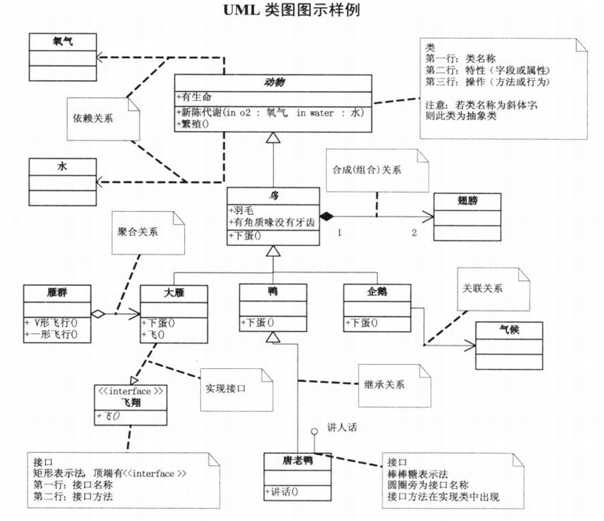
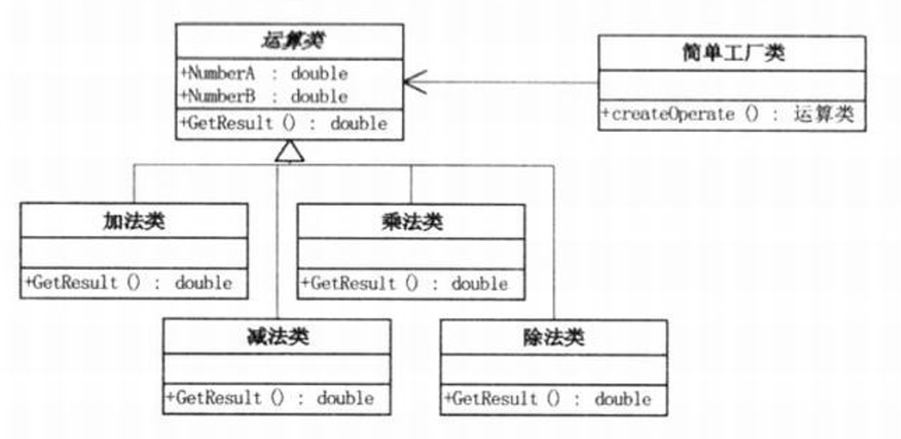
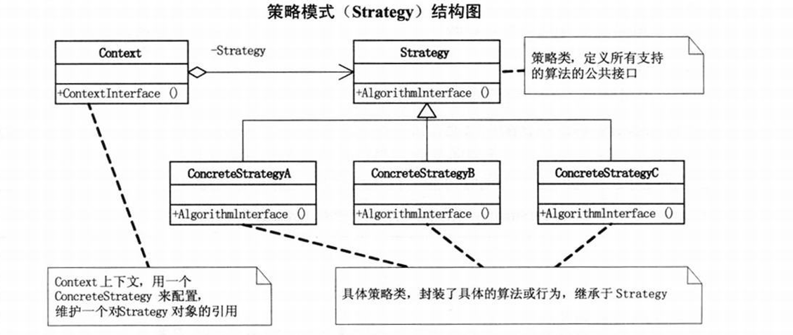
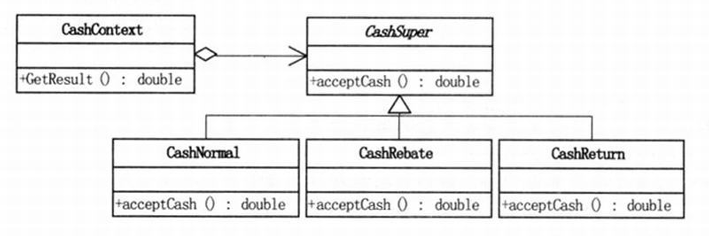
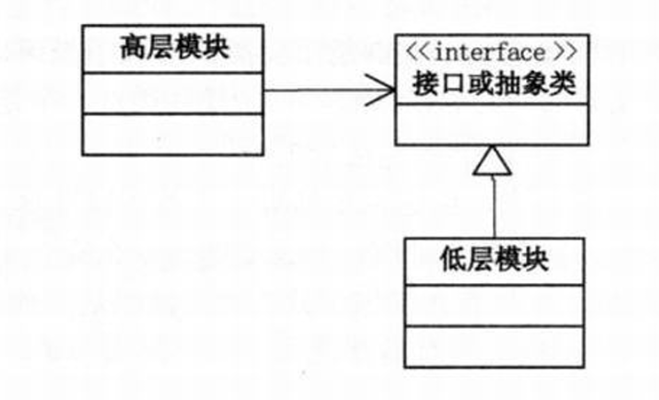

**好的代码可维护, 可复用, 可扩展, 灵活性强.**

<!--more-->

<p><font size = 5><b>目录</b></font></p>

- [Additional : UML类图](#additional--uml类图)
  - [什么是UML](#什么是uml)
  - [UML类图的示例](#uml类图的示例)
- [Chapter 1: 简单工厂模式(Simple Factory)](#chapter-1-简单工厂模式simple-factory)
- [Chapter 2: 策略模式(Strategy)](#chapter-2-策略模式strategy)
  - [收银的策略模式实现](#收银的策略模式实现)
  - [策略模式解析](#策略模式解析)
- [Chapter 3: 单一职责原则(SRP)](#chapter-3-单一职责原则srp)
- [Chapter 4: 开放-封闭原则(OCP)](#chapter-4-开放-封闭原则ocp)
- [Chapter 5: 依赖倒转原则](#chapter-5-依赖倒转原则)
  - [里氏代换原则(LSP)](#里氏代换原则lsp)

## Additional : UML类图

**在线UML工具:** <https://www.plantuml.com/plantuml/uml>

### 什么是UML

**统一建模语言UML(Unified Modeling Language)** 是一种脚本语言, 是一种开放的方法, 用于说明, 可视化, 构建和编写一个正在开发的, 面向对象的, 软件密集系统的产品的开放方法.

简单来说, 对于应用的人, 可以通过简单的语言来生成描述的图像(包括类图, 时序图等).

### UML类图的示例



关于UML类图的介绍在Internet中有充足的资料和手册, 书中也有简单的规约介绍, 笔者在此不详细介绍UML图的语法和规约.(或者待专门出一期整理UML用法的栏目)

## Chapter 1: 简单工厂模式(Simple Factory)

先来看看书中给的例子:

```C#
//简单工厂类
public class OperationFactory{
    public static Operation createOperate(string operate){
        Operation oper = null;
        switch (operate){
            case "+":
                oper = new OperationAdd();
                break;
            case "-":
                oper = new OperationSub();
                break;
            case ...
            ...
        }
        return oper;
    }
}

//应用端
Operation oper;
oper = OperationFactory.createOperate("+");
oper.NumberA = 1;
oper.NumberB = 2;
double result = oper.GetResult();
```

UML图如下:



简单来说, 就是通过一个简单工厂类`XXXFactory`生产"产品"(实例化类),即**有一个专门的类负责创建实例的过程**. 这样修改后端的功能时(比如说添加新的运算类), 前端的逻辑不需要重构(以上述例子中只需要修改`createOperate("+")->createOperate("-")`); 同时后端的具体实现细节没有暴露给前端, 降低了耦合度.

## Chapter 2: 策略模式(Strategy)

- 面向对象的编程, 并不是类越多越好, 类的划分是为了封装, 但分类的基础是抽象, 具有相同属性和功能的对象的抽象集合才是类.

**策略模式(Strategy)** 定义了算法家族, 分别封装起来, 让它们之间相互替换, 此模式让算法的变化不会影响到使用算法的客户.



### 收银的策略模式实现



```C#
//back end
class CashContext{
    CashSuper cs = null;
    public CashContext(string type){
        //该部分可以采用访问者模式(Visitor)优化
        switch(type){
            case "正常收费":
                Cashnormal cs0 = new CashNormal();
                cs = cs0;
                break;
            case "300减100":
                CashReturn cr1 = new CashReturn("300", "100");
                cs = cr1;
                break;
            case "打8折":
                CashRebate cr2 = new CashRebate("0.8");
                cs = cr2;
                break;
        }
    }
    public double GetResult(double money){
        return cs.acceptCash(money);
    }
}
/*------------------------------------------------------------*/
//front end
double total = 0.0d
private void btnOk_click(object sender, EventArgs e){
    //客户端UI操作时传入相应字符串
    CashContext csuper = new CashContext(cbxType.SelectedItem.ToString());
    double totalprices = 0d;
    totalPrices = csuper.Getresult(Convert.ToDouble(txtPrice.Text) * Convert.ToDouble(txtNum.Text));
    total += totalPrices;
    ...
}
```

### 策略模式解析

- 策略模式是一种定义一系列算法的方法, 从概念上看, 所有这些算法完成的都是相同的工作, 只是实现不同, 它可以以相同的方式调用所有的算法, 减少了各种算法类与使用算法类之间的耦合.
- 策略模式的Strategy类层次为Context定义了一系列的可供重用的算法或行为. 继承有助于析出这些算法的公共功能.

    > 对于上述代码案例, 即是`GetResult()`.

- 策略模式的优点是简化了单元测试, 因为每个算法都有自己的类, 可以通过自己的接口单独测试.
- 策略模式用于封装算法, 在实践中, 可以用它来封装几乎任何类型的规则, 只要在分析过程中听到需要在不同时间应用不同的业务规则, 就可以考虑使用策略模式处理这种变化的可能性.

## Chapter 3: 单一职责原则(SRP)

**就一个类而言, 应该仅有一个引起它变化的原因.**

- 如果一个类承担的职责过多, 就等于把这些职责耦合在一起, 一个职责的变化可能会削弱或者抑制这个类完成其他职责的能力. 这种耦合会导致脆弱的设计, 当变化发生时, 设计会遭受到意想不到的破坏.
- 软件设计真正要做的许多内容, 就是发现职责并把那些职责相互分离.
- 如果你能想到多于一个的动机去改变一个类, 那么这个类就具有多于一个的职责.

## Chapter 4: 开放-封闭原则(OCP)

- **开放-封闭原则(The Open-Closed Principle):** 软件实体(类, 模块, 函数等)应该可以扩展, 但不能修改.
    - 对于扩展是开放的(Open for extension)
    - 对于修改是封闭的(Closed for modification)

- **绝对的对修改关闭是不可能的.**

    > 无论模块是多么的"封闭", 都会存在一些无法对之封闭的变化. 既然不可能完全封闭, 设计人员必须对于他设计的模块应该对哪种变化封闭做出选择. 他必须先猜测出最有可能发生的变化种类, 然后构造抽象来隔离那些变化.

- **等到变化发生时立即采取行动**
  - 最初编写代码时, 假设变化不会发生. 当变化发生时, 创建抽象来隔离以后发生的同类变化.
  - 面对需求, 对程序的改动是通过增加新代码进行的, 而不是更改现有的代码.

**开放-封闭原则是面向对象设计的核心所在. 遵循这个原则可以带来面向对象奇数所声称的巨大好处, 也就是可维护, 可扩展, 可复用, 灵活性好. 开发人员应当仅对程序中频繁出现的变化的那部分做出抽象. 然而, 对于应用程序中的每个部分都刻意地进行抽象同样不是一个好主意. 拒绝不成熟的抽象和抽象本身一样重要.**

## Chapter 5: 依赖倒转原则

- **依赖倒转原则:** 抽象不应该依赖细节, 细节应该依赖于抽象
  - 即: **针对接口编程, 不要对实现编程.**
  - 高层模块不应该依赖低层模块, 两个都应该依赖抽象.

**依赖倒转其实可以说是面向对象设计的标志, 用哪种语言来编写程序不重要, 如果编写时考虑的都是如何针对抽象编程而不是针对细节编程, 即程序中所有的依赖关系都是终止于抽象类或者接口, 那就是面向对象的设计, 反之那就是过程化的设计了.**

### 里氏代换原则(LSP)

**子类型必须能够替换掉它们的父类型.**

- 一个软件实体如果使用的是一个父类的话, 那么一定适用于其子类, 而且它察觉不出父类对象和子类对象的区别. 也就是说, 在软件里面, 把父类都替换成它的子类, 程序的行为没有变化.
- 只有当子类可以替换掉父类, 软件单位的功能不受影响时, 父类才能真正被复用, 而子类也能够在父类的基础上增加新的行为.
- 由于子类型的可替换性才使得使用父类类型的模块在无需修改的情况下就可以扩展.

    > 