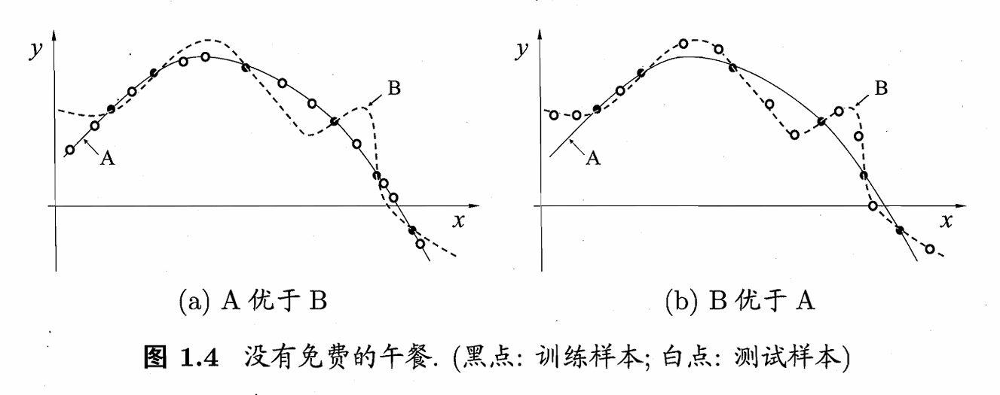

**机器学习所研究的主要内容, 是关于在计算机上从数据中产生"模型"(model)的算法, 即"学习算法"(learning algorithm).**

<!-- more -->

<b>目录</b>

- [书籍基本信息](#书籍基本信息)
- [Chapter 0: 主要符号表](#chapter-0-主要符号表)
- [Chapter 1: 绪论](#chapter-1-绪论)
  - [1.1 基本术语](#11-基本术语)
  - [1.3 假设空间](#13-假设空间)
  - [1.4 归纳偏好](#14-归纳偏好)

---

## 书籍基本信息

《机器学习》周志华 2016.

大名鼎鼎的西瓜书, 笔者在此略去介绍.

## Chapter 0: 主要符号表

$$\begin{aligned}
&\mathit{x}& &标量\\
&\boldsymbol{x}& &向量 \\
&\mathrm{x}& &变量集 \\
&\mathbf{A}& &矩阵 \\
&\mathbf{I}& &单位阵 \\
&\mathcal{X}& &样本空间或状态空间\\
&\mathcal{D}& &概率分布\\
&\mathit{D}& &数据样本(数据集)\\
&\mathcal{H}& &假设空间\\
&\mathit{H}& &假设集\\
&\mathfrak{L}& &学习算法\\
&\left ( \cdot ,\cdot ,\cdot  \right )& &行向量\\
&\left ( \cdot ;\cdot ;\cdot \right )& &列向量\\
&\left ( \cdot  \right )^{T}& &向量或矩阵转置\\
&\left \{  \cdot \cdot \cdot \right \}& &集合\\
&\left | \left \{ \cdot \cdot \cdot \right \} \right |& &集合中元素个数\\
&\left \| \cdot  \right \|_{p}& &L_p范数, p缺省时为L_2范数\\
&\mathit{P}\left ( \cdot  \right ),\mathit{P}\left ( \cdot |\cdot  \right )& &概率质量函数,条件概率质量函数\\
&\mathit{p}\left ( \cdot  \right ),\mathit{p}\left ( \cdot  | \cdot \right )& &概率密度函数, 条件概率密度函数\\
&\mathbb{E}_{\cdot \sim \mathcal{D}}\left [ f\! \left ( \cdot \right ) \right ]& &函数 f\! \left ( \cdot \right ) 对 \cdot 在分布 \mathcal{D} 下的数学期望:意义明确是将省略 \mathcal{D} 和(或)\cdot \\
&sup\left ( \cdot \right )& &上确界\\
&\mathbb{I} \left ( \cdot  \right )& &指示函数，在 \cdot  为真和假分别取值为1 , 0 \\
&sign\left ( \cdot  \right )& &符号函数，在 \cdot < 0, = 0 , >  0 时分别取值为 -1,0,1
\end{aligned}$$

## Chapter 1: 绪论

### 1.1 基本术语

> 假定我们收集了一批关于西瓜的数据, 例如(色泽 = 浅白; 根蒂 = 蜷缩; 敲声 = 浊响), (色泽 = 乌黑; 根蒂 = 稍蜷; 敲声 = 沉闷), (色泽 = 浅白; 根蒂 = 硬挺; 敲声 = 清脆), ......, 每对括号内是一条记录, 下文关于术语的表述会基于上述假定进行解释.

- **数据集/样本(Data Set):** 这组记录的集合称为一个数据集.

    > **Tips:** 数据集亦称样本, 因为数据集可看作对样本空间的一个采样.
    >
    > **Addtional:** "样本"的具体指代示例还是数据集, 要看具体的上下文.

- **示例(Instance)/样本(Sample):** 每条记录称为示例/样本, 是关于一个事件或对象的描述(以上例, 该对象为西瓜).

- **属性(Attribute)/特征(Feature):** "色泽", "根蒂", "敲声"称为属性.

- **属性值(Attribute Value):** 属性的取值称为属性值(以上例, "青绿"和"乌黑"是色泽的属性值).

- **属性空间(Attribute Space)/样本空间(Sample Space)/输入空间:** 属性张成的空间.

    > **Tips:** 此处涉及的是线性代数知识, 即将样本(Instance)依据属性转化为向量, 其中色泽, 根蒂和敲声为坐标轴, 张成了一个用于描述西瓜特征的三维空间, 该空间每个点即是线性代数意义上的一个向量, 也就是**特征向量(Feature Vector)**. 我们可以认为, 示例(Instance)的另一种等价表述是特征向量.

- **数据集的表示:** 令 $\mathit{D} = \{x_1, x_2, ..., x_m\}$ 表示包含$m$个示例的数据集, 每个示例由 $d$ 个属性描述, 则每个示例(Instance) $x_i= (x_{i1}; x_{i2}; ...; x_{id})$ 是 $d$ 维样本空间 $\mathcal{X}$ 中的一个向量, $x_i \in \mathcal{X}$. $d$ 称为样本 $x_i$ 的**维数(Dimensionality)**.

- **学习(Learning)/训练(Training):** 从数据中学得模型的过程称为学习/训练, 该过程通过执行某个学习算法完成.

- **训练数据(Training Data):** 训练过程中所使用的数据.

- **训练样本(Training Sample)/训练示例(Training Instance):** 训练数据中的每个样本/示例.

- **训练集(Training Set):** 训练样本组成的集合称为训练集.

    > **Tips:** 训练集相当于训练数据的子集, 训练数据除去**训练集**外还存在**验证集**.(参考自:[**知乎|训练集(training dataset), 测试集(test dataset)与验证集(validation dataset)**](https://zhuanlan.zhihu.com/p/115344944))

- **假设(Hypothesis)&真相/真实(Ground-Truth):** 学得模型对应了关于数据的某种潜在规律, 因此亦称假设.这种潜在规律称为"真相"/"真实". 学习的过程就是为了找出或逼近真相.

    > **Tips:** [**WIKIPEDIA|Ground-Truth**](https://en.wikipedia.org/wiki/Ground_truth)又将其表述为**基准真相**.
    >
    > "Ground truth is information that is known to be real or true, provided by direct observation and measurement (i.e. empirical evidence) as opposed to information provided by inference."

**Tips:** 本书有时又将**模型**称为**学习器(Learner)**, 模型可看作是学习算法在给定数据和参数空间上的实例化.

- **标记(Label):** 关于示例(Instance)结果的信息, 称为标记(如"好瓜"). 一般的, 用 $(x_i, y_i)$ 表示第 $i$ 个样例, 其中 $y_i \in \mathcal{Y}$ 是示例 $x_i$ 的标记, $\mathcal{Y}$ 是所有标记的集合, 又称**标记空间(Label Space)/输出空间**.

- **分类(Classification):** 若**预测(Prediction)**的是离散值(如"好瓜", "坏瓜"), 则称此类学习任务是分类.

- **回归(Regression):** 若预测的是连续值(如成熟度0.95, 0.7), 则称此类学习任务是回归.

- **二分类(Binary Classification):** 只涉及两个类别的分类任务, 通常称其中一类为**正类(Positive Class)**, 另一类为**反类(Negative Class)**.

- **多分类(Multi-class Classification):** 与之相对的, 涉及多种类别的分类任务称为多分类任务.

- **预测任务:** 预测任务希望通过对训练集$\{(x_1, y_1), (x_2, y_2), ..., (x_m, y_m)\}$ 进行学习, 建立一个从输入空间 $\mathcal{X}$ 到输出空间 $\mathcal{Y}$ 的映射 $f : \mathcal{X} \rightarrow \mathcal{Y}$. 对二分类, 通常取 $\mathcal{Y} = \{-1, 1\}$ 或 $\{0, 1\}$; 对于多分类, $|\mathcal{Y}| > 2$; 对于回归, $\mathcal{Y} = \mathbb{R}$.

- **测试(Testing):** 使用学习得到的模型进行预测的过程称为测试, 预测的样本称为**测试样本(Testing Sample)/测试示例(Testing Instance)**.

- **聚类(Clustering):** 将训练集中的样本分为若干组, 每组称为一个**簇(Cluster)**.

    > **Tips:** 形成的簇可能对应一些潜在的概念划分(如本地瓜, 外地瓜), 但这样的概念我们事先不知道, 否则通过标记(Label)就可以形成簇划分.

- **监督学习(Supervised Learning)/有导师学习:** 训练数据拥有标记信息, 分类和回归为代表.

- **无监督学习(Unsupervised Learning)/无导师学习** 训练数据无标记信息, 聚类为代表.

> **Tips:** 此处仅作最基本的概念了解, 关于上述两概念的具体释义留及之后的学习.

- **泛化(Generalization):** 学得模型适用于新样本的能力,称为泛化能力.

    > **Tips1:** 样本空间通常很大, 训练过程无法涵盖所有的示例, 我们希望模型可以对新样本有较好的目标表现, 这就是泛化的意义.
    >
    > **Tips2:** 泛化的数学支撑:
    >
    >关于这种泛化, 我们通常假设样本空间中的所有样本都服从一个未知的**分布(Distribution)** $\mathcal{D}$, 获取的样本是从该分布上采样获得的, 满足**独立同分布(Independent and Identically Distributed, *i.d.d*)**.
    >
  > 关于机器学习中为什么使用i.d.d, 可以从[**知乎|为什么机器学习中, 要假设我们的数据是独立同分布的?**](https://www.zhihu.com/question/41222495)获取相关信息.

### 1.3 假设空间

**归纳(Induction)**与**演绎(Deduction)**是科学推理的两大基本手段.

> 前者是从特殊到一般的**泛化(Generalization)**过程; 后者是从一般到特殊的**特化(Specialization)**过程.

- **归纳学习(Inductive Learning):** 广义的归纳学习大体相当于从样例中学习, 狭义的归纳学习要求从学习过程中习得**概念(concept)**, 亦称**概念学习/概念形成**.

- **版本空间(Version Space):** 存在一个与训练集一致的"假设集合", 称为版本空间, 例如:

其假设空间为

其版本空间为

> **Tips:** 在该数据集中, 好瓜具有的共同特征是蜷缩和浊响. 因此色泽标识为通配符 $*$, 同时, 第一行的两种假设同样是与训练集一致的(可以匹配好瓜).

### 1.4 归纳偏好

- **归纳偏好(Inductive bias):** 算法在学习过程中对某种类型假设的偏好称为归纳偏好.

    > **Tips:** **任何**一个有效的机器学习算法必有其归纳偏好, 否则它无法产生确定的学习结果.
    >
    > 以图1-2的版本空间为例, 对新瓜(色泽=青绿;根蒂=蜷缩;敲声=沉闷), 若模型告诉我们这种瓜时好时坏则没有意义, 模型必须对给定的样本给予确定的结果.
    >
    > **Additional:** 归纳偏好可看作学习算法自身在一个可能很庞大的假设空间中对假设进行选择的启发式或"价值观". 常遵循**奥卡姆剃刀(Occam's Razor)**原则(**若有多个假设与观察一致, 则选简单的那个**).

接下来我们来比较不同归纳偏好的优劣

从直观上看我们一般会认为, 拟合出平滑的曲线A要优于曲线B, 但很遗憾, 当面临一些极端数据时, 曲线B可能会优于曲线A, 情形如下图所示.

接下来我们用数学语言尝试量化模型的优劣.

假设样本空间 $\mathcal{X}$ 和假设空间 $\mathcal{H}$ 都是离散的, 令 $P(h|X, \mathfrak{L})$ 代表学习算法 $\mathfrak{L}_a$ 基于训练数据 $X$ 产生假设 $h$ 的概率, 令 $f$ 为目标函数.则 $\mathfrak{L}_a$ 在训练集外的所有样本上的误差为

$$\begin{equation} \label{eq1.1}
E_{ote}(\mathfrak{L}_a|X, f) = \sum_h \sum_{x \in \mathcal{X} -X} P(x) \mathbb{I}(h(x) \neq f(x)) P(h|X, \mathfrak{L}_a)
\tag{1.1}
\end{equation}$$

> **Tips:** 以下是笔者个人对该公式的理解,可能存在疏漏或错误.
>
> 首先看乘起来的的三个式子, $\mathbb{I}$ 为指示函数, 代表的含义是假设 $h$ 与目标函数 $f$ 没有误差时取0, 存在误差时取1. 若取1, 则两个概率乘积表示在给定的$x$和$h$下, 存在误差的概率.
>
> 接下来的两个求和就不难理解了, 分别是对$x$的所有取值求和以及对$h$的所有取值求和, 权重为特定$x$和$h$的概率.

为简化问题, 考虑二分类, 真实目标函数$f$可以是任何函数$\mathcal{X} \rightarrow \{0,1\}$, 函数空间$\{0,1\}^{|\mathcal{X}|}$. 对所有可能的$f$按均匀分布对误差求和,有

$$
\begin{align} \nonumber
\sum_f E_{ote}(\mathfrak{L}_a|x, f) &= \sum_f \sum_h \sum_{x \in \mathcal{X} -X} P(x) \mathbb{I}(h(x) \neq f(x)) P(h|X, \mathfrak{L}_a)\\ \nonumber
&= \sum_{x \in \mathcal{X} -X} P(x) \sum_h P(h|X, \mathfrak{L}_a) \sum_f \mathbb{I}(h(x) \neq f(x))\\ \nonumber
^*&=  \sum_{x \in \mathcal{X} -X} P(x) \sum_h P(h|X, \mathfrak{L}_a) \frac{1}{2}2^{|\mathcal{X}|}\\ \nonumber
&= \frac{1}{2}2^{|\mathcal{X}|} \sum_{x \in \mathcal{X} -X} P(x) \cdot 1 \tag{1.2}
\end{align}
$$

> **Tips:** 标识$*$的一步因为若$f$均匀分布, 则有一半的$f$对$x$的预测与$h(x)$不一致.

式(1.2)指出, 误差与学习算法$\mathfrak{L}$无关! 对于任意学习算法$\mathfrak{L}_a$和$mathfrak{L}_b$,有

$$\begin{equation}
\sum_f E_{ote}(\mathfrak{L}_a|X, f) = \sum_f E_{ote}(\mathfrak{L}_b|X, f) \tag{1.3}
\end{equation}$$

这简直糟糕透了, 似乎所有的学习算法期望性能居然都相同. 这就是**没有免费午餐定理(No Free Lunch Theorem, NFL)**.

> **Tips:** 原书的证明是多重假设下的简化论述, 对严格数学证明感兴趣的读者可以自行查阅相关资料.

但是, NFL定理有一个重要前提, 它假定了所有问题出现的机会相等, 所有问题同等重要(例如上述证明中假设了$f$均匀分布). 但我们并不要求模型对所有情况都能给出一个好的解决方案, 往往我们希望模型对特定问题表现是好的.

> **Tips:** 原书中举了一个简单的例子, 骑自行车从南京鼓楼到南京新街口显然是好方案(距离约两站地铁), 但骑自行车从南京鼓楼到北京新街口, 显然不是好的方案,但我们不care.

简单来说, NFL定理指出了**没有一种机器学习算法是适用于所有情况的**, 只有针对具体问题, 才能谈论模型的优劣.
