**有多个算法和参数生成的模型, 哪个才是好的模型?**

<!-- more -->

<b>目录</b>

- [Chapter 2: 模型评估与选择](#chapter-2-模型评估与选择)
  - [$ 2.1 经验误差与过拟合](#-21-经验误差与过拟合)
  - [$ 2.2 评估方法](#-22-评估方法)
    - [$ 2.2.1 留出法(Hold-Out)](#-221-留出法hold-out)
    - [$ 2.2.2 交叉验证法(Cross Validation)](#-222-交叉验证法cross-validation)
    - [$ 2.2.3 自助法(Bootstapping)](#-223-自助法bootstapping)
    - [$ 2.2.4 调参与最终模型](#-224-调参与最终模型)
  - [$ 2.3 性能度量](#-23-性能度量)
    - [$ 2.3.1 错误率与精度](#-231-错误率与精度)
    - [$ 2.3.2 查准率(Precision), 查全率(Recall), F1](#-232-查准率precision-查全率recall-f1)
    - [$ 2.3.3 ROC与AUC](#-233-roc与auc)
    - [$ 2.3.4 代价敏感错误率与代价曲线](#-234-代价敏感错误率与代价曲线)
  - [$ 2.4 比较检验](#-24-比较检验)
    - [$ 2.4.1 假设检验](#-241-假设检验)
    - [$ 2.4.2 多学习器比较](#-242-多学习器比较)
  - [2.5 偏差与方差](#25-偏差与方差)

---

## Chapter 2: 模型评估与选择

### $ 2.1 经验误差与过拟合

- **错误率(Error Rate):** 分类错误的样本数占样本总数的比例, 记样本数为$m$, $a$个错误分类的样本, 错误率 $E=\frac{a}{m}$ .

- **精度(Accuracy):** $(1 - \frac{a}{m}) \times 100\%$ 称为精度, 即 "精度 = 1 - 错误率".

- **误差(Error):** 更一般地, 我们把**学习器的实际预测输出**与**样本的真实输出**之间的差异称为误差, 学习器在训练集上的误差称为 **训练误差(Training Error)/经验误差(Empirical Error)**, 在新样本上的误差称为**泛化误差(Generalization Error)**.

    > **Tips:** 这里的误差均指**误差期望**.

尽管我们希望得到一个泛化误差小的学习器, 使得其在新样本上表现很好, 但我们并不能预测新样本, 因此我们只能尝试降低经验误差. 但经验误差很小的学习器往往在泛化误差的表现上都很糟糕. 这样的学习器发生了**过拟合**.

- **过拟合(Overfitting):** 学习器可能将训练样本自身的一些特点当作了所有潜在样本都具有的一般性质, 导致泛化能力下降的现象.

- **欠拟合(Underfitting):** 与过拟合相对, 指对训练样本的一般性质尚未学好.

> **Tips:** 导致过拟合的原因很多, 最常见的原因是学习能力过强; 欠拟合则相反, 因为学习能力低下. 欠拟合容易克服, 但过拟合很难解决, 且过拟合无法彻底避免.

- **模型选择(Model Selection):** 在实际中, 面对同一个问题, 往往有多种学习算法可以选择, 参数配置也会对模型产生影响.

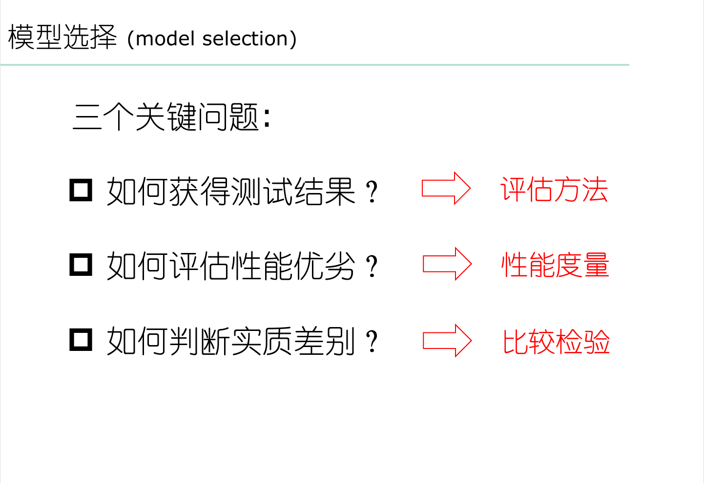

### $ 2.2 评估方法

通常我们可以通过实验测试对学习器的泛化误差进行评估, 使用**测试集(Testing Set)**测试学习器对新样本的判别能力, 以测试集上**测试误差(Testing Error)**作为泛化误差的近似. 但需要注意的是, 测试集应尽可能与训练集互斥.

> 假设我们有且只有一个包含$m$个样例的数据集$D = \{(x_1,y_1),(x_2,y_2), ..., (x_m,y_m)\}$, 既要训练, 又要测试, 这样就需要对$D$进行适当处理, 从中产生 **训练集** $S$和 **测试集** $T$.

#### $ 2.2.1 留出法(Hold-Out)

留出法的思路很简单, 直接将数据集$D$划分成两个互斥的集合, 即$D = S \cup T, S \cap T = \emptyset$.

使用留出法时需要注意训练集和测试集的划分需要保持数据分布一致性, 避免因数据划分引入额外偏差对结果产生影响. 同时单次留出法得到的估计往往并不够准确可靠, 一般采用若干次随机划分, 重复进行实验评估取平均值作为留出法评估结果. 关于划分比例, 通常取2/3 ~ 4/5的样本用于训练, 其余用于测试.

#### $ 2.2.2 交叉验证法(Cross Validation)

交叉验证法可以看作是一种具体的留出法, 其方法过程是:

先将数据集$D$划分为$k$个大小相似的互斥子集, $D = D_1 \cup D_2 \cup ... \cup D_k, D_i \cap D_j = \emptyset (i \neq j)$, 子集$D_i$通过保留类别比例的**分层采样(Stratified Sampling)**来尽可能保持数据分布一致性.

接下来每次取$k-1$个子集作为训练集, 余下一个作为测试集, 进行$k$次训练和测试, 最终结果取$k$个结果的均值.

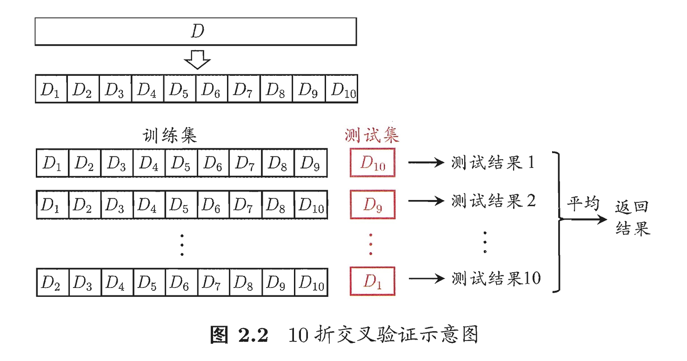

显然交叉验证法评估结果的**稳定性(Stability)**和**保真性(Fidelity)**与$k$的取值强相关. 故而交叉验证法又称**k折交叉验证(k-fold Cross Validation)**. 最常见的取值是 $k=10$.

由于$D$的$k$划分不唯一, k折交叉验证通常也要重复多次, 记为$p$, 最终结果取这$p$次k折交叉验证结果的均值.

**留一法(Leave-One-Out, LOO)**, $|D| = m$, 则令$k = m$ 就得到了留一法.

留一法的优势是不受样本划分影响(有且仅有一种划分方式), 训练集仅比$D$少一个样本, 绝大多数情况下留一法中被评估的模型与期望用$D$训练的模型相似. 因此认为留一法评估结果较为准确. 缺点是当$m$较大时, 计算开销过大以致无法接受.

#### $ 2.2.3 自助法(Bootstapping)

留出法和交叉验证法都保留了一部分样本用于测试, 因此实际评估的模型所使用的训练集比$D$小, 必然会引入一些因训练样本规模不同而导致的估计偏差. 留一法的计算复杂度又太高了. 自助法提供了一个较好的解决方案.

自助法直接以 **自助采样法(Bootstrap Sampling)** 为基础. 给定包含$m$个样本的数据集$D$, 对其进行采样产生数据集$D'$. 采样过程每次随即从$D$中挑选一个样本, 将拷贝放入$M'$ **(意味着下次采样该样本仍有可能被采样到)**. 重复该过程$m$次, 得到了包含$m$个样本的数据集$D'$.

  > **Tips:** 此处"自助"为意译, 称**可重复采样/有放回采样**更符合其原理.

不难看出, 可能存在部分样本被多次采样到, 部分样本未被采样到. 我们关注某个样本在$m$次中未被采样的概率,有

$$\begin{equation}
\lim_{m \rightarrow \infty}(1 - \frac{1}{m})^m  = \frac{1}{e} \approx 0.368 \tag{2.1}
\end{equation}$$

通过自主采样, 初始数据集$D$中约有$36.8\%$的样本未出现在采样数据集$D'$中, 将$D'$作为训练集, $D \backslash D'$作为测试集. 这样的测试结果称为**包外估计(Out-Of-Bagestimate)**.

自助法在数据集较小, 难以有效划分训练和测试集的时候具有优势. 但自助法产生的数据集改变了初始数据集的分布, 会引入估计误差. 初始数据集较大时更常用留出法和交叉验证法.

#### $ 2.2.4 调参与最终模型

**参数(Parameter)**和**调参(Parameter Tuning)**释义见名称.

> **Tips:** 机器学习常涉及两类参数: 算法参数和模型参数.

- **验证集(Validation Set):** 模型评估与选择中用于评估测试的数据集常称为验证集.

  > **Additonal:** 关于训练集, 测试集和验证集的区别, 笔者在此参考[**[知乎|训练集、验证集、测试集]**](https://zhuanlan.zhihu.com/p/98532085)

### $ 2.3 性能度量

- **性能度量(Performance Measure):** 衡量模型泛化能力的评价标准. 显然该标准取决于任务需求.

以预测任务为例, 给定样例集$D = \{(\boldsymbol{x_1}, y_1), (\boldsymbol{x_2}, y_2), ..., (\boldsymbol{x_m}, y_m)\}$, 其中$y_i$是$\boldsymbol{x_i}$的真实标记, 评估学习器$f$的性能, 需要比较预测结果$f(x)$与真实标记$y$.

回归任务常用性能度量**均方误差(Mean Squared Error)**

$$\begin{equation}
E(f;D) = \frac{1}{m} \sum_{i=1}^{m}(f(\boldsymbol{x_i}) - y_i)^2 \tag{2.2}
\end{equation}$$

更一般地, 对于数据分布$\mathcal{D}$和概率密度函数$p(\cdot)$, 均方误差描述为

$$\begin{equation}
E(f;\mathcal{D}) = \int_{x \sim \mathcal{D}}^{}(f(\boldsymbol{x}) - y)^2 p(\boldsymbol{x}) d\boldsymbol{x} \tag{2.3}
\end{equation}$$

#### $ 2.3.1 错误率与精度

错误率和精度是分类任务中最常用的两种性能度量.

对于样例集$\mathcal{D}$, 错误率和精度定义为

$$\begin{equation}
E(f;D) = \frac{1}{m} \sum_{i=1}^{m}\mathbb{I}(f(\boldsymbol{x_i}) \neq y_i) \tag{2.4}
\end{equation}$$

$$\begin{equation}
acc(f;D) = \frac{1}{m} \sum_{i=1}^{m}\mathbb{I}(f(\boldsymbol{x_i}) = y_i) = 1 - E(f;D) \tag{2.5}
\end{equation}$$

对于数据分布$\mathcal{D}$和概率密度函数$p(\cdot)$, 错误率和精度定义为

$$\begin{equation}
E(f;\mathcal{D}) = \int_{x \sim \mathcal{D}}^{}\mathbb{I}(f(\boldsymbol{x}) \neq y) p(\boldsymbol{x}) d\boldsymbol{x} \tag{2.6}
\end{equation}$$

$$\begin{equation}
acc(f;\mathcal{D}) = \int_{x \sim \mathcal{D}}^{}\mathbb{I}(f(\boldsymbol{x}) = y) p(\boldsymbol{x}) d\boldsymbol{x} = 1 - E(f;\mathcal{D}) \tag{2.7}
\end{equation}$$

#### $ 2.3.2 查准率(Precision), 查全率(Recall), F1

有时我们更关心模型的正确率, 比如说"挑选出来的瓜有多少是好瓜","有多少好瓜被挑选出来了", 查准率和查全率更适合用来度量.

对于二分类问题, 我们有**混淆矩阵(Confusion Matrix)**

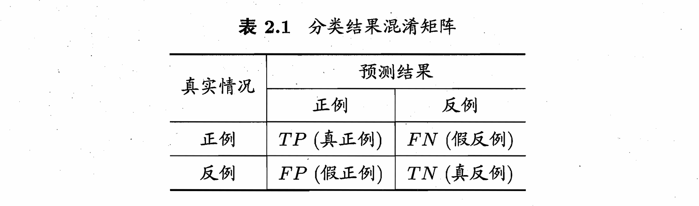

定义查准率$P$, 查全率$R$

$$\begin{equation}
P = \frac{TP}{TP + FP}\tag{2.8}
\end{equation}$$

$$\begin{equation}
P = \frac{TP}{TP + FN}\tag{2.9}
\end{equation}$$

> **Tips:** 自然语言解释就是, 查准率是在预测正确中实际正确的比率, 查全率是在实际正确中预测正确的比率.

查准率和查全率是一对矛盾的度量, 二者负相关. 是**sound**和**complete**的关系

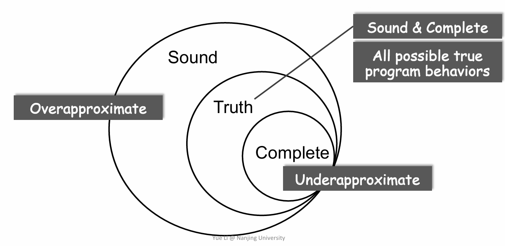

> **Tips:** 该图片截选自NJU软件分析课件, ~~ly和tt老师应该不会在意吧(雾)~~
>
> 课程地址链接[**[Static Program Analysis]**](https://tai-e.pascal-lab.net/lectures.html)

查准率和查全率的关系可以用**P-R图**表示

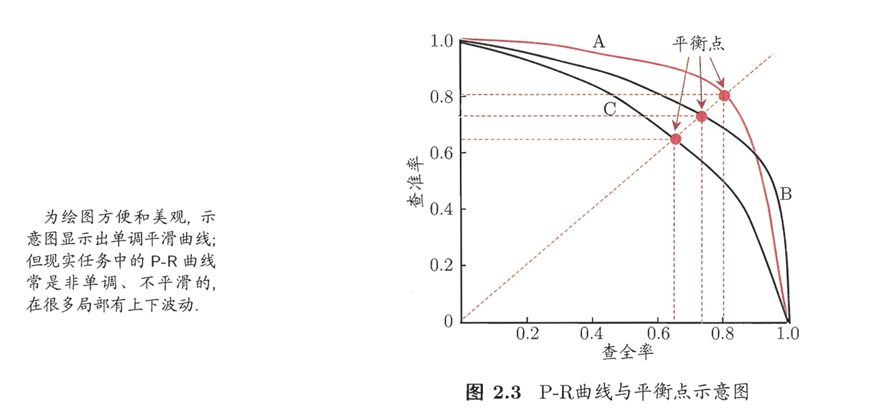

- **平衡点(Break-Even Point, BEP):** $P=R$时的取值, 可基于BEP评估两个学习器的优劣, 如图2-3, 可认为$A>B>C$

比BEP更常用的是$F1$度量定义为

$$\begin{equation}
F1 = \frac{2 \times P \times R}{P + R} = \frac{2 \times TP}{样例总数 + TP - TN}\tag{2.10}
\end{equation}$$

$F_{\beta}$是$F_1$的一般形式, 定义为

$$\begin{equation}
F_{\beta} = \frac{(1 + \beta^2) \times P \times R}{(\beta^2 \times P) + R}\tag{2.11}
\end{equation}$$

其中$\beta > 0$度量了查全率对查准率的相对重要性, $\beta = 1$时退化为$F_1$, $\beta > 1$时查全率影响更大, $\beta < 1$时查准率影响更大.

> **Tips:**
>
> $F_1$基于调和平均定义, $\frac{1}{F_1} = \frac{1}{2} \cdot (\frac{1}{P} + \frac{1}{R})$.
>
> $F_\beta$基于加权调和平均定义, $\frac{1}{F_\beta} = \frac{1}{1 + \beta^2} \cdot (\frac{1}{P} + \frac{\beta^2}{R})$

若在n个二分类混淆矩阵上考察准确率和查全率, 我们有**macro**和**micro**两种选择.

对于**宏(macro)**, 在各个混淆矩阵上分别计算$P$和$R$, 再取平均.得到**宏查准率(macro-P)**, **宏查全率(macro-R)**, **宏F1(macro-F1)**

$$\begin{equation}
macro\text{-}P = \frac{1}{n} \sum_{i=1}^{n} P_i\tag{2.12}
\end{equation}$$

$$\begin{equation}
macro\text{-}R = \frac{1}{n} \sum_{i=1}^{n} R_i\tag{2.13}
\end{equation}$$

$$\begin{equation}
macro\text{-}F1 = \frac{2 \times macro\text{-}P \times macro\text{-}R}{macro\text{-}P + macro\text{-}R}\tag{2.14}
\end{equation}$$

对于**微(micro)**, 先平均混淆矩阵得到$\overline{TP}, \overline{FP}, \overline{TN}, \overline{FN} $, 再计算出**微查准率(micro-P)**, **微查全率(micro-R)**, **微F1(micro-F1)**

$$\begin{equation}
micro\text{-}P = \frac{\overline{TP}}{\overline{TP}+\overline{FP}}\tag{2.15}
\end{equation}$$

$$\begin{equation}
micro\text{-}R = \frac{\overline{TP}}{\overline{TP}+\overline{FN}}
\tag{2.16}
\end{equation}$$

$$\begin{equation}
micro\text{-}F1 = \frac{2 \times micro\text{-}P \times micro\text{-}R}{micro\text{-}P + micro\text{-}R}\tag{2.17}
\end{equation}$$

#### $ 2.3.3 ROC与AUC

现重新考虑查准率和查全率, 首先我们来看看学习器如何给正/反的分类.

很多学习器为测试样本产生一个实值或概率预测, 将预测值与**分类阈值(Threshold)**比较, 大于阈值则为正类, 否则为反类. 根据该实值或概率预测进行排序, 概率高的在前, 概率低的在后, 则这个分类阈值就是**截断点(Cut Point)**, 前一部分为正例, 后一部分为负例.

不难得到以下结论: 截断点越靠前, 查准率增高而查全率降低; 截断点越靠后, 查准率降低而查全率增高. 同时, 排序质量越好的学习器"在一般情况下"泛化性能越好, ROC基于此度量模型的泛化能力.

**受试者工作特征(Receiver Operating Characteristic, ROC)**, 根据学习器的预测结果对样例进行排序, 顺序逐个把样本作为正例进行预测(选择不同的截断点),计算 **真正例率(True Positive Rate, TPR)**, **假正例率(False Positive Rate, FPR)** 作为纵横轴.

$$\begin{equation}
TPR = \frac{TP}{TP + FN}
\tag{2.18}
\end{equation}$$

$$\begin{equation}
FPR = \frac{FP}{TN + FP}
\tag{2.19}
\end{equation}$$

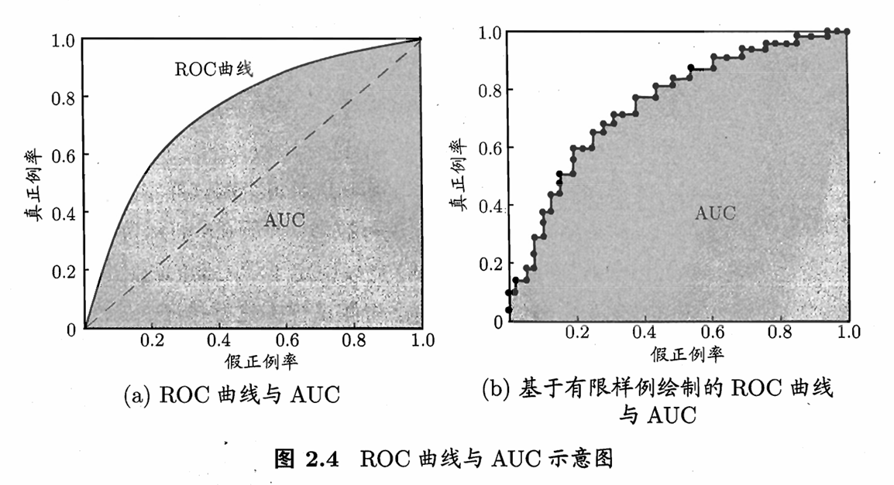

对角线对应随即猜测模型, 点(0, 1)对应所有正例在负例前的理想模型.

- **AUC(Area Under ROC Curve):** ROC曲线下面积. 为依据两个模型绘制的ROC曲线比较两个模型的优劣而引入.

对于离散样本, 计算AUC:

$$\begin{equation}
AUC = \frac{1}{2} \sum^{m - 1}_{i=1}(x_{i+1} - x_i)\cdot(y_i + y_{i + 1} )
\tag{2.19}
\end{equation}$$

形式化上AUC度量排序质量, 记有$m^+$个正例, $m^-$个反例, 令$D^+$为正例集合, $D^-$为负例集合, 定义排序**损失(loss):**

$$\begin{equation}
\mathscr{l}_{rank} = \frac{1}{m^+ m^-}\sum_{x^+ \in D^+} \sum_{m^- \in D^-}\left(\mathbb{I}(f(x^+)<f(x^-)) + \frac{1}{2} \mathbb{I}(f(x^+)= f(x^-))\right)
\tag{2.21}
\end{equation}$$

如何理解这个式子? 考虑每一对正反例, 若正例小于反例记一个"罚分", 相等则记半个. 不难看出, 对于每个正例/负例, 可能造成的"罚分"与其"位置", 越"错误"的位置会引起越多的"罚分", 这与AUC计算过程及其相似. 实际上, $\mathscr{l}_{rank}$对应ROC曲线上方的面积, 有

$$\begin{equation}
AUC = 1 - \mathscr{l}_{rank}
\tag{2.22}
\end{equation}$$

#### $ 2.3.4 代价敏感错误率与代价曲线

为权衡不同类型错误所造成的不同损失, 我们为错误赋予**非均等代价(UnEqual Cost)**.

以二分类为例, **代价矩阵(Cost Matrix)**如下:

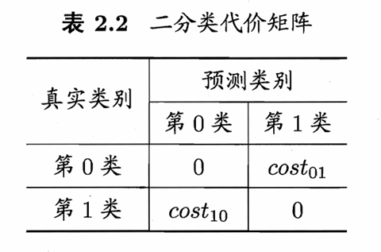

若将0类记为正例, 1类记为负例, 定义$D^+, D^-$, **代价敏感(Cost-Sensitive)** 错误率为

$$\begin{equation}
E(f;D;cost) = \frac{1}{m} \left(\sum_{\boldsymbol{x}_i \in D^+} \mathbb{I}(f(\boldsymbol{x}_i) \neq y_i) \times cost_{01} + \sum_{\boldsymbol{x}_i \in D^-} \mathbb{I}(f(\boldsymbol{x}_i) \neq y_i) \times cost_{10}\right)
\tag{2.23}
\end{equation}$$

非均等情况下, **代价曲线(Cost Curve)**可以解决ROC曲线不能反映出学习器的期望**总体代价(Total Cost)**问题.

其横轴是取值为$[0,1]的$正例概率代价, 其中$p$为样例是正例的概率

$$\begin{equation}
P(+)cost=\frac{p \times cost_{01}}{p \times cost_{01} + (1 - p) \times cost_{10}}
\tag{2.24}
\end{equation}$$

纵轴是取值为$[0,1]$的归一化代价,FPR为假正例率, FNR为假反例率

$$\begin{equation}
cost_{norm} = \frac{FNR \times p \times cost_{01} + FPR \times (1 - p) \times cost_{10}}{p \times cost_{01} + (1 - p) \times cost_{10}}
\tag{2.25}
\end{equation}$$

绘制代价曲线时, ROC曲线上每个点对应代价平面上的一条线段, 设ROC点坐标为$(FPR, TPR)$, 然后在代价平面上绘制一条从$(0, FPR)$到$(1, FNR)$的线段, 线段下面积代表了该条件下的期望总体代价.如此为每个点绘制线段, 取线段下界, 围成面积即为在所有条件下学习器的总体期望代价.

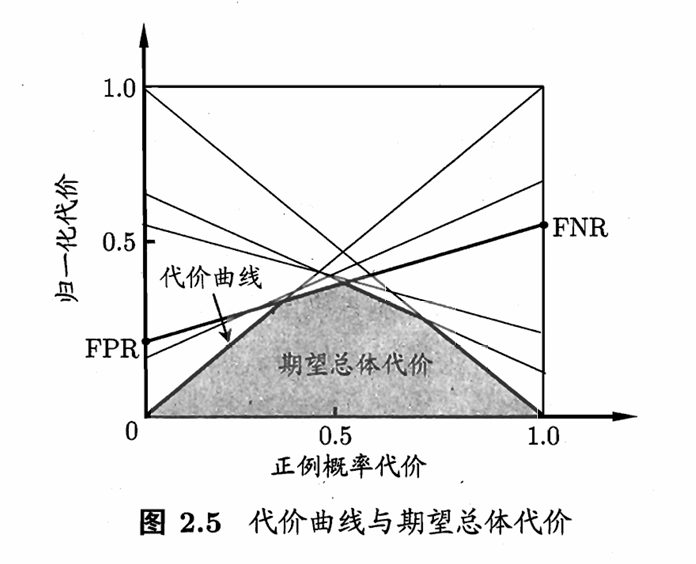

> **Addtional:** 如何理解代价曲线?
>
> 笔者在此给出一篇参考[**[知乎|代价曲线的理解]**](https://www.zhihu.com/question/63492375).这篇参考中对大部分问题给到了解释.
>
> 在此额外补充一点困惑笔者许久的问题, 每一条线段代表什么?
>
> 每一条线段代表当前**阈值**条件下, 对不同样本集的期望代价. 具体来说, 是以FPR和FNR为预测值对不同样本集的预测.

### $ 2.4 比较检验

**统计假设检验(Hypothesis Test)** 为比较学习器性能提供了重要依据. 本节默认以错误率为性能度量, 用$\epsilon$表示.

#### $ 2.4.1 假设检验

现实中我们无法知道学习器的泛化错误率 $\epsilon$, 只能获知其测试错误率 $\hat{\epsilon}$. 常用测试错误率估推出泛化错误率.

对于 $m$ 个测试样本, 如果测试错误率为 $\hat{\epsilon}$, 则被误分类的样本数量 $m'=\hat{\epsilon} \times m$, 假定测试样本从样本总体分布中独立采样获得, 由**二项(Binomial)分布**, 泛化错误率为 $\hat{\epsilon}$ 的学习器恰有 $m'$ 个样本被误分类的概率是 $\binom{m}{m'}\epsilon^{m'}(1-\epsilon)^{m-m'}$ . 同时, 这也表示泛化错误率为 $\epsilon$ 的学习器在$m$个样本上测试得到测试错误率为 $\hat{\epsilon}$ 的概率:

$$\begin{equation}
P(\hat{\epsilon};\epsilon)=\binom{m}{\hat{\epsilon} \times m} \epsilon^{\hat{\epsilon} \times m} (1 - \epsilon)^{m - \hat{\epsilon} \times m}
\tag{2.26}
\end{equation}$$

由二项分布性质, 或者计算 $P(\hat{\epsilon};\epsilon)$ 对 $\epsilon$ 的偏导, 可以知道 $P(\hat{\epsilon};\epsilon)$ 在 $\epsilon = \hat{\epsilon}$ 时最大, $|\epsilon - \hat{\epsilon}|$ 增大时 $P(\hat{\epsilon};\epsilon)$ 减小.

若取 $m=10, \epsilon = 0.3$, 示意图如2.6所示.

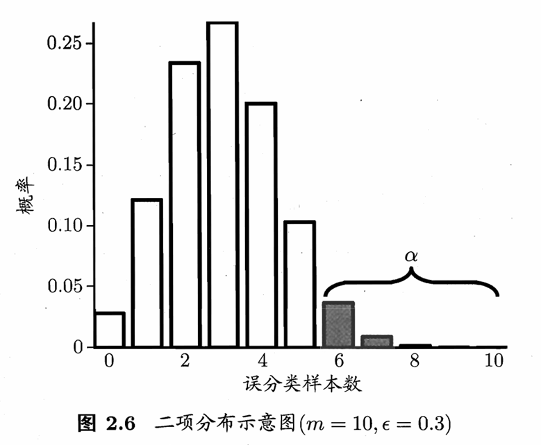

> **Tips:** ~~死去的《概率论与数理统计》突然复活起来攻击我~~, 推荐复习笔记[**[知乎|概率论与数理统计复习整理]**](https://zhuanlan.zhihu.com/p/243215469).

由**二项检验(Binomial Test)**, 考虑假设$\epsilon \leq \epsilon_0$, 在 $1 - \alpha$ 的概率内能观测到的最大错误率为

$$\begin{equation}
\bar{\epsilon} = \min \epsilon \ \ \text{s.t.} \ \ \sum_{i = \epsilon \times m + 1}^{m} \binom{m}{i}\epsilon_0^i (1 - \epsilon_0)^{m - i} < \alpha
\tag{2.27}
\end{equation}$$

其中 $1-\alpha$ 为**置信度(Confidence)**, 直观上对应图2.6的非阴影部分; "s.t."是"subject to", 使左边式子在右边式子条件满足时成立.

若测试错误率 $\hat{\epsilon}$ 大于临界值 $\bar{\epsilon}$, 由二项检验, 我们可以认为在 $\alpha$ 的显著度下, 假设 $\epsilon \leq \hat{\epsilon}$ 不能被拒绝, 即能以 $1-\alpha$ 的置信度认为, 学习器的泛化错误率不高于 $\epsilon_0$; 否则可以拒绝假设, 在 $\alpha$ 的显著度下可认为学习器的泛化错误率大于 $\epsilon_0$.

在通过多次测试中中我们会获得多个测试错误率, 此时可使用**t检验(t-test)**.

设$k$个错误率 $\hat{\epsilon_1}, \hat{\epsilon_2}, ..., \hat{\epsilon_k}$, 则平均错误率 $\mu$, 方差 $\sigma^2$ 为

$$\begin{equation}
\mu = \frac{1}{k} \sum_{i=1}^k \hat{\epsilon_i}
\tag{2.28}
\end{equation}$$

$$\begin{equation}
\sigma^2=\frac{1}{k-1} \sum^{k}_{i=1}(\hat{\epsilon_i} - \mu)^2
\tag{2.29}
\end{equation}$$

$k$ 个测试错误率可看作是泛化错误率 $\epsilon_0$ 的独立采样, 则变量

$$\begin{equation}
\tau_t=\frac{\sqrt{k} (\mu - \epsilon_0)}{\sigma}
\tag{2.30}
\end{equation}$$

服从自由度为 $k-1$ 的 $t$ 分布.

> **Addtional:** **基础知识补充**
>
> $\chi^2$ 分布: $X_1, X_2, ..., X_n$ 为独立同分布随机变量, 服从 $N(0, 1)$, 则 $\chi^2_n = \sum_{i=1}^n X^2_i$ 为服从自由度为 $n$ 的 $\chi^2$ 分布
>
> $t$ 分布: $X \sim N(0,1), Y \sim \chi^2(n)$, $X,Y$ 独立, 称 $T = \frac{X}{\sqrt{\frac{Y}{n}}}$ 为服从自由度为 $n$ 的 $t$ 分布.

> **Tips:** **推导补充**
>
>原书中没有关于这个$\tau_t$服从$t$分布的推导, 笔者在此给出补充.
>
>假设$X_1,X_2,...X_n$是来自正态总体$N(\mu,\sigma^2)$的样本. 我们有以下重要统计量:
>
>$$
>\begin{align}
>\nonumber\text{样本均值}& \ \bar{X}=\frac{1}{n}\sum_{i=1}^n >X_i \\
>\nonumber\text{样本方差}& \ S^2=\frac{1}{n-1}\sum_{i-1}^{n}(X_i-\bar{X})^2
>\end{align}
>$$
>
> 我们有几个重要结论:
>
> 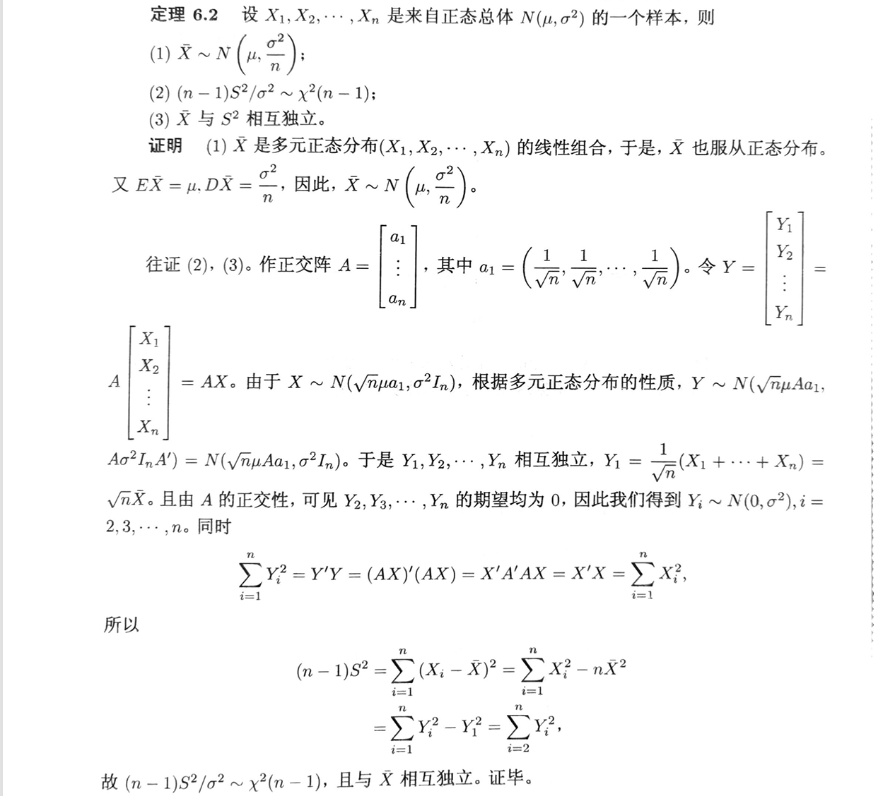
>
> 故而有推论:
>
> 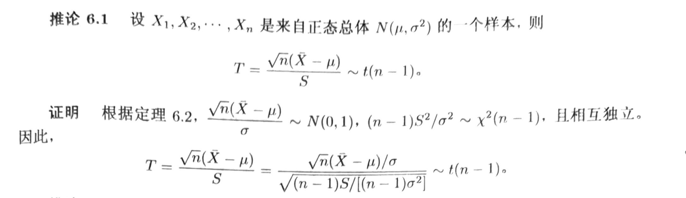

对假设$\mu=\epsilon_0$和显著度$\alpha$, 可以算出临界值——在$1-\alpha$内能观测到的最大错误率. 考虑**双边假设(Two-Tailed)**, 若$\tau_t$位于临界区$[t_{-\alpha/2},t_{\alpha/2}]$内(如图2.7所示), 则不能拒绝假设$\mu=\epsilon_0$. 我们可以认为泛化错误率为$\epsilon_0$.

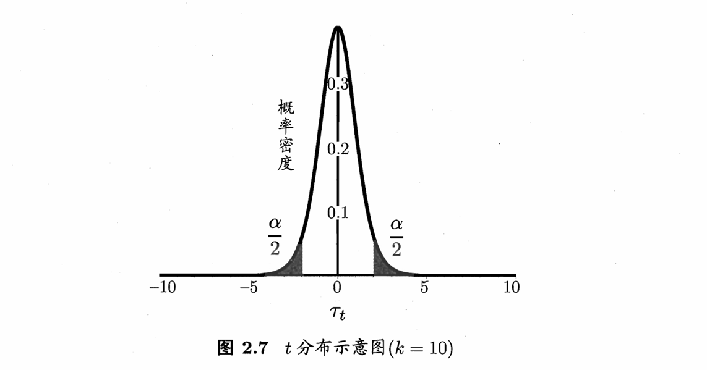

#### $ 2.4.2 多学习器比较

笔者对这部分不做过多记录, 翻阅原书该部分即可.

对于两个学习器,我们有

- 交叉验证t检验(基于成对t 检验)
- McNember检验(基于列联表，卡方检验)

对于多个学习器,我们有

- Friedman检验(基于序值，F检验; 判断”是否都相同”)
- Nemenyi后续检验(基于序值，进一步判断两两差别)

### 2.5 偏差与方差

- **偏差-方差分解(Bias-variance Decomposition)**

对测试样本$\boldsymbol{x}$, 令$y_D$为$\boldsymbol{x}$在数据集的集中标记, $y$为$\boldsymbol{x}$的真实标记, $f(\boldsymbol{x};D)$为训练集$D$上的学得模型$f$在$\boldsymbol{x}$上的预测输出.

以回归算法为例, 我们有如下定义(符号定义见[**[Lapluma|读书笔记-机器学习 Ch0-Ch1]**](http://localhost:4000/2024/09/18/BookNote-MachineLearning-by-ZhihuaZhou-1/#chapter-0-%E4%B8%BB%E8%A6%81%E7%AC%A6%E5%8F%B7%E8%A1%A8)):

学习算法的期望预测.

$$\begin{equation}
\bar{f}(\boldsymbol{x})=\mathbb{E}_D[f(\boldsymbol{x};D)]
\tag{2.37}
\end{equation}$$

使用样本数相同的不同训练集产生的方差, 度量了同样大小的训练集变动导致的学习性能变化, 刻画了数据扰动造成的影响.

$$\begin{equation}
\mathcal{var}(\boldsymbol{x})=\mathbb{E}_D[(f(\boldsymbol{x};D)-\bar{f}(x))^2]
\tag{2.38}
\end{equation}$$

噪声, 在当前学习任务上任何学习算法所能达到的期望泛化误差下界, 刻画了学习问题本身的难度.

$$\begin{equation}
\varepsilon^2=\mathbb{E}_D[(y_D-y)^2]
\tag{2.39}
\end{equation}$$

期望输出与真实标记的差别称为偏差, 度量了学习算法的期望预测与真是结果的偏离程度, 刻画了学习算法本身的拟合能力.

$$\begin{equation}
\mathcal{bias}^2(\boldsymbol{x})=(\bar{f}(\boldsymbol{x})-y)^2
\tag{2.40}
\end{equation}$$

便于讨论,我们假定噪声期望为0, 即$\mathbb{E}_D[y_D-y]=0$, 对期望泛化误差进行分解(推导略, 见原书), 有

$$\begin{equation}
E(f;D)=bias^2(\boldsymbol{x})+var(\boldsymbol{x})+\varepsilon ^2
\tag{2.42}
\end{equation}$$

即泛化误差可以分解为偏差, 方差和噪声之和.

一般来说, 偏差和方差存在冲突, 称为**偏差-方差窘境(Bias-Variance Dilemma)**,见图2-9.

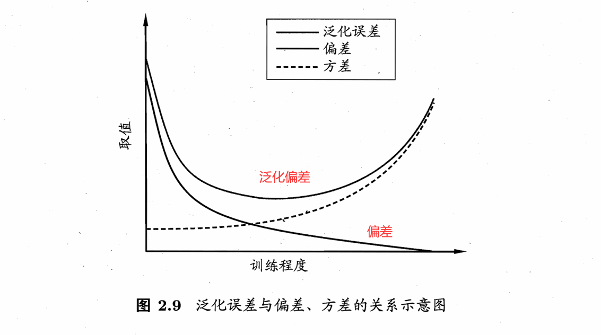

训练不足时, 学习器拟合能力不足, 训练数据的扰动不足以使学习器产生显著变化, 此时偏差主导了泛化错误率;训练程度加深, 学习器拟合能力增强, 训练数据发生的扰动被学习器学习到, 方差逐渐主导了泛化错误率;训练充足后, 学习器拟合能力非常强. 训练数据发生轻微扰动都会导致学习器发生显著变化, 此时训练数据自身,非全局的性质被学习器学习, 发生过拟合.
