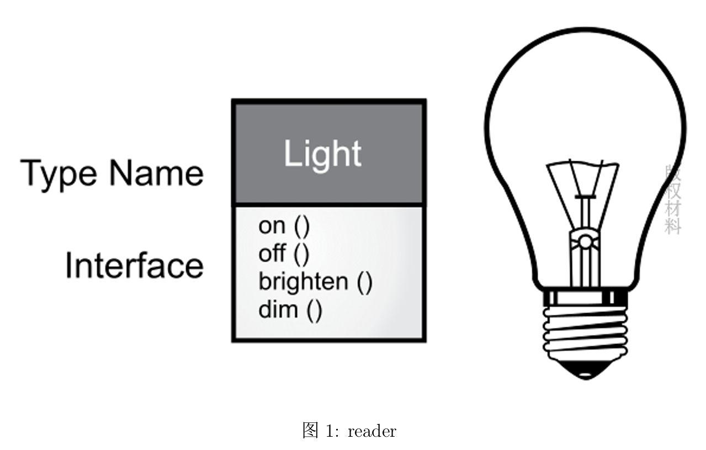
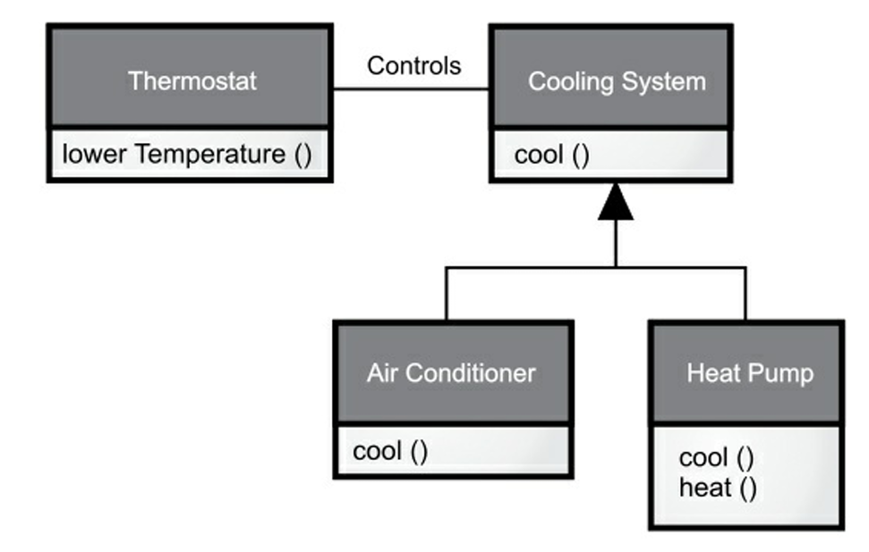
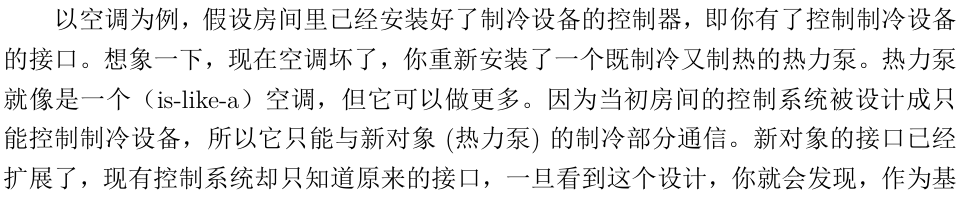
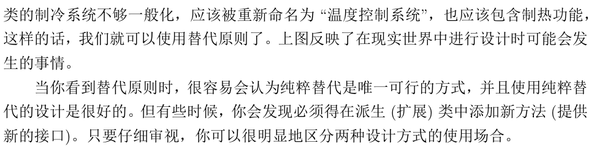
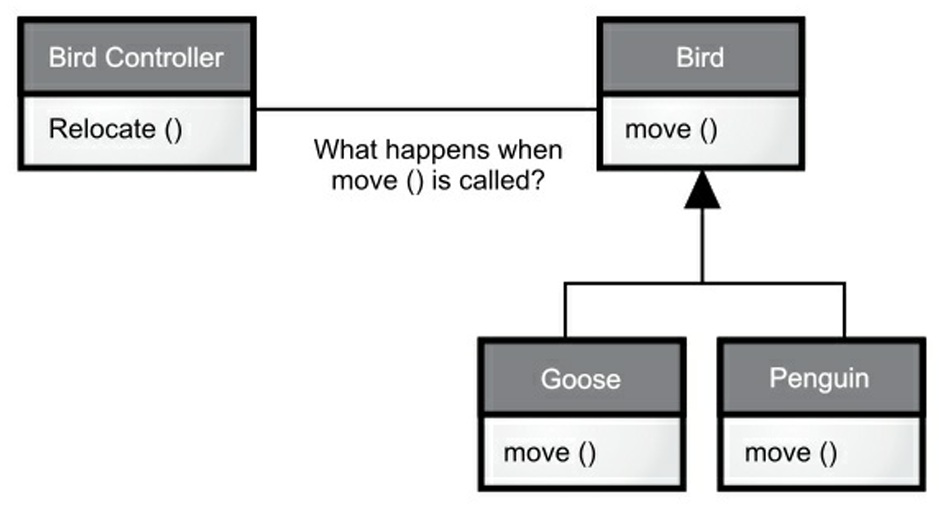

**你所使用的编程语言会将你的思维模式固化并逐渐远离其他语言, 而且往往发生在潜移默化中. Java作为一门傲娇的语言尤其如此. —— Bruce Eckel**

<!--more-->

<p><font size = 5><b>目录</b></font></p>

- [书籍基本信息](#书籍基本信息)
- [Chapter0 简介\&前言](#chapter0-简介前言)
- [Chapter1 对象的概念](#chapter1-对象的概念)
  - [抽象](#抽象)
    - [所有编程语言都提供抽象机制](#所有编程语言都提供抽象机制)
    - ["纯粹"OOP五大基本特征(Alan Kay)](#纯粹oop五大基本特征alan-kay)
    - [Grady Booch对对象的描述](#grady-booch对对象的描述)
  - [接口](#接口)
  - [服务提供](#服务提供)
  - [封装](#封装)
    - [使用访问控制的原因](#使用访问控制的原因)
    - [Java访问控制关键字](#java访问控制关键字)
  - [复用](#复用)
    - [关联关系](#关联关系)
  - [继承](#继承)
    - [区分基类与派生类](#区分基类与派生类)
    - [is-a 与 is-like-a](#is-a-与-is-like-a)
  - [多态](#多态)
  - [单继承结构](#单继承结构)
  - [容器](#容器)
    - [泛型](#泛型)
  - [对象创建与生命周期](#对象创建与生命周期)
  - [异常处理](#异常处理)
- [Chapter2 安装Java和本书用例](#chapter2-安装java和本书用例)

---

## 书籍基本信息

Bruce Eckel "最新"力作*On Java 8*, 笔者因为课程需要遂阅读本书. 可以从[**此处**](https://github.com/Knn120/OnJava8-PDF)获取电子书文件.

需要注意的是, 阅读本书需要一定的编程基础.

## Chapter0 简介&前言

> **语言决定世界观. —— 路德维希·维特根斯坦(Wittgenstein)**

- Java的最核心变化: **虚拟机** 和 **垃圾回收机制**

- 编程的过程就是复杂性管理的过程: 业务问题的复杂性, 以及依赖的计算机的复杂性.

*Thing in C* 可以在官方地址[www.OnJava8.com](www.OnJava8.com)免费下载.

示例代码可以通过官方地址[https://github.com/BruceEckel/OnJava8-examples](https://github.com/BruceEckel/OnJava8-examples)中下载.

## Chapter1 对象的概念

> **我们没有意识到惯用语言的结构有多大力量. 可以毫不夸张地说, 它通过语义反应机制奴役我们. 语言表现出来并在无意识中给我们留下深刻印象的结构会自动投射到我们周围的世界. —— Alfred Korzybski(1930)**

- 面向对象编程(Object-Oriented Programming, OOP)是一种编程思维方式和编码架构.

### 抽象

#### 所有编程语言都提供抽象机制

某种程度上, 问题的复杂度直接取决于抽象的类型和质量.

- 汇编语言是对底层机器的轻微抽象.

- "命令式"语言(FORTRAN, BASIC, C)是对汇编语言的抽象.

    > **Tips:** 命令式语言的抽象原理依然要求程序员着重考虑计算机的结构而非问题本身的结构.

程序员必须要在**机器模型(解决方案空间)** 和实际解决的**问题模型(问题空间)** 之间建立一种关联. 这个过程既费精力, 又脱离编程语言本身的范畴.

- 问题空间中的元素以及它们在解决方案空间的表示称作**对象(Object)**.

- OOP允许程序员根据问题来描述问题, 而不是根据运行解决方案的计算机.

    > **Tips:** 每个对象都类似一台小计算机, 有自己的状态并且可以进行特定的操作; 与现实中的"对象"或"物体"相似, 有自己的特征和行为.

#### "纯粹"OOP五大基本特征(Alan Kay)

- 万物皆对象.
  
- 程序是一组对象, 通过消息传递来告知彼此该做什么.

- 每个对象有自己的存储空间, 可容纳其他对象.

- 每个对象都有一种类型.

- 同一类所有对象都能接收相同信息.

    > **Tips:** 这个表述有点抽象, 结合书中的解释会有所理解.
    >
    > 由于类型为“圆”（Circle）的一个对象也属于类型为“形状”（Shape）的一个对象，所以一个圆完全能接收发送给“形状”的消息。这意味着可让程序代码统一指挥“形状”，令其自动控制所有符合“形状” 描述的对象，其中自然包括 “圆”。这一特性称为对象的“可替换性”，是OOP最重要的概念之一。

#### Grady Booch对对象的描述

- 一个对象具有自己的状态, 行为和标识. 即对象有自己的内部数据(提供状态), 方法(产生行为), 并彼此区分(每个对象[笔者注: 称之为实例instance或许更好理解]在内存中有唯一的地址).

### 接口

我们向对象发出的请求是通过它的**接口(Interface)**定义的, 对象的**类型** 或 **类** 规定了接口形式.

假设我们有一个`Class Light`, 其**统一建模语言(Unified Modeling Language, UML)** 设计图如下:



可以通过这样的方式调用:

```java
Light lt = new Light()
lt.on()
```

### 服务提供

在开发或理解程序设计时, 可以将对象看成是**服务提供者**. 程序本身为用户提供服务, 并且能通过调用其他对象提供的服务来实现.

在开发时, 可以将分体一一分解, 抽象成一组服务, 每个对象都提供了一组紧密的服务.

软件设计的基本原则是**高内聚**: 每个组件内部作用明确, 功能紧密相关.

### 封装

- 编程的侧重领域可以划分为**研发** 和 **应用**. 应用程序员调用研发程序员构建的基础工具来做快速开发.

#### 使用访问控制的原因

- 让应用程序员不要触摸他们不应该触摸的部分.

- 使类库的创建者(研发程序员)在不影响应用程序员使用的情况下完善更新工具库.

#### Java访问控制关键字

- **public**: 任何人都可以访问和使用.

- **private**: 除了类本身和类内部方法, 外界无法直接访问.

- **protected**: 允许子类访问protected成员, 但不能访问private成员.

- **default**: 包访问, 可以被同一包(组件库)中其他类的成员访问.

### 复用

- 一个类经创建和测试后, 理应是可复用的.

- 代码和设计方案的可复用性是OOP的优点之一.

#### 关联关系

- **组合(Composition)**: 表示**拥有关系(has-a relationship)**.

- **聚合(Aggregation)**: 动态的组合.

> **Tips: 组合与聚合**
>
> - 聚合关系中, 整件不会拥有部件的生命周期, 多个整件可以共享同一个部件.
>
> - 组合关系中, 整件拥有部件的生命周期, 多个整件不可以共享同一个部件.

组合/聚合的设计相较继承, 更简单灵活, 设计更清晰.

### 继承

- **基类(父类, 超类)** 包含派生自它的类型之间的共享特征和行为, 表示思想的核心.
- **派生类(子类, 继承类)** 从基类中派生以表示核心的不同方式.

**类的层次结构体现了class之间的相似性和差异性.**

#### 区分基类与派生类

- 派生类中添加新功能.

- 派生类改变基类现有方法的行为, 即**覆盖(overriding)**.

#### is-a 与 is-like-a

- **is-a**: 继承只覆盖基类的方法, 不添加基类没有的方法. 此时派生类和基类可以认为是**同一种类型**(具有完全相同的接口). 称为**纯粹替代**.

- **is-like-a**: 派生类中添加了新的接口元素, 此时基类无法访问这些新的接口元素.

> **Tips:** 此处笔者直接使用原书中的例子.
>
> 
> 
> 

### 多态

处理类的层次结构时, 通常把一个对象看成他所属的基类而不是具体类. 这样可以编写出不局限于特定类型的代码.

> 在此给出一个多态的例子:
>
> 
> `Birld Controller`在`Relocate()`时不知道也不需要知道`Bird`的具体类, 也不需要知道执行的是`Goose move()`还是`Penguin move()`.

- **早期绑定**: 非OOP编译器产生的函数调用, 其地址在程序运行前就已确定, 调用会被解析为执行代码的绝对地址.

- **后期绑定**: 被调用的代码直到运行时才确定. 编译器确保方法存在, 对参数和返回值进行类型检测.

多态的机制就是由后期绑定实现的.(在部分语言, 如C++中, 必须使用`virtual`关键字显示授予方法后期绑定属性)

**编译器和运行时系统会负责对所有细节的控制, 程序员只需要知道要做什么, 以及如何利用多态性来更好地设计程序.**

### 单继承结构

Java中所有的类都默认继承自一个基类`Object`. 与之相对的, C++允许多继承方案.

### 容器

通常我们不知道解决某个具体问题需要的对象数量和持续时间, 以及对象的存储方式. 所以我们该如何获知程序在运行时分配的内存对象?

在OOP中, 创建一个新类型的对象来引用, 容纳其他对象. Java中通常使用**容器(Collection)**.

> **Tips**: 笔者完全不知道翻译时为何要使用"集合"这个术语, 很容易与 **set** 混淆. C++中的**STL(Standard Template Library)** 亦翻译为容器, 故笔者在此统一使用容器这个表述.

使用容器的经验告诉我们, 不存在一种容器可以满足所有需求, 针对具体的问题, 需要选择能解决这个问题的容器. 需要注意的是:

- 容器可以提供不同类型的接口和外部行为.

- 不同集合对某些操作有不同的效率.

#### 泛型

Java5 之前的容器都只保存`Object`类型, 使用容器时需要对元素做"向上转型", 取出元素时需要做"向下转型". 但遗憾的是"向下转型" **IS NOT SAFE**.

Java5开始提供了**泛型(Generic)**的**参数化类型机制(Parameterized Type Mechanism)**.

```java
ArrayList<Shape> shapes = new ArrayList<>();
```

### 对象创建与生命周期

对象可以放在**栈(Stack, 自动变量/作用域变量)** 或 **静态存储域(Static Storage Area)** 静态确定; 也可以在 **堆(Heap)**上动态创建.

C++中需要程序员自己处理对象的创建与回收的一整个生命周期, 以此保证效率.

Java使用动态内存分配, 其内存管理建立在垃圾回收器机制上, 提供了更高级别的保险, 防止了潜在的内存泄漏问题.

### 异常处理

异常处理机制将程序错误直接交给编程语言甚至操作系统.

**异常(Exception)** 是一个从出错点**抛出(Thrown)** 后能被特定类型的异常处理程序**捕获(Catch)** 的一个对象.

异常机制提供了一种可靠的从错误状态中恢复的方法.

## Chapter2 安装Java和本书用例

笔者在此略去这部分内容, 有需要的读者可以查阅原书内容.