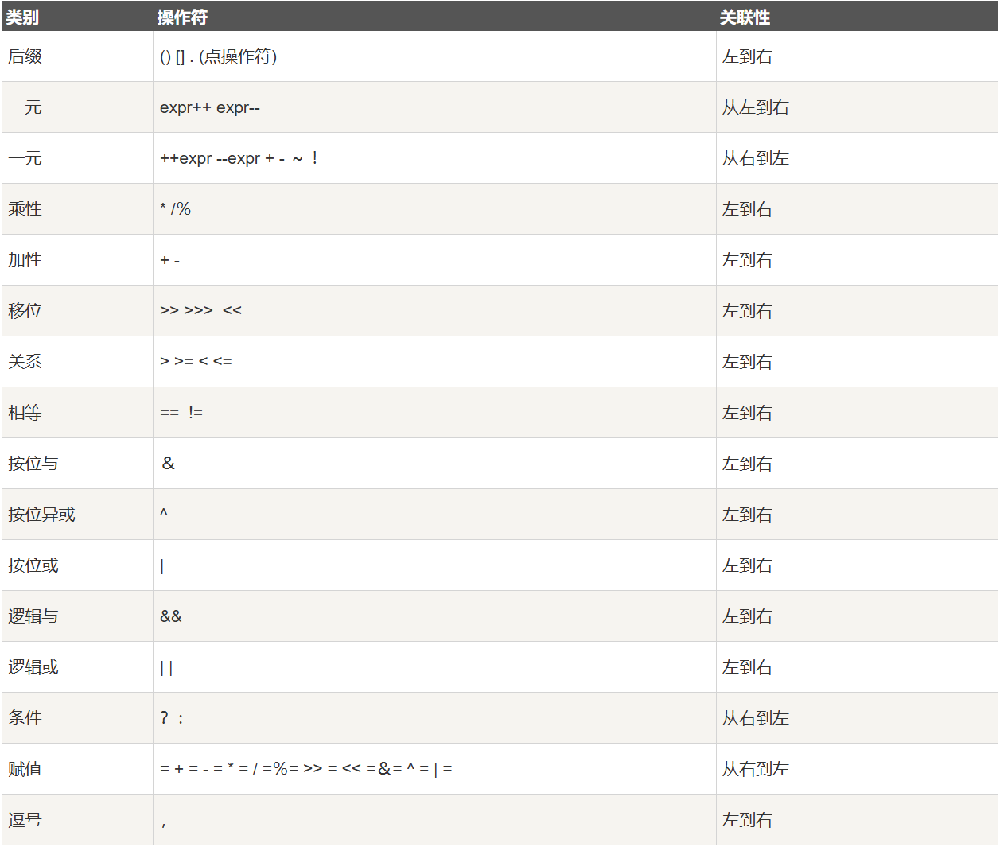

**Java语言假设程序员只进行面向对象编程, 因此Java中(几乎)万物皆对象.**

<!--more-->

<p><font size = 5><b>目录</b></font></p>

- [Chapter3 万物皆对象](#chapter3-万物皆对象)
  - [对象操纵](#对象操纵)
  - [对象创建](#对象创建)
    - [数据存储](#数据存储)
    - [基本类型存储](#基本类型存储)
    - [高精度数值](#高精度数值)
    - [数组存储](#数组存储)
  - [代码注释](#代码注释)
  - [对象清理](#对象清理)
    - [作用域](#作用域)
    - [对象作用域](#对象作用域)
  - [类的创建](#类的创建)
    - [类型](#类型)
    - [字段(Field)](#字段field)
    - [基本类型默认值](#基本类型默认值)
    - [方法使用](#方法使用)
    - [返回类型](#返回类型)
    - [参数列表](#参数列表)
  - [程序编写](#程序编写)
    - [命名可见性](#命名可见性)
    - [import](#import)
    - [static](#static)
  - [编码风格](#编码风格)
- [Chapter4 运算符](#chapter4-运算符)
  - [Beginning](#beginning)
  - [优先级\&关联性](#优先级关联性)
  - [赋值](#赋值)
  - [算术运算符](#算术运算符)
  - [自增\&自减](#自增自减)
  - [关系运算符](#关系运算符)
  - [逻辑运算符](#逻辑运算符)
    - [短路](#短路)
  - [字面值常量(Literal)](#字面值常量literal)
  - [位运算符](#位运算符)
  - [三目运算符](#三目运算符)
- [Chapter5 控制流](#chapter5-控制流)
  - [if-else](#if-else)
  - [for while do-while](#for-while-do-while)
  - [return](#return)
  - [break\&continue](#breakcontinue)
    - [标签](#标签)
  - [switch](#switch)

---

## Chapter3 万物皆对象

> **如果我们说另一种不同的语言, 我们会发觉一个不同的世界! —— Ludwig Wittgenstein(1889-1951)**

### 对象操纵

所有的编程语言都会操纵内存中的元素.

> - C/C++中对象的操纵是通过指针来完成的.
> - Java利用万物皆对象的思想和单一一致的语法方式来简化问题, 采用**引用(Reference)** 操纵对象.

### 对象创建

Java中使用**引用**关联**对象**.

通常使用关键字`new`创建对象实例.

```java
String s = new String("hello world");
```

#### 数据存储

- **寄存器(Registers)**: 最快的存储器, 位于CPU内部. 但数量有限, 且Java无法直接控制(C/C++允许开发者像编译器建议寄存器的分配).
- **栈内存(Stack)**: 位于**随机访问存储器(Random Access Memory, RAM)** 中, CPU可通过栈指针直接访问. 栈指针下移分配内存, 上移释放内存. 但栈上的数据要求提前知晓对象生存周期, 因此栈内存上只存放部分Java数据, 对象本身存储在堆内存.
- **堆内存(Heap)**: RAM区域的一种通用内存池, 存放着所有的Java对象. 相较于栈区, 堆区的使用更灵活, 但代价是分配和清理对象会比栈区更耗时.
- **常量存储(COnstant Storage)**: 通常直接放在代码中, 可考虑置于**只读存储器(Read Only Memory, ROM)**.
- **非RAM存储(Non-RAM Storage)**: 数据存在于程序之外, 包括**序列化对象**和**持久化对象**.

#### 基本类型存储

Java中使用和C/C++一样策略的基本类型数据, 存放在栈中, 其内存占用大小固定.

|基本类型|大小|最小值|最大值|包装类型|
|:---:|:---:|:---:|:---:|:---:|
|boolean|---|---|---|Boolean|
|char|16bits|$Unicode\ 0$|$Unicode\ 2^{16}-1$|Character|
|byte|8bits|$-128$|$+127$|Byte|
|short|16bits|$-2^{15}$|$+2^{15}-1$|Short|
|int|32bits|$-2^{31}$|$+2^{31}-1$|Integer|
|long|64bits|$-2^{63}$|$+2^{63}-1$|Long|
|float|32bits|$IEEE754$|$IEEE754$|Float|
|double|64bits|$IEEE754$|$IEEE754$|Double|
|void|---|---|---|Void|

在堆区表示基本类型数据, 需要使用包装类:

```java
char c = 'x';
Charactor ch = new Charactor(c);
Charactor ch = new Charactor('x');
//自动装箱
Charactor ch = 'x';
//自动开箱
char c = ch;
```

#### 高精度数值

`BigInteger` & `BigDecimal`

#### 数组存储

Java设计主要目标之一是安全性, 尽管牺牲了部分效率, 但换来了安全性.

### 代码注释

```java
/*
* 跨行注释
*/

//单行注释
```

### 对象清理

#### 作用域

C/C++和Java中的作用域由`{}`决定.

```java
{
    int x = 42;
    {
        int q = 114514;
        //x & q可用
    }
    //仅x可用
}
```

需要注意的是, 以下操作在Java中非法:

```java
{
    int x = 42;
    {
        x = 114514; //Illegal
    }
}
```

> **Tips:** 尽管作者在书中如此说明, 但在新版的Java中(笔者使用为JDK17), 该操作是允许的, 仅仅是IDE给出一个提示.

#### 对象作用域

Java中的对象与基本类型具有不同的生命周期.

```java
{
    int x;
    String s = new String("a string");
}
// 作用域终点
// x生命周期结束
// s生命周期独立作用域
```

Java的内存回收不同于C++, 采用的是垃圾收集器机制, 通过不可达的判断回收对象. 可以有效避免**内存泄漏**问题.

### 类的创建

#### 类型

Java中使用`class`关键字描述新对象.

```java
class Example{
    
}

Example example = new Example();
```

#### 字段(Field)

字段可以是基本类型或引用类型.

与C++中对应则是**成员变量**.

#### 基本类型默认值

默认值仅在Java初始化类时使用.

- 基本类型会被赋值为`0`(`boolean`为`false`).

- 但局部变量不会被赋默认值, 如果不显式指定初始化, 编译器会报错.

#### 方法使用

对应C++中的成员函数.

```java
[return type] [method name](/*args list*/){
    //method body
}
```

#### 返回类型

- **方法签名(Signature of the Method)** 是方法的唯一标识, 包括方法名和参数列表. (**返回类型不是方法签名的一部分**)

#### 参数列表

Java中参数也是通过对象的形式传递, 也就是说, 传递的是对象引用(不包括基本类型).

### 程序编写

#### 命名可见性

- C++通过**命名空间(namespace)** 解决命名冲突.

- Java为一个类库生成一个明确的名称来解决冲突. 使用反向URL关联命名空间和文件路径会导致源代码管理出现混乱, 比如说空目录问题(用于表示反向URL).

#### import

```java
import java.util.ArrayList;
import java.util.*;
```

#### static

在类中的使用与C++基本一致.

- 有时Java使用**类数据(class data)** 和**类方法(class method)** 来表示静态成员.

### 编码风格

**Java编程语言编码规范(Code Conventions for the Java Programming Language).** 采用驼峰命名法. 其中类首字母大写, 字段和方法首字母小写. 对于常量, 可采用全大写 + 下划线的命名方式.

## Chapter4 运算符

> **运算符操纵数据.**

### Beginning

- 运算符接受一个或多个参数并生成新值.

- **副作用(Side Effect):** 运算符可改变运算对象的值.

### 优先级&关联性



> **Tips:** 节选自[**[菜鸟教程|Java运算符]**](https://www.runoob.com/java/java-operators.html)

### 赋值

- `=`表示, 将右边的值赋给左边的变量.

- 基本类型的赋值是**值传递**.

- 对象的赋值是**引用传递**.

  > **Tips:** 实际上引用传递也是值传递, 只是这里传递的是**内存地址**.

> **Additional:** [**[知乎|Java 到底是值传递还是引用传递？]**](https://www.zhihu.com/question/31203609?sort=created)

### 算术运算符

- `+`, `-`, `*`, `/`, `%`

### 自增&自减

- `++`, `--`

```java
a = 1;
b == a++; //先传值后自增, b = 1
c == ++a; //先自增后传值, c = 3
```

### 关系运算符

- `>`, `<`, `==`, `>=`, `<=`, `!=`

- 接受两个操作数, 返回一个`boolean`值表示操作数之间的关系.

尽管`==`和`!=`可以比较对象, 但更推荐的方法是使用`equals()`, 需要注意的是, 自定义类型使用`equals()`需要手动**覆写(Override)**.

### 逻辑运算符

- `&&`, `||`, `!`

- 根据参数逻辑关系生成布尔值`true`, `false`.

#### 短路

当逻辑运算符运算结果确定时, 便会发生**短路(short-circuiting)**.

```java
class ShortCircuit{
  public static void main(String[] args){
    test() && test() && test()
  }
  private boolean test(){
    System.out.println("test");
    return false;
  }
}
```

上述代码执行结果只会得到一条`test`而非三条, `&&`在运算时发生了短路.

### 字面值常量(Literal)

可以指定字面值来确定常量的类型.

```java
int i1 = 0x2f; //16进制
int i2 = 0177; //8进制
long n1 = 200L; //long型
float f1 = 1f; //float
double d1 = 1d; //double
byte b = (byte)0b00110101; //2进制
```

### 位运算符

- `&`, `|`, `~`(取反), `^`(异或),`<<`, `>>`, `>>>`(按位右移补零)

### 三目运算符

- `?:` -> `variable x = (expression) ? value if true : value if false`

## Chapter5 控制流

> **程序必须在执行过程中控制它的世界并作出选择. 在Java中, 程序员需要执行控制语句来做出选择.**

Java支持的关键字包括`if-else`, `while`, `do-while`, `for`, `return`, `break`, `switch`.

需要注意的是, 所有条件语句的Expression应当是`boolean`类型.

### if-else

```java
//允许省略else
if(Boolean-Expression){
  statement
}
//最常见的形式
if(Boolean-Expression){
  statement
}
else{
  statement
}
//允许嵌套
if(Boolean-Expression){
  statement
}
else if(Boolean-Expression){
  statement
}
else{
  statement
}
```

### for while do-while

- 循环语句又称迭代语句.

```java
//while
while(Boolean-Expression){
  statement
}
//do-while
//do-while中do的内容无论while判断是否成立都会被至少执行一次.
do{
  statement
}while(Boolean-Expression)
//for
for(Initialization; Boolean-Expression; step){
  statement
}
//for允许逗号操作符, 使用示例如下
for(int i = 0, j = 0; i < 5; i++, j += i){
  statement
}
//for-in/for-each
for(Type x: Contianer){
  statement
}
for(int i : range(10)){
  statement
}
Container.forEach(
(Var1, Var2, ...) -> {statement}
);
```

### return

- 退出当前方法, 返回方法返回值.

### break&continue

- `break`与`continue`均用在循环体中.

- `break`表示跳出当前循环; `continue`表示停止本次循环, 进行下一次循环.

#### 标签

- 源于`goto`机制, 在Java中, 允许为循环体定义**label**, 并允许`break`和`continue`使用**label**.

具体规则如下:

- `continue`会回退到最内层循环开头, 并继续执行.

- `continue label`会到达标签位置, 并重新进入紧接着那个标签后的循环.

- `break`会中断当前循环, 并移离当前标签末尾.

- `break label`会中断当前循环, 并移离由那个标签指示的循环末尾.

我们来看两个例子:

```java
public class Main {
    public static void main(String[] args) {
        outerLoop:
        for (int i = 0; i < 3; i++) {
            innerLoop:
            for (int j = 0; j < 3; j++) {
                if (i == 1 && j == 1) {
                    break outerLoop; // 跳出外部循环
                }
                System.out.println("i: " + i + ", j: " + j);
            }
        }
    }
}
```

执行结果为:

```shell
i: 0, j: 0
i: 0, j: 1
i: 0, j: 2
```

```java
public class Main {
    public static void main(String[] args) {
        outerLoop:
        for (int i = 0; i < 3; i++) {
            innerLoop:
            for (int j = 0; j < 3; j++) {
                if (i == 1 && j == 1) {
                    continue outerLoop; // 跳过外部循环的当前迭代
                }
                System.out.println("i: " + i + ", j: " + j);
            }
        }
    }
}
```

执行结果为:

```shell
i: 0, j: 0
i: 0, j: 1
i: 0, j: 2
i: 1, j: 0
i: 2, j: 0
i: 2, j: 1
i: 2, j: 2
```

### switch

其基本格式如下:

```java
switch(integral-selector OR string-selector){
  case int1/string1: statement; break;
  case int2/string2: statement; break;
  case int3/string3: statement; break;
  default: statement;
}
```

在`switch`体中, `default`可以省略. 如果缺少`break`, `switch`将会发生穿透. 示例如下:

```java
public class Main {
  public static void main(String[] args) {
    int x = 2;
    switch(x){
      case 1:
        System.out.println("case 1").
        break;
      case 2:
        System.out.println("case 2").
      case 3:
        System.out.println("case 3").
      case 4:
        System.out.println("case 4").
        break;
      default:
        System.out.println("default").
    }
  }
}
```

其结果如下:

```shell
case 2
case 3
case 4
```
