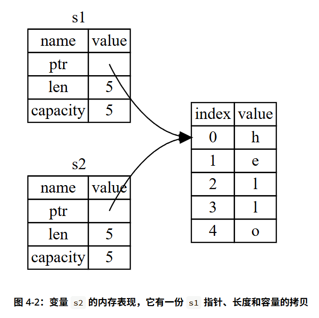
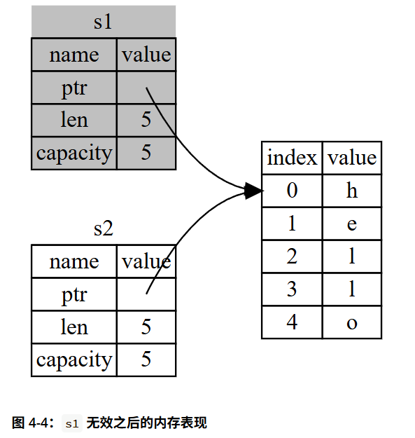
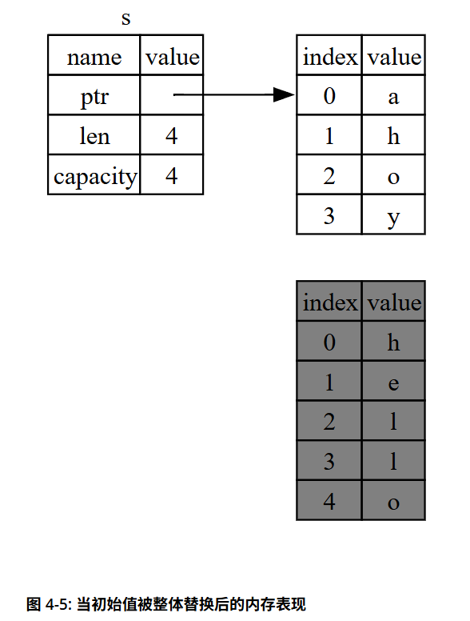
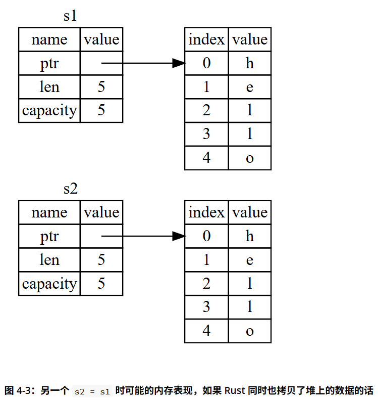
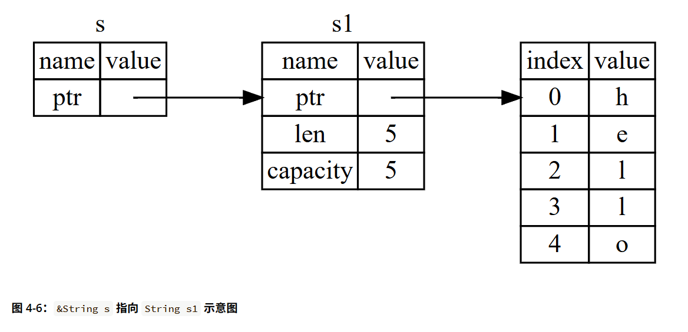
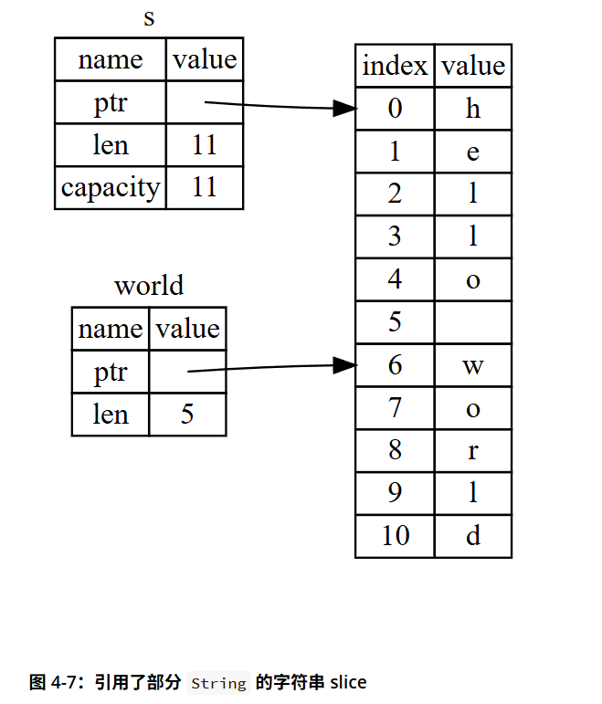

**The Rust programming language is fundamentally about empowerment.**

<!--more-->

## 书籍基本信息

英文版: <https://doc.rust-lang.org/stable/book/>

中文版: <https://kaisery.github.io/trpl-zh-cn/>

## Chapter1 Rust部署

### 安装

见原文<https://kaisery.github.io/trpl-zh-cn/ch01-01-installation.html>

笔者使用的IDE为vscode, 推荐配置rust-analyzer插件

### 使用Cargo管理Rust项目

- `cargo new [proj_name]`, 创建一个新的Rust项目
- `cargo init`, 将当前目录初始化为一个Rust项目
  - 需要注意的是, 需要手动创建src目录并转移项目文件
  - 因此更建议从一开始就采用cargo进行项目管理
- `cargo build`, 进行编译, 生成build
  - `cargo build --release`, 花费更长的时间在编译时进行优化, 适用于release版本构建
- `cargo run`, 运行可执行文件, 默认以main作为入口
- `cargo check`, 在不生成可执行文件的情况下检验代码是否可编译

## Chapter2 快速入门

跟着书中教程走即可

## Chapter3 编程概念

**关键字(Keywords):** 由语言保留使用而不允许变量或函数定义的名称, 对于Rust, 请参见[**附录A**](https://kaisery.github.io/trpl-zh-cn/appendix-01-keywords.html)

### 3.1 变量和可变性

#### 3.1.1 变量

- 使用关键字`let`声明**变量(Variable)**
- 变量默认是**不可改变的(Immutable)**
  - 直观上来说, 这样的变量不允许**二次赋值**
- 使用`mut`关键字修饰变量使其可变

```rust
let a = 5;
a = 6; //error!

let mut b = 6;
b = 7; //pass
```

#### 3.1.2 常量

- 使用关键字`const`声明**常量(Constant)**
- 常量无法被`mut`修饰
- 常量**必须**在声明时指定类型
- 常量**只能**被常量表达式赋值
  - 与常量相比, 不可变变量允许使用一个不确定值(运行前)进行赋值; 二者的共同点是均不允许二次赋值.

```rust
let HOURS_IN_SECONDS: u32 = 60 * 60;
```

> **Additional:** Rust中的常量求值
>
> <https://doc.rust-lang.org/reference/const_eval.html#constant-evaluation>

#### 3.1.3 遮蔽

**遮蔽(Shadowing):** 定义一个与之前变量同名的新变量, 在作用域范围内, 此时的变量均视为后定义的变量

```rust
fn main() {
    let x = 5;
    println!("The value of x is: {x}");
    let x = x + 1;
    println!("The value of x is: {x}");
    {
        let x = x * 2;
        println!("The value of x in the inner scope is: {x}");
    }
    println!("The value of x is: {x}");
}
-----------------------------------------------------------------
The value of x is: 5
The value of x is: 6
The value of x in the inner scope is: 12
The value of x is: 6
```

> **Compare: shadowing & mut**
>
> 遮蔽从原来上是新建了一个变量, 因此允许覆盖定义的变量类型不同; 而可变变量从始至终都是对同一个变量操作, 因此不允许赋值不同的变量类型.
>
> ```rust
> //pass
> let spaces = "   "; // Type: String
> let spaces = spaces.len(); // Type: Integer
> //error
> let mut spaces = "   ";
> let spaces = spaces.len(); // mismatched types
> ```

### 3.2 数据类型

**数据类型(Data Type):** 包括**标量(scalar)**和**复合(compound)**

> **Tips:** Rust是**静态类型(statically typed)**语言, 在编译时就必须知道所有变量的类型; 当有多种类型可能时, 需要**显式**指定变量类型.

#### 3.2.1 标量类型

包括整型, 浮点型, 布尔类型和字符类型

##### 整型

|长度|有符号|无符号|
|:---:|:---:|:---:|
|8|i8|u8|
|16|i16|u16|
|32|i32|u32|
|64|i64|u64|
|128|i128|u128|
|32/64|isize|usize|

对于`iszie`/`usize`, 在32位机器上是32位, 在64位机器上是64位

**数字字面值:**

|数字字面值|例子|
|:---:|:---:|
|Decimal|98_222(允许使用'_'作为分隔符)|
|Hex|0xff|
|Octal|0o77|
|Binary|0b1111_0000|
|Byte(仅用于u8)|b'A'|

> **Additional: Rust中的整型溢出**
>
> - debug模式下Rust面对整型溢出的情况会使程序panic
> - `--release`模式下Rust默认采用和C++相同的处理方式(补码溢出)
>
> Rust标准库提供了处理溢出的方法
>
> ```Rust
> //wrapping_*: 正常溢出
> let a: u8 = 255;
> assert_eq!(a.wrapping_add(1), 0); // a = 0
> //checked_*: 返回None
> let b: u8 = 200;
> assert_eq!(b.checked_mul(2), None); // 200*2=400 > u8::MAX(255)
> assert_eq!(b.checked_div(0), None); // 除零错误
> //overflowing_*: 返回布尔值表示是否溢出
> let (result, overflowed) = 255u8.overflowing_add(1);
> assert_eq!(result, 0);     // 环绕结果
> assert_eq!(overflowed, true); // 标记溢出
> //saturating_*: 最大/最小值处做饱和处理
> assert_eq!(255u8.saturating_add(1), 255); // 上饱和到 u8::MAX
> assert_eq!((-128i8).saturating_sub(1), -128); // 下饱和到 i8::MIN
> assert_eq!(100u8.saturating_mul(3), 255); // 300 > 255 → 255
> ```

##### 浮点型

遵循IEEE-754标准, 包括`f32`和`f64`两种类型

##### 布尔类型

包括`ture`和`false`, 允许使用`bool`关键字标识布尔类型

##### 字符类型

使用关键字`char`标识字符类型

Rust中字符类型长度为4Bytes(32bits), 表示**Unicode标量值(Unicode Scalar Value)**, 有效值为`U+0000 ~ U+D7FF, U+E000 ~ U+10FFFF`

#### 3.2.2 复合类型

包括**元组(tuple)**和**数组(array)**

##### 元组

元组的长度在声明后**不会变化**, 元组中元素类型允许不同

```rust
let tup: (i32, f64, u8) = (500, 6.4, 1);
//元组元素的访问
//方法1: 模式匹配(pattern matching)进行解构(destructure)
let (x, y, z) = tup;
println!("y: {y}");
//方法2: 索引
let five_hundred = tup.0;
let six_point_four = tup.1;
let one = tup.2;

//单元(unit): 不包含值的元组
let empty = ()
```

##### 数组

```rust
// 数组的声明
let a = [1, 2, 3, 4, 5];
let b: [i32; 5] = [1, 2, 3, 4, 5]; // 声明一个类型为i32, 长度为5的数组
let c: [3; 5]; // 等价于 let c = [3, 3, 3, 3, 3];
// 数组元素的访问
let first = a[0]; //下标从0开始
```

> **Tips:** Rust中的数组越界访问
>
> rust中面临数组的越界访问, 程序会panic而非继续执行, 这避免了某些可能会出现在c/c++中的非预期结果(例如在linux下越界访问可能会引起`segmentation fault`)

### 3.3 函数

使用关键字`fn`定义函数.

与C/C++不同, rust不关注函数定义的位置, 因此也不需要进行函数声明

```rust
fn main(){
    let ret = foo(42, 'c');
    println!("ret = {ret}")
}

fn foo(x: i32, y: char) -> i32{
    println!("x = {x}, y = {y}");
    return 5;
    // 5
    // 上述两行代码的作用完全是等价的, 但是笔者是C/C++系受众, 
    // 因此更习惯return的表达方式
}
--------------
Output
--------------
x = 42, y = c
ret = 5
```

> **Additional: 语句(Statement)和表达式(Expression)**
>
> 简单来说, 语句执行动作但无返回值, 表达式执行计算产生值
>
> 例如: `x + y`是一个表达式, 但`let z = x + y`是一个语句
>
> 在Rust中, 语句不允许作为右值出现(`let a = (let b = 3)`是非法的)

### 3.4 注释

- 用`//`标识的内容会被注释, 这与C/C++的用法是一致的
- 用`/*`和`*/`包围的内容会被注释, 同样与C/C++一致
- 用`///`标识的内容称为文档注释, 此处暂且不做展开

### 3.5 控制流

#### 3.5.1 条件控制

包括`if`, `else`, `if else`

需要注意的是, 与C/C++不同, rust的布尔表达式不会做整型到布尔类型的自动转化, 需要显式给出`number != 0`作为判断条件

```rust
if number > 0{
    println!("positive number")
} else if number == 0 {
    println!("zero")
} else {
    println!("negtive number")
}
-------
// 允许左值为表达式
if number % 2 == 0 {
    println!("even number")
} else {
    println!("odd number")
}
-------
// 允许使用if作为表达式
let condition = true;
let number = if condition { 5 } else { 6 }; // number = 5
// 需要注意的是, if表达式的所有分支必须返回相同类型的值, 否则会报错
let number = if condition { 5 } else { "6" }; //error!
```

#### 3.5.2 循环控制

```rust
------
loop
------
// 直到手动中断或执行到循环体分支中的break
loop {
    println!("again!");
}
// loop允许作为表达式返回值
let mut counter = 0;
let result = loop {
    counter += 1;
    if counter == 10 {
        break counter * 2; // 返回20
    }
};
// 标签机制
// rust提供了标签机制标识嵌套的循环, 部分替代了goto的用法
let mut count = 0;
'outer: loop {
    println!("count = {count}");
    let mut remaining = 10;
    loop {
        if remaining == 9 {
            break; // 仅跳出内层循环
        }
        if count == 2 {
            break 'outer; // 跳出外层循环
        }
        remaining -= 1;
    }
    count += 1;
}
------
while
------
while condition {
    // 循环体
}
------
for
------
let a = [10, 20, 30, 40, 50];
for element in a {
    println!("the value is: {element}");
}
for number in (0..5) { // 0..5表示0,1,2,3,4
    println!("{a[number]}");
}
```

## Chapter4 所有权

### 4.1 所有权

- **所有权(ownership):** 所有权是Rust管理内存的一组规则
  - Rust通过所有权系统管理内存, 编译器在编译时会根据一系列的规则进行检查. 如果违反了任何这些规则, 程序将不能编译
  - 在运行时, 所有权系统的任何功能都不会减慢程序的运行

> **Tips:** 想要理解所有权系统需要对基本的内存管理模型**堆(heap)**, **栈(stack)** 有所了解

#### 4.1.1 所有权规则

- Rust中的每一个值都有一个所有者(owner)
- 值在任一时刻有且只有一个所有者
- 当所有者离开作用域, 这个值将被丢弃

#### 4.1.2 作用域

- **作用域(scope):** 作用域是一个**项(item)**在程序中的有效范围

```rust
{                      // s 在这里无效，它尚未声明
    let s = "hello";   // 从此处起，s 是有效的

    // 使用 s
}                      // 此作用域已结束，s 不再有效
```

> **Tips:** Rust的作用域与C/C++一致, 笔者在此不再赘述

#### 4.1.3 所有权转移

接下来以`String`为例解释所有权的概念

```rust
{
    let s = String::from("hello"); // 从此处起, s有效

    // 使用s
}   // 此作用域已结束, s不再有效
```

> Rust提供了`drop`函数用于释放内存, 当变量离开作用域时会自动调用`drop`函数(也即`}`处)

由于String类型在堆上分配内存, 因此其行为会变得更加复杂和"有趣", 我们来看下面的例子

```rust
{
    let x = 5;
    let y = x;
}
```

> 这段代码最终会在栈上分配两个i32类型的x,y, 它们的值都是5.

```rust
{
    let s1 = String::from("hello");
    let s2 = s1;
}
```

> 如果String类型数据的行为和之前的i32类型相同, 那么我们期望其行为也是一致的, 也就是说, `y = x`时应当会拷贝一个String绑定到y上, ***但事实并非如此***
>
> 被上述"特性"坑过的读者应当反应过来了, 这就是**浅拷贝**和**深拷贝**带来的问题, 在内存中的模型如下图所示:
>
> 

接着来考虑一下Rust在离开某个作用域后会自动drop的机制, s1和s2在离开作用域时都会被释放, 但字符串"hello"会被**二次释放(double free)!**

Rust所有权可以解决这个问题, 在实际的Rust逻辑中, 当s1被赋值给s2时, s1的所有权会转移给s2, 此时s1不再有效, 如果此时试图使用s1, Rust编译器会报错

```rust
{
    let s1 = String::from("hello");
    let s2 = s1; // s1的所有权转移给s2, s1不再有效
    println!("{s1}"); //error! s1 is no longer valid
}
```

> 

#### 4.1.4 作用域与赋值

**作用域, 所有权, drop释放内存之间的关系反过来也成立**, 当给已有变量重新赋值时, 会调用drop释放原先的内存.

```rust
{
    let s = String::from("hello");
    s = String::from("ahoy"); // 这里会调用drop释放原先的内存
}
```

> 

#### 4.1.5 rust深拷贝

```rust
{
    let s1 = String::from("hello");
    let s2 = s1.clone(); // 深拷贝
}
```

> 此时代码的行为和之前的i32类型一致
>
> 

> **Additional: Copy类型**
>
> Rust中有一些类型是**Copy类型**, 这意味着这些类型的值在赋值时会被复制而不是转移所有权. 这是因为这些类型在编译时就可以知道其大小, 对其拷贝是快速且简单的. 以下是Rust中支持的Copy类型:
>
> - 所有整数类型（i32, u32, i64, u64等）
> - 布尔类型（bool）
> - 浮点数类型（f32, f64）
> - 字符类型（char）
> - 元组类型（tuple）, 只要它们的元素都是Copy类型
> - 其他实现了Copy trait的类型(Rust注解, 将在后文介绍)

#### 4.1.6 所有权与函数

- 函数参数的所有权转移

```rust
fn main() {
    let s = String::from("hello");  // s 进入作用域

    takes_ownership(s);             // s 的值移动到函数里 ...
                                    // ... 所以到这里不再有效

    //println!("{}", s);            // error! s 不再有效

    let x = 5;                      // x 进入作用域

    makes_copy(x);                  // x 应该移动函数里，
                                    // 但 i32 是 Copy 的，
    println!("{}", x);              // 所以在后面可继续使用 x

} // 这里，x 先移出了作用域，然后是 s。但因为 s 的值已被移走，没有特殊之处

fn takes_ownership(some_string: String) { // some_string 进入作用域
    println!("{some_string}");
} // 这里，some_string 移出作用域并调用 `drop` 方法。
  // 占用的内存被释放

fn makes_copy(some_integer: i32) { // some_integer 进入作用域
    println!("{some_integer}");
} // 这里，some_integer 移出作用域。没有特殊之处
```

这里的所有权转移符合之前的预期, 当 `s` 被移动到 `takes_ownership` 函数时, `s` 不再有效, 而 `x` 由于是 `Copy` 类型, 在函数调用后仍然有效.

- 函数返回值的所有权转移

```rust
fn main() {
    let s1 = gives_ownership();        // gives_ownership 将它的返回值传递给 s1

    let s2 = String::from("hello");    // s2 进入作用域

    let s3 = takes_and_gives_back(s2); // s2 被传入 takes_and_gives_back, 
                                       // 它的返回值又传递给 s3
} // 此处，s3 移出作用域并被丢弃。s2 被 move，所以无事发生
  // s1 移出作用域并被丢弃

fn gives_ownership() -> String {       // gives_ownership 将会把返回值传入
                                       // 调用它的函数

    let some_string = String::from("yours"); // some_string 进入作用域

    some_string                        // 返回 some_string 并将其移至调用函数
}

// 该函数将传入字符串并返回该值
fn takes_and_gives_back(a_string: String) -> String {
    // a_string 进入作用域

    a_string  // 返回 a_string 并移出给调用的函数
}
```

### 4.2 引用与借用

4.1节的所有权"似乎"解决了全部的问题, 但在某些情况下我们并不希望转移所有权, 比如说函数传参时: 如果我们想在执行完函数后继续使用原有变量, 就需要将参数的所有权从函数参数传回调用者. 这未免有些麻烦, 因此, Rust提出了**引用与借用**.

- **引用(Reference):** 引用像是一个指针, 允许在不获取所有权的情况下访问数据. 但与指针不同, 引用在其生命周期中保证指向某个特定类型的有效值.

- **借用(Borrowing):** 我们将创建引用的行为称之为借用. **默认情况下, 借用的变量无法进行修改**.

```rust
fn main() {
    let s1 = String::from("hello");
    let len = calculate_length(&s1); // 传入引用
    println!("The length of '{}' is {}.", s1, len);
}

fn calculate_length(s: &String) -> usize { // s 是 String 的引用
    // s.push_str(", world!"); // error! 借用的变量无法修改
    s.len()
} // 这里，s 离开了作用域。但因为它并不拥有引用值的所有权，
  // 所以什么也不会发生
```

> 注意到函数参数的类型是`&String`而不是`String`, 这意味着s1的所有权没有转移到`calculate_length`函数中, 而是通过引用传递. 这使得`s1`在函数调用后仍然有效.
>
> 

> **Additional: 解引用(dereferencing)**
>
> Rust同时支持解引用操作`*`, 暂且先留到下文介绍.

#### 4.2.1 可变引用

只读的引用显然无法满足程序员的需求, 因此Rust提供了**可变引用(mutable reference)**.

```rust
fn main() {
    let mut s = String::from("hello");

    change(&mut s);
}

fn change(some_string: &mut String) {
    some_string.push_str(", world");
}
```

**可变引用有一个很大的限制：如果你有一个对该变量的可变引用，你就不能再创建对该变量的引用**.

```rust
fn main() {
    let mut s = String::from("hello");

    let r1 = &mut s;
    let r2 = &mut s; // error! 不能同时拥有两个可变引用
    println!("{}, {}", r1, r2);
}
```

这一限制同时包括了不可变引用:

```rust
let mut s = String::from("hello");

let r1 = &s; // 没问题
let r2 = &s; // 没问题
let r3 = &mut s; // 大问题, 编译器会报错

println!("{}, {}, and {}", r1, r2, r3);
```

不过, Rust是允许同时拥有多个不可变引用的

> **Tips: 为什么要这么设计?**
>
> 这个限制的好处是可以在编译时便避免**数据竞争(data race)**.
>
> - 两个或多个指针同时访问同一数据
> - 至少有一个指针进行写操作
> - 没有数据同步机制
>
> 数据竞争会导致未定义行为，难以在运行时追踪，并且难以诊断和修复；Rust 通过拒绝编译存在数据竞争的代码来避免此问题！

作用域在可变引用上也是照常生效的, 因此下面的代码是正确的:

```rust
let mut s = String::from("hello");

{
    let r1 = &mut s;
} // r1 在这里离开了作用域，所以我们完全可以创建一个新的引用

let r2 = &mut s;
```

```rust
let mut s = String::from("hello");

let r1 = &s; // 没问题
let r2 = &s; // 没问题
println!("{r1} and {r2}");
// 此位置之后 r1 和 r2 不再使用

let r3 = &mut s; // 没问题
println!("{r3}");
```

> 不可变引用 r1 和 r2 的作用域在 println! 最后一次使用之后结束，这发生在可变引用 r3 被创建之前。因为它们的作用域没有重叠，所以代码是可以编译的。编译器可以在作用域结束之前判断不再使用的引用。

#### 4.2.2 悬垂引用

- **悬垂指针(Dangling pointer):** 悬垂指针是指向一个已经被释放或无效的内存地址的指针
  - 在C/C++中, 悬垂指针可能会导致未定义行为, 因为程序可能会尝试访问已经被释放的内存.

Rust的所有权可以在编译期间识别出**悬垂引用(Dangling reference)**, 从而避免此类问题.

```rust
fn main() {
    let reference_to_nothing = dangle();
}

fn dangle() -> &String { // dangle 返回一个字符串的引用

    let s = String::from("hello"); // s 是一个新字符串

    &s // 返回字符串 s 的引用
} // 这里 s 离开作用域并被丢弃。其内存被释放。
  // 危险！
```

正确的写法是直接将所有权转移出去

```rust
fn dangle() -> String {
    let s = String::from("hello");

    s
}
```

### 4.3 Slice

- **切片(slice)**允许引用集合中一段连续的元素序列，而不用引用整个集合. 切片并不拥有所有权

#### 4.3.1 字符串 slice

- **字符串 slice (string slice)**: 字符串slice是String中一部分值的引用

```rust
let s = String::from("hello");

let hello = &s[0...5];
let world = &s[6...11];
```

> 其示意图如下:
>
> 

slice语法允许省略

```rust
let s = String::from("hello");

let slice = &s[0..2];
let slice = &s[..2]; //省略starting_index

let len = s.len();

let slice = &s[3..len];
let slice = &s[3..]; //省略ending_index

let slice = &s[0..len];
let slice = &s[..]; //省略两个索引
```

> **Tips:** 字符串 slice range 的索引必须位于有效的 UTF-8 字符边界内，如果尝试从一个多字节字符的中间位置创建字符串 slice，则程序将会因错误而退出

现在来看一个string slice的例子:

```rust
fn main() {
    let mut s = String::from("hello world");

    let word = first_word(&s); // word是一个string slice

    s.clear(); // 错误！执行clear时尝试获取可变引用, 但此时已经有一个引用word了

    println!("the first word is: {word}");
}

fn first_word(s: &String) -> &str {
    let bytes = s.as_bytes();

    for (i, &item) in bytes.iter().enumerate() {
        if item == b' ' {
            return &s[0..i];
        }
    }

    &s[..]
}
```

定义一个获取字符串 slice 而不是 String 引用的函数使得我们的 API 更加通用并且不会丢失任何功能(`&s[..]`相当于整个字符串的切片, 等价于`&s`)

#### 4.3.2 其他类型 slice

```rust
let a = [1, 2, 3, 4, 5];

let slice = &a[1..3]; // slice的类型是 &[i32]

assert_eq!(slice, &[2, 3]);
```

## Chapter5 结构体

- **结构体(struct)**: 结构体是一个自定义数据类型，允许你包装和命名多个相关的值，从而形成一个有意义的组合

- **字段(field)**: 结构体中的每个值称为一个字段

### 5.1 结构体的定义和实例化

#### 5.1.1 结构体定义

```rust
struct User {
    active: bool,
    username: String,
    email: String,
    sign_in_count: u64,
}
```

#### 5.1.2 结构体实例化

通过为每个字段指定具体值来创建这个结构体的实例

```rust
let user1 = User {
    active: true,
    username: String::from("user1"),
    email: String::from("user1@example.com"),
    sign_in_count: 1,
};
```

#### 5.1.3 结构体字段访问

与C/C++相同, Rust访问结构体字段使用`.`

```rust
fn main() {
    let mut user1 = User { // 可变结构体实例
        active: true,
        username: String::from("someusername123"),
        email: String::from("someone@example.com"),
        sign_in_count: 1,
    };

    user1.email = String::from("anotheremail@example.com");
}
```

> **Tips:** Rust不允许单独指定结构体某个字段可变, 只有整个结构体实例可变时才能修改其中的字段.

#### 5.1.4 一些语法糖

Rust提供了部分简写语法糖方便程序员进行开发

```rust
fn build_user(email: String, username: String) -> User {
    User {
        active: true,
        username: username,
        email: email,
        sign_in_count: 1,
    }
}
```

```rust
fn build_user(email: String, username: String) -> User {
    User {
        active: true,
        username,
        email,
        sign_in_count: 1,
    }
}
```

> 当字段名和参数名相同时, 允许进行省略

```rust
fn main() {
    // --snip--

    let user2 = User {
        active: user1.active,
        username: user1.username,
        email: String::from("another@example.com"),
        sign_in_count: user1.sign_in_count,
    };
}
```

```rust
fn main() {
    // --snip--

    let user2 = User {
        email: String::from("another@example.com"),
        ..user1
    };
}
```

> 结构体更新语法允许你使用现有实例的值来创建新的实例, 可以省略无需改变的字段设置

#### 5.1.5 元组结构体

- **元组结构体(Tuple Struct)**: 元组结构体是一个没有命名字段的结构体, 其定义类似于元组

```rust
struct Color(i32, i32, i32);
struct Point(i32, i32, i32);

fn main() {
    let black = Color(0, 0, 0);
    let origin = Point(0, 0, 0);
}
```

#### 5.1.6 类单元结构体

- **类单元结构体(Class-like Unit Struct)**: 类单元结构体没有任何字段, 但仍然是一个结构体

```rust
struct AlwaysEqual;
```

> **Tips:** 类单元结构体通常用于实现特定的 trait 或作为类型标记, 关于trait请参见下文~~(为什么Rust教程总是会提到一些后续才知道的东西铺垫在前面呢)~~

> **Additional: 结构体所有权**
>
> 上述举的例子中结构体字段没有引用类型, 此时结构体拥有所有字段的所有权; 在这并不意味着结构体不能定义引用类型的字段, 而是需要**生命周期**进行标注(关于生命周期, 烦请参见下文)

### 5.2 方法语法

- **方法(method)**: 使用 fn 关键字和名称声明，可以拥有参数和返回值，同时包含在某处调用该方法时会执行的代码. 方法可以在结构体, 枚举和 trait 中定义

```rust
#[derive(Debug)] // 用于输出调试信息的trait
struct Rectangle {
    width: u32,
    height: u32,
}

impl Rectangle {
    fn area(&self) -> u32 {
        self.width * self.height
    }
    fn can_hold(&self, other: &Rectangle) -> bool {
        self.width > other.width && self.height > other.height
    }
}

fn main() {
    let rect1 = Rectangle {
        width: 30,
        height: 50,
    };

    let rect2 = Rectangle {
        width: 10,
        height: 40,
    };

    println!(
        "The area of the rectangle is {} square pixels.",
        rect1.area()
    );

    println!("Can rect1 hold rect2? {}", rect1.can_hold(&rect2));
}
```

> **Additional: 自动引用与解引用(automatic referencing and dereferencing)**
>
> Rust会在调用方法时自动添加引用或解引用, 这使得方法调用更加简洁. 例如, 当`object.something()`调用方法时, Rust 会自动为 object 添加 &、&mut 或 * 以便使 object 与方法签名匹配.
>
> ```rust
> p1.distance(&p2);
> (&p1).distance(&p2); //两者等价
> ```
>
> 这种自动引用的行为之所以有效，是因为方法有一个明确的接收者———— self 的类型。在给出接收者和方法名的前提下，Rust 可以明确地计算出方法是仅仅读取（&self），做出修改（&mut self）或者是获取所有权（self）

#### 5.2.1 关联函数

- **关联函数(Associated Function)**: 所有在 impl 块中定义的函数被称为关联函数.
  - 关联函数可以通过结构体名直接调用, 而不需要实例化结构体. `let sq = Rectangle::square(3);`

```rust
impl Rectangle {
    fn square(size: u32) -> Self {
        Self {
            width: size,
            height: size,
        }
    }
}
```

## Chapter6 枚举与模式匹配

### 6.1 枚举的定义与使用

#### 6.1.1 枚举的定义

```rust
enum IpAddrKind {
    V4,
    V6,
}
```

#### 6.1.2 枚举值

```rust
fn main() {
    let four = IpAddrKind::V4;
    let six = IpAddrKind::V6;
}
```

#### 6.1.3 枚举类型绑定值

Rust中枚举类型允许绑定值

```rust
enum IpAddr {
    V4(u8, u8, u8, u8),
    V6(String),
}

let home = IpAddr::V4(127, 0, 0, 1);

let loopback = IpAddr::V6(String::from("::1"));
```

```rust
struct Ipv4Addr {
    // --snip--
}

struct Ipv6Addr {
    // --snip--
}

enum IpAddr {
    V4(Ipv4Addr),
    V6(Ipv6Addr),
}
```

```rust
enum Message {
    Quit,
    Move { x: i32, y: i32 },
    Write(String),
    ChangeColor(i32, i32, i32),
}

impl Message {
    fn call(&self) {
        // 在这里定义方法体
    }
}
```

#### Option

Option是一个枚举类型, 用于表示一个值可能存在也可能不存在. 它有两个变体: Some 和 None.

```rust
enum Option<T> { // <T>表示泛型, 可以是任意类型
    Some(T),
    None,
}
```

其中前缀`Option::`可以省略, 例如

```rust
    let some_number = Some(5);
    let some_char = Some('e');

    let absent_number: Option<i32> = None;
```

需要注意的是`T`和`Option<T>`并不是同一个类型, `Option<T>`是一个包含`Some(T)`或`None`的枚举类型, 而`T`是一个具体的类型. 因此当期望对`Option<T>`进行处理时, 需要转化为`T`, 从而一定程度上规避了空值造成的异常.

### 6.2 match

match类似C/C++的switch语句, 但功能更强大, 可以匹配任意类型的值, 并且可以进行模式匹配.

```rust
enum Coin {
    Penny,
    Nickel,
    Dime,
    Quarter,
}

fn value_in_cents(coin: Coin) -> u8 {
    match coin {
        Coin::Penny => {
            println!("Lucky penny!");
            1
        }
        Coin::Nickel => 5,
        Coin::Dime => 10,
        Coin::Quarter => 25,
    }
}
```

#### 6.2.1 绑定值的模式

```rust
#[derive(Debug)] // 这样可以立刻看到州的名称
enum UsState {
    Alabama,
    Alaska,
    // --snip--
}

enum Coin {
    Penny,
    Nickel,
    Dime,
    Quarter(UsState),
}

fn value_in_cents(coin: Coin) -> u8 {
    match coin {
        Coin::Penny => 1,
        Coin::Nickel => 5,
        Coin::Dime => 10,
        Coin::Quarter(state) => {
            println!("State quarter from {state:?}!");
            25
        }
    }
}
```

#### 6.2.2 Option的匹配

```rust
fn plus_one(x: Option<i32>) -> Option<i32> {
    match x {
        None => None,
        Some(i) => Some(i + 1),
    }
}

let five = Some(5);
let six = plus_one(five);
let none = plus_one(None);
```

> **Tips: 匹配是穷尽的(exhaustive)** 
>
> 如果在上述代码中漏写了None的匹配, 编译器会报错

#### 6.2.3 通配模式和_占位符

```rust
let dice_roll = 9;
match dice_roll {
    3 => add_fancy_hat(),
    7 => remove_fancy_hat(),
    other => move_player(other), // 通配模式
}

fn add_fancy_hat() {}
fn remove_fancy_hat() {}
fn move_player(num_spaces: u8) {}
```

```rust
    let dice_roll = 9;
    match dice_roll {
        3 => add_fancy_hat(),
        7 => remove_fancy_hat(),
        _ => reroll(), // 占位符
        // _ => {} // 也可以什么都不做
    }

    fn add_fancy_hat() {}
    fn remove_fancy_hat() {}
    fn reroll() {}
```

### 6.3 if let 和 let else简洁控制流

使用模式匹配时需要匹配全部情况

```rust
let config_max = Some(3u8);
match config_max {
    Some(max) => println!("The maximum is configured to be {max}"),
    _ => (),
}
```

`if let`可以简化控制流代码

```rust
let mut count = 0;
if let Coin::Quarter(state) = coin {
    println!("State quarter from {state:?}!");
} else { // else是可选的
    count += 1;
}
```

但有时if-else的情况也会十分恼人

```rust
fn describe_state_quarter(coin: Coin) -> Option<String> {
    let state = if let Coin::Quarter(state) = coin {
        state
    } else {
        return None;
    };

    if state.existed_in(1900) {
        Some(format!("{state:?} is pretty old, for America!"))
    } else {
        Some(format!("{state:?} is relatively new."))
    }
}
```

Rust提供了 `let...else`用于简化

```rust
fn describe_state_quarter(coin: Coin) -> Option<String> {
    let Coin::Quarter(state) = coin else {
        return None;
    };

    if state.existed_in(1900) {
        Some(format!("{state:?} is pretty old, for America!"))
    } else {
        Some(format!("{state:?} is relatively new."))
    }
}
```