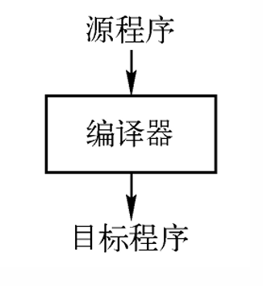
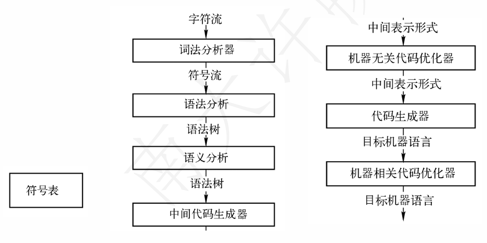
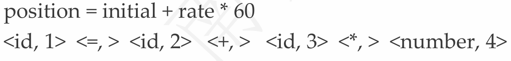
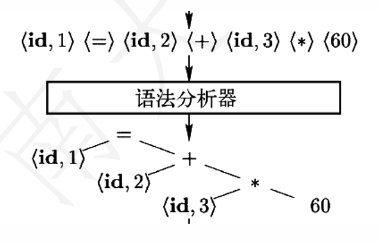
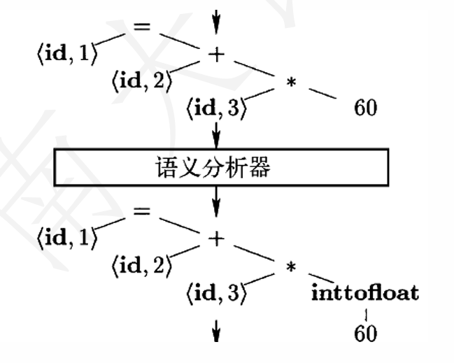
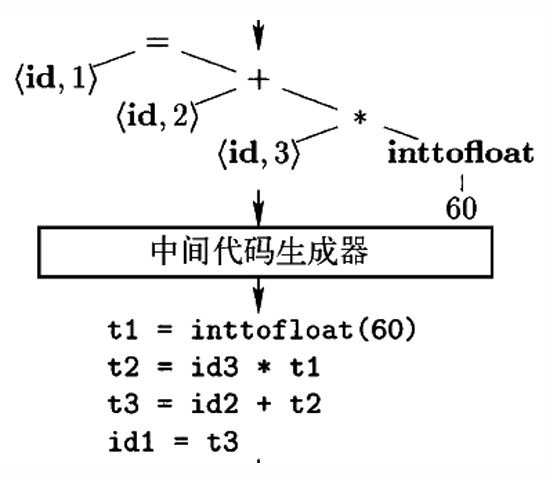
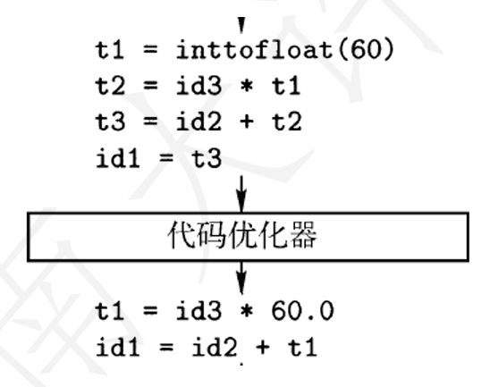
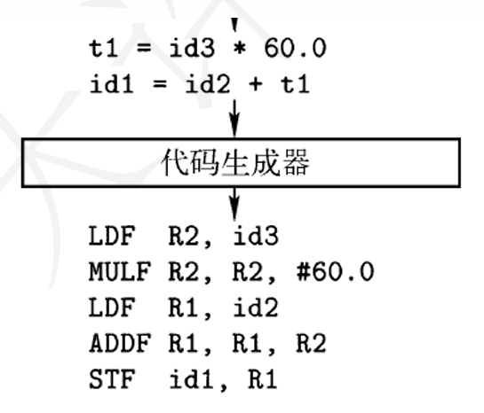
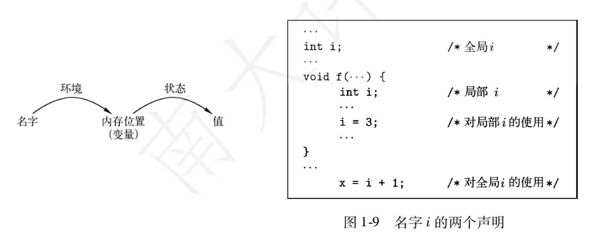

**NJU-CourseNote: Principles and Techniques of Compilers - Ch01 Introduction.**

<!--more-->

## 课程信息

NJU许畅老师([主页](https://cs.nju.edu.cn/changxu))开设的编译原理课程(**Principles and Techniques of Compilers**).

**参考教材:**

《编译原理》(龙书),《编译方法、技术与实践》/《编译原理实践与指导教程》

### 课程内容

- [**Ch1 引论**](https://la-pluma.github.io/Course-Compiler-1)
- [**Ch3 词法分析**](https://la-pluma.github.io/Course-Compiler-3)
- [**Ch4 语法分析**](https://la-pluma.github.io/Course-Compiler-4)
- [**Ch5 语法制导的编译技术**](https://la-pluma.github.io/Course-Compiler-5)
- [**Ch6 中间代码生成**](https://la-pluma.github.io/Course-Compiler-6)
- [**Ch7 运行时刻环境**](https://la-pluma.github.io/Course-Compiler-7)
- [**Ch8 代码生成**](https://la-pluma.github.io/Course-Compiler-8)
- **Ch9 机器无关优化**

### 实验内容

因为笔者自身能力有限, 故而不卖弄浅薄的理解, 本课程暂无设置实验记录的想法.

> Tips: 在将来可能会公开一份参考实现, 但实现本身并不优秀且得分并不理想

## 引论

### 编译器(Compiler) & 解释器(Interpreter)

- **编译器**
    - 读入以某种语言(源语言) 编写的程序
    - 输出等价的用另一种语言(目标语言) 编写的程序
    - 通常目标程序是可执行的

- **解释器**
    - 直接利用用户提供的输入，执行源程序中指定的操作
    - 不生成目标程序，而是根据源程序的语义直接运行
    - Java语言的处理结合了编译和解释

### 编译器的结构

编译器可以分为**分析**和**综合**两部分.

- **分析(Analysis)/前端(front end)**
    - 把源程序分解成组成要素，以及相应的语法结构
    - 使用这个结构创建源程序的中间表示
    - 同时收集和源程序相关的信息，存放到符号表

- **综合(Synthesis)/后端(back end)**
    - 根据中间表示和符号表信息构造目标程序

> **其中前端部分是机器无关的，后端部分是机器相关的**

编译器执行步骤(phase)

### 词法分析

- **词法分析/扫描(lexical analysis/scanning)**
    - 读入源程序的字符流，输出为有意义的词素(lexeme)
    - 格式: `<token-name, attribute-value>`
    - token-name由语法分析步骤使用
    - attribute-value指向相应的符号表条目，由语义分析/代码生成步骤使用

    > **Example:**
    > 

### 语法分析

- **语法分析/解析(syntax analysis/parsing)**
    - 根据各个词法单元的第一个分量来创建树型的中间表示形式，通常是**语法树(syntax tree)**
    - 中间表示形式指出了词法单元流的语法结构
    - 

### 语义分析

- **语义分析(semantic analysis)**
    - 使用语法树和符号表中的信息，检查源程序是否满足语言定义的语义约束
    - 同时收集类型信息，用于代码生成、类型检查、类型转换
    - 

### 中间代码生成

根据语义分析输出，生成类机器语言的中间表示

- **三地址代码(three-address code)**
    - 每个指令最多包含三个运算分量
    - Example: `t1 = inttofloat(60); t2 = id3 * t1; t3 = id2 + t2;`
    - 很容易生成机器语言指令
    - 

### 中间代码优化

通过对中间代码的分析，改进中间代码的质量(更快、更短、能耗更低)

### 代码生成

把中间表示形式映射到目标语言(寄存器分配与指令选择)

### 语言与编译器的关系

- 程序设计语言的新发展向编译器设计者提出新的要求
  - 设计相应的算法和表示方法来翻译和支持新的语言特征，如多态、动态绑定、类、类属(模板) 、…
- 通过降低高级语言的执行开销，推动这些高级语言的使用
- 编译器设计者还需要更好地利用新硬件的能力
  - RISC技术、多核技术、大规模并行技术

### 程序设计语言的基础概念

#### 动态&静态

- **静态:** 支持编译器静态决定某个问题
- **动态:** 只允许在程序运行时刻作出决定

#### 作用域

x的作用域指程序文本的一个区域，其中对x的使用都指向这个声明

- **静态作用域(static scope):** 通过静态阅读程序可决定
- **动态作用域(dynamic scope):** 运行时确定x的指向

#### 环境&状态

- **环境(environment):** 是从名字到存储位置的映射
- **状态(state):** 从存储位置到它们值的映射

