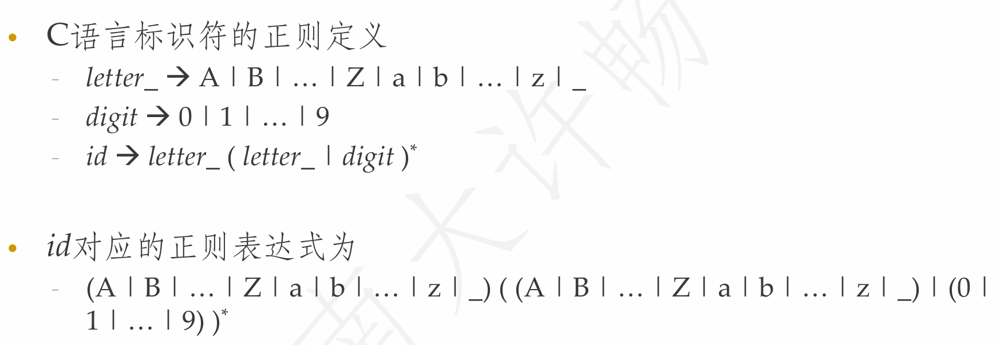

**NJU-CourseNote: Principles and Techniques of Compilers - Ch03 Lexical Analysis**

<!--more-->

## 词法分析器的作用

- 读入字符流，组成词素，输出**词法单元**序列
- 过滤空白、换行、制表符、注释等
- 将词素添加到符号表中
- 在逻辑上独立于语法分析，但是通常和语法分析器处于同一趟(pass)中

### 独立词法分析器设置原因

- 简化编译器的设计
  - 词法分析器可以首先完成一些简单的处理工作
- 提高编译器效率
  - 相对于语法分析，词法分析过程简单，可高效实现(**下推自动机PDA**&**有穷自动机DFA**)
- 增强编译器的可移植性

## 名词定义&符号规约

> **Tips:** 该部分涉及大量**形式语言与自动机(FLA)**的内容, 笔者在此给出一个参考笔记[**[崔家才|形式语言与自动机]**](https://fla.cuijiacai.com/)

### 名词定义

- **词法单元(token)**
  - `<词法单元名, 属性值(可选) >`
  - 单元名是表示词法单位种类的抽象符号，语法分析器通过单元名即可确定词法单元序列的结构
  - 属性值通常用于语义分析之后的阶段
- **模式(pattern)**
  - 描述了一类词法单元的词素可能具有的形式
- **词素(lexeme)**
  - 源程序中的字符序列
  - 它和某个词法单元的模式匹配，被词法分析器识别为该词法单元的实例

> **Additional:**
>
> 
>
> 上面的定义稍显晦涩, 不妨结合例子来看.
>
> 不恰当的比喻来说, 词法单元是**类型名**, 模式是**类型特征**, 词素是**具体实例**. 即`猫 : 头顶有耳朵, 有尾巴的四足覆毛生物(非严谨) : 布偶猫`.

#### 词法单元的属性

- 一个模式匹配多个词素时，必须通过属性来传递附加的信息
  - 属性值将被用于语义分析、代码生成等阶段
- 不同的目的需要不同的属性
  - 属性值通常是一个结构化数据
- 如词法单元id的属性
  - 词素、类型、第一次出现的位置

### 符号规约

> **Tips:** 由于本部分内容基本已在FLA中学习过, 故此处笔者仅作最基本的符号规约和定义陈述.

#### 串(string)和语言(language)

- **字母表(Alphabet):** 一个有穷的符号集合$\Sigma$
- **串(String):** 字母表中符号的有穷序列$s$
  - $|s|$, 串长
  - $\epsilon$, 空串
- **语言(language):** 是某个给定字母表上的串的可数集合
- **前缀(prefix)/后缀(suffix):** 从串的尾部/头部删除0个或多个符号后得到的串
- **子串(substring):** 删除串的某个前缀和某个后缀得到的串
- **子序列:** 从原串中删除0个或者多个符号后得到的串
- **真前缀, 真后缀, 真子串:** 既不等于原串, 也不等于空串的前缀, 后缀, 子串
- **串的运算**

    > 
    >
    > 其中$\lambda$和$\epsilon$均表示空串

- **字母表的运算**

    > 

- **语言的运算**

    > 

#### 正则表达式(RE)

**归纳奠基:**

- $\epsilon$是一个正则表达式, $L(\epsilon) = \{\epsilon\}$
- 如果$a$是$\Sigma$上的一个符号，那么$a$是正则表达式, $L(a) = \{a\}$

**归纳递推:**

- **选择(或):** $r|s, L(r|s)=L(r)\cup L(s)$
- **连接(拼接):** $rs, L(rs)=L(r)L(s)$
- **闭包:** $r^*, L(r^*)=L^*(r)$

> **正则表达式的扩展运算:**
>
> 

#### DFA&NFA

详见[**崔家才|有穷自动机**](https://fla.cuijiacai.com/02-fa/)

内容包括

- DFA&NFA的定义
- DFA<->NFA的转化
- DFA最小化算法
  - [**知乎|Hopcroft 算法**](https://zhuanlan.zhihu.com/p/31166841)

### 词法单元的规约

**正则表达式**可以高效、简洁地描述处理词法单元时用到的模式类型

> **Example:**
>
> 

### 词法单元的识别

- 词法分析器要求能够检查输入字符串，在其前缀中找出和某个模式匹配的词素
- 首先通过正则定义来描述各种词法单元的模式
- 定义$ws \rightarrow(blank | tab | newline)^+$来消除空白
  - 当词法分析器识别出这个模式时，不返回词法单元，继续识别其它模式

#### 状态转移图(transition diagram)

词法分析器最重要的组件之一.

- **状态(state):** 表示在识别词素时可能出现的情况
  - 状态看作是已处理部分的总结
  - 某些状态为接受状态或最终状态，表明已找到词素
  - 加上*的接受状态表示最后读入的符号不在词素中
  - 开始状态(初始状态)：用Start边表示
- **边(edge):** 从一个状态指向另一个状态.
  - 边的标号是一个或多个符号
  - 当前状态为s，下一个输入符号为a，就沿着从s离开，标号为a的边到达下一个状态

> **Example:**
>
> 

### 词法分析器的体系结构

- 从转换图构造词法分析器的方法
  - 变量state记录当前状态
  - 一个switch语句根据state的值转到相应的代码
  - 每个状态对应于一段代码
    - 这段代码根据读入的符号，确定下一个状态
    - 如果找不到相应的边，则调用`fail()`进行错误恢复
  - 进入某个接受状态时，返回相应的词法单元
    - 注意状态有*标记时，需要回退forward指针
- 实际是模拟转换图的运行

#### 处理多个模式的方法

- 按照优先级，顺序地尝试各个状态转换图，如果引发`fail()`，回退并尝试下一个状态图
- 更好的方法：并行地运行各个状态转换图；通过greedy策略，识别最长的与某个模式匹配的输入前缀
- 实际使用的方法：预先把各个状态转换图合成一个状态转换图，然后运行这个状态转换图

### 词法分析工具Lex/Flex

#### Lex源程序的结构

- **声明部分**
  - 常量：表示常数的标识符
  - 正则定义
- **转换规则:** `模式{ 动作 }`
  - 模式是正则表达式
  - 动作表示识别到相应模式时应采取的处理方式
  - 处理方式通常用是C语言代码表示
- **辅助函数**
  - 各个动作中使用的函数

> 例子详见ppt: [**传送链接**](https://cs.nju.edu.cn/changxu/2_compiler/slides/Chapter_3.pdf#page=35)

#### 词法分析器的工作方式

- Lex生成的词法分析器作为一个函数被调用
- 在每次调用过程中，不断读入余下的输入符号
- 发现最长的、与某个模式匹配的输入前缀时
  - 调用相应的动作，该动作进行相关处理
  - 之后词法分析器继续寻找其它词素

#### Lex中的冲突解决方法

