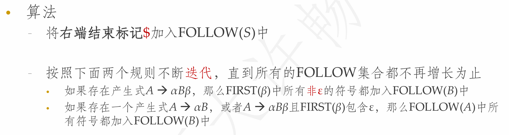

**NJU-CourseNote: Principles and Techniques of Compilers - Ch04 Syntax Analysis.**

<!--more-->

## 前言

**笔者注:** 语法分析部分的内容实在是过于繁杂和细碎, 以至于不知道该如何进行笔记整理, 暂且归纳出如下的版本.

> **Tips:** ~~你这做的是笔记吗, 我都懒得喷你, 什么ppt高级截图手()~~

## 语法分析器的作用

- 从词法分析器获得词法单元的序列，确认该序列是否可以由语言的文法生成
- 对于语法错误的程序，报告错误信息
- 对于语法正确的程序，生成**语法分析树**(简称语法树)

## 语法分析器的分类

- 通用语法分析器
  - 可以对任意文法进行语法分析
  - 效率很低，不适合用于编译器
- **自顶向下**语法分析器(通常用于处理LL文法)
  - 从语法分析树的根部开始构造语法分析树
- **自底向上**语法分析器(通常用于处理LR文法)
  - 从语法分析树的叶子开始构造语法分析树

    > **Tips:**
    > 自顶向下和自底向上总是从左到右、逐个扫描词法单元，只能处理特定类型的文法，但足以描述程序设计语言

## 程序设计语言构造的描述

- 程序设计语言构造的语法可使用**上下文无关文法(CFG)**或**BNF表示
法**来描述
  - 文法可给出精确易懂的语法规则
  - 可以自动构造出某些类型的文法的语法分析器
  - 文法指出了语言的结构，有助于进一步的语义处理/代码生成
  - 支持语言的演化和迭代

## 名词定义&符号规约

与词法分析一致, 语法分析部分也涉及大量的自动机理论知识, 主要是**下推自动机PDA**和**上下文无关文法CFG**.

**参考链接:** [**[崔家才|形式语言与自动机]**](https://fla.cuijiacai.com/)

### 上下文无关文法

- **最左/最右推导(leftmost/rightmost derivation):** $\alpha/\beta$是由终结符构成的字符串.
  - 符号: $\Rightarrow^*_{lm}/ \Rightarrow^*_{rm}$
- **句型(sentential form):** 若$S \Rightarrow^* \alpha$, 称$\alpha$是文法$S$的句型.
  - 可能既包含非终结符号，又包含终结符号，也可以是空串
- **句子(sentence):** 文法的句子就是不包含非终结符号的句型
- **语言(language):** 文法$G$的语言就是$G$的句子的集合，记为$L(G)$
  - $\omega$在$L(G)$中当且仅当$\omega$是$G$的句子，即$S \Rightarrow^* \omega$

### 下推自动机

### 语法分析树(解析树)

- 推导的图形表示形式
  - 根结点的标号是文法的开始符号
  - 每个叶子结点的标号是非终结符号、终结符号或$\epsilon$
  - 每个内部结点的标号是非终结符号
  - 每个内部结点表示某个产生式的一次应用
    - 结点的标号为产生式头，其子结点从左到右是产生式的体
- 树的叶子组成的序列是根的文法符号的一个句型
- 一棵语法分析树可对应多个推导序列
  - 但只有唯一的最左推导及最右推导

#### 从推导序列构造分析树

#### 二义性

- **二义性(ambiguity):** 如果一个文法可以为某个句子生成多棵语法分
析树，这个文法就是二义的
  - 二义性是**文法**的性质, 而非句型的缘故.

> 程序设计语言的文法通常是无二义的, 因此需要消除这种二义性.

## 设计文法

- **文法能够描述程序设计语言的大部分语法**
  - 但有特例，比如，标识符的先声明后使用则无法用上下文无关文法描述
  - 因此语法分析器接受的语言是程序设计语言的超集；必须通过语义分析来剔除一些符合文法、但不合法的程序

- **在进行高效的语法分析之前，需要对文法做以下处理**
  - 消除二义性
  - 消除左递归
  - 提取左公因子

### 二义性消除

- 一些二义性文法可被改成等价的无二义性的文法
- 二义性的消除方法没有规律可循, 只能具体情况具体分析
- 尽管如此, 仍然可以寻得部分"共性"
  - 

> **Example:** if-then
>
> 
>
> 

### 左递归消除

- **左递归:** 文法中一个非终结符号$A$使得对某个串$\alpha$, 存在一个推导$A \rightarrow^* A\alpha$, 则称这个文法是左递归的

- **立即左递归:** 文法中存在一个形如$A \rightarrow A\alpha$的产生式

- **多步左递归:** 形如$S \rightarrow A, A \rightarrow S|a$的文法, 有$S \Rightarrow^* Sa$

- 自顶向下的语法分析技术不能处理左递归的情况，因此需要消除左
递归，但是自底向上的技术可以处理左递归

#### 直接左递归消除

> **Additional:**
>
> 举一个例子就知道为什么可以这么转化了.
>
> $A \rightarrow A\alpha | \beta$
>
> 对于上述文法, 可以有$A \Rightarrow^* \beta, \beta\alpha, \beta\alpha\alpha...$
>
> 不难注意到由上述文法产生的句型, 开头一定是$\beta$ ($A$为非终结符), 那么就可以稍微修改变为"右递归": $A \rightarrow \beta A', A' \rightarrow \alpha A' | \epsilon$

#### 通用左递归消除

> **Example:**
>
> 

### 提取公因子

#### 预测分析法

- 试图从开始符号推导出输入符号串
- 每次为最左边的非终结符号选择适当的产生式
  - 通过查看**下一个输入符号**来选择这个产生式
  - 有多个可能的产生式时则无能为力
- 当两个产生式具有相同前缀时无法预测
  - 因此需要提取左公因子

> **Tips:** 此处仅作最基本释义, 具体实现参见下文内容.

#### 提取公因子的文法变换

> **Example:**
>
> 

## 自顶向下的语法分析

- **为输入串构造语法分析树**
  - 从分析树的根节点开始, 按照先后次序, 深度优先创建各个节点
  - 对应于**最左推导**
- **基本步骤(预测分析法)**
  - 确定对句型中最左边的非终结符应用哪个生产式
  - 然后确定该生产式与输入符号进行匹配
- **关键问题**
  - 确定对最左边的非终结符应用哪个生产式

> **Example:**
>
> 

### 递归下降的语法分析

- 每个非终结符对应一个过程, 该过程负责扫描此非终结符对应的结构
- 程序执行从开始符号对应的过程开始
- 算法框架:
  - 

#### 递归下降的回溯

- 如果没有足够的信息来唯一确定可能的产生式，那么分析过程就产生回溯
- 回溯需要来回扫描，甚至撤销已完成的语义动作

> **Example:**
>
> 文法G: $S \rightarrow cAd, A \rightarrow ab|a$
>
> input: $cad$
>
> - **step1:** $S$选择唯一的生产式$cAd$
> - **step2:** $A$选择$ab$, 但$b$与$d$不匹配, 发生**回溯**
> - **step3:** $A$选择$a$, 成功匹配
> - **conclusion:** $cad \in L(G)$

##### 如何避免回溯?

- 在自顶向下的分析技术中，使用向前看几个符号来确定产生式(通常只看一个符号)
- 当前句型是$xA\beta$，而输入是$xa...$，那么选择产生式$A \rightarrow \alpha$的必要条件是下列之一
  - $\alpha \Rightarrow ^* a...$
  - $\alpha \Rightarrow ^* \epsilon$, 且$\beta$以$a$开头
- 若上述选择是唯一的, 则可以避免回溯的过程

### 基于LL(1)文法的递归下降

由于递归下降法回溯的性能开销问题, 使得该技术并不实用.

接下来介绍可以消除回溯的基于LL(1)文法的优化.

#### 什么是LL(k)

- **L:** left-to-right, 从左到右扫描
- **L:** left-most, 最左推导
- **k:** 向前看k个符号

> **LL(1): 每次为最左边的非终结符号选择产生式时，向前看1个输入符号，预测要使用的产生式**

#### FIRST & FOLLOW

为了简化表述, 我们按如下方式定义FIRST, FOLLOW.

##### FIRST的计算

> **Tips:** ppt上写的比较拗口, 其实就是FIRST的定义

##### FOLLOW的计算

> **Tips:** 为什么第二条规则是对的?
>
> 现考虑$S \rightarrow Aa,\ A \rightarrow \alpha B,\ B \rightarrow b$
>
> 易见有$FOLLOW(A) = \{\$, a\}$
>
> 那么对于$S \rightarrow Aa$, 有$S \Rightarrow \alpha Ba$, 即作为$A$可能的产生式的末尾非终结符$B$, $B$可以共享$A$的$FOLLOW(A)$

> **Example:**
>
> **文法**
>
> - $E \rightarrow TE'$
> - $E' \rightarrow +TE'|\epsilon$
> - $T \rightarrow FT'$
> - $T' \rightarrow *FT'|\epsilon$
> - $F \rightarrow (E) | id$
>
> **FIRST**
>
> - $FIRST(F) = \{ (, id \}$
> - $FIRST(T) = FIRST(F) = \{ (, id \}$
> - $FIRST(E) = FIRST(T) = \{ (, id \}$
> - $FIRST(E') = \{ +, \epsilon \}$
> - $FIRST(T') = \{ *, \epsilon \}$
>
> **FOLLOW**
> 
> - $FOLLOW(E) = \{ \$, ) \} \quad \text{(since E is the starting symbol)}$
> - $FOLLOW(E') = \{ \$, ) \} \quad \text{(since } E \to TE' \text{)}$
> - $FOLLOW(T) = \{ +, \$, ) \} \quad \text{(since } E' \to +TE' \text{)}$
> - $FOLLOW(T') = \{ +, \$, ) \} \quad \text{(since } T \to FT' \text{)}$
> - $FOLLOW(F) = \{ *, +, \$, ) \} \quad \text{(since } T \to FT' \text{)}$

#### LL(1)文法

- **定义:** 对文法的任意两个产生式$A \rightarrow \alpha| \beta$
  - 不存在终结符号$a$使得$\alpha$和$\beta$都可推导出以$a$开头的串
  - $\alpha$和$\beta$最多只有一个可推导出空串
  - 如果$\beta$可推导出空串，那么$\alpha$不能推导出以$FOLLOW(A)$中任何终结符号开头的串

- **形式化定义为**
  - $FIRST(\alpha) \cap FIRST(\beta) = \emptyset$
  - $\text{if}\ \epsilon \in FIRST(\beta), \text{then}\ FIRST(\alpha) \cap FOLLOW(A) = \emptyset$
  - $\text{if}\ \epsilon \in FIRST(\alpha), \text{then}\ FIRST(\beta) \cap FOLLOW(A) = \emptyset$

> **Additional: 为什么需要条件三?**
>
> 不妨考虑$a \in FOLLOW(A), \alpha \Rightarrow^* aw, \beta \Rightarrow^* \epsilon$
>
> 向前看到下一个字符是$a$, 此时考虑$A$的产生式应选择$\alpha$或$\beta$
>
> 于是发生了冲突, 因为无论选择$\alpha$还是$\beta$都可能推导出$a$(选择$\beta$时将产生$a$的任务交给了下一个非终结符)

#### LL(1)文法的递归下降分析

- 递归下降语法分析程序由一组过程组成
- 每个非终结符号对应于一个过程，该过程负责扫描该非终结符号对应的结构
- 可以使用当前的输入符号来**唯一**地选择产生式

#### 预测分析表

FIRST和FOLLOW的定义并不适合计算机的查询操作, 因此为了便于计算机的程序实现, 需要根据FIRST和FOLLOW构建预测分析表.

- 输入: 文法G
- 输出: 预测分析表M
- 方法:
  - 对于文法G的每一个生产式$A \rightarrow \alpha$
    - 对于$FIRST(\alpha)$中的每个终结符$a$, 将$A \rightarrow \alpha$添加进`M[A, a]`
    - 若$\epsilon \in FIRST(\alpha)$, 对于$\forall b \in FOLLOW(A)$, 将 $A \rightarrow \alpha$ 添加进`M[A, b]`
  - 上述过程结束后在剩余条目中填入`Error`

> **Example:**
>
> 

##### 预测分析表的冲突

如果预测分析表中某个条目包含大于一个生产式, 则称发生了冲突.

> **这种冲突是由文法本身引起的, 因此这个文法是二义的. 可以证明, LL(1)文法构造的预测分析表不存在冲突.**

### 非递归的预测分析

基于LL(1)文法可以消除递归下降的回溯问题, 至此, 预测分析法不再依赖于回溯, 因此也就没有必要进行递归.

我们先来看看自顶向下的预测分析法中需要干什么:

- 匹配掉句型中左边的所有终结符号
- 对于最左边的非终结符号，选择适当的产生式展开
- 匹配成功的终结符号不会再被考虑，因此只需要记住句型的余下部分，以及尚未匹配的输入终结符号串
- 由于展开的动作总是发生在余下部分的左端，我们可以用栈来存放这些符号

#### 非递归的预测分析算法

- 初始化时，栈中仅包含开始符号S(和$)
- 如果栈顶元素是终结符号，那么进行匹配
- 如果栈顶元素是非终结符号
  - 使用预测分析表来选择适当的产生式
  - 在栈顶用产生式右部替换产生式左部

#### 分析表驱动的预测分析器

> **Example:**
>
> 

> **Tips: 学到这里感觉很乱?**
>
> 这一块内容ppt以需要什么从而展开什么的方法进行讲述.
>
> 自顶向下的分析过程思想即是**预测分析法**, 接下来最朴素的算法**递归下降**可以实现预测分析法. 但我们发现有严重的性能问题.
>
> 这部分开销主要消耗在回溯上, 因此想办法研究**如何避免回溯**, 发现问题出在选择的**不唯一性**.
>
> 自然引申出了**LL(1)文法**和辅助函数**FIRST&FOLLOW**. 为便于计算机实现, 构造出**预测分析表**.
>
> 此时**递归下降**中的**递归**已然不是必要的了, 可以使用**栈Stack**更为便捷地实现预测分析法.
>
> 至此, 便整理出了本节内容的逻辑.

### 自顶向下的局限

- 根据极为有限的信息预测(猜)产生式
- 能识别的文法有局限性
  - 需要改造文法消除左递归
  - 改造后的文法不直观
  - 生成的语法树不易理解和处理

## 自底向上的语法分析

- 为一个输入串构造语法分析树的过程
- 从叶子(输入串中的终结符号，将位于分析树的底端) 开始，向上到达根结点
  - 在实际的语法分析过程中并不一定会构造出相应的分析树，但是用分析树的概念可以方便理解
- 自底向上语法分析的通用框架: **移植-规约(shift-reduce)**

> **Example:**
>
> 

### 移入-归约分析技术

#### 规约

- 自底向上的语法分析过程可以看成是从串$\omega$归约为文法开始符号$S$的过程
- **行为:** 一个与某产生式体相匹配的特定子串被替换为该产生式头部的非终结符号
- **关键问题:**
  - 何时规约?(规约哪些字符串)
  - 如何规约?(归约到哪个非终结符)

#### 句柄

- 对输入从左到右扫描，并进行自底向上的语法分析，实际可以反向构造出一个**最右推导**
- **句柄(handle)**
  - 最右句型中和某个产生式体相匹配的子串，对它的归约代表了该最右句型的最右推导的最后一步
  - **定义:** 若$S \Rightarrow^*_{rm} \alpha A \omega \Rightarrow_{rm} \alpha \beta \omega$, 称$\beta$是$A \rightarrow \beta$的一个句柄
- 在一个最右句型中，句柄右边只有终结符号
- 如果文法是无二义性的，那么每个句型有且只有一个句柄

> **Example:**
>
> 
>
> 这个例子看起来有一点"反直觉", 为什么`id1 * id2`的句柄是`id1`? 因为最右推导是**正向的**, `E -> T*F -> T*id2 -> F*id2 -> id1*id2`. 但是句柄的定义是**反向的**, 所以第一行的句柄是`id1`

#### 移入-规约模型

- 使用一个栈来保存归约/扫描移入的文法符号
- 栈中符号(从底向上) 和待扫描的符号组成了一个**最右句型**
- 开始时刻：栈中只包含$\$$，而输入为$\omega\$$
- 结束时刻：栈中为$S\$$，而输入为$\$$
- 在分析过程中，不断移入符号，并在识别到句柄时进行归约
- 句柄被识别时总是出现在栈的顶部

##### 行为定义

- **移入(shift):** 将下一个输入符号移入到栈顶
- **归约(reduce):** 将句柄归约为相应的非终结符号
  - 句柄总是在栈顶
  - 具体操作时弹出句柄，压入被归约到的非终结符号
- **接受(accept):** 宣布分析过程成功完成
- **报错(error):** 发现语法错误，调用错误恢复子程序

> **Tips: 为什么句柄总是在栈顶?**
>
> 

#### 移入-归约分析中的冲突

**对于有些不能使用移入-归约分析的文法，不管用什么样的移入-归约分析器都会到达这样的格局.**

- 即使知道了栈中所有内容、以及下面k个输入符号，人们仍然无法知道是否该进行归约(**移入-归约冲突**)，或者不知道按照什么产生式进行归约(**归约-归约冲突**)
- 设栈中符号串是$\alpha \beta$，接下来的k个符号是$x$，产生移入/归约冲突的原因是存在$y$和$y'$使得$a\beta xy$是最右句型且$\beta$是句柄(需归约)，而$a\beta xy'$也是最右句型，但是句柄还在右边(需移入)

> **Example:**
>
> 

### LR语法分析技术

- **LR(k)**
  - L: 从左往右扫面
  - R: 最右推导
  - k: 向前看k个符号

> **Tips:** 当k增大时, 相应的语法分析器的规模急剧增大. 而`k = 0,1`时已经具有实践意义.

#### LR语法分析器的优点

- 由表格驱动，虽然复杂语法对应的表格很大，但表格可以自动生成
- 对于几乎所有的程序设计语言，只要写出上下文无关文法，就能够构造出识别该语言的LR语法分析器
- 最通用的无回溯移入-归约分析技术
- 能分析的文法比LL(k)文法更多

### LR(0)语法分析

#### LR语法分析思路

#### 相关定义

##### 增广文法

- **增广文法(augmented grammar)**
  - $G$的增广文法$G'$是在$G$中增加新开始符号$S'$，并加入产生式$S' \rightarrow S$而得到的
  - 显然$G'$和$G$接受相同的语言，且按照$S' \rightarrow S$进行归约实际上就表示已经将输入符号串归约成为开始符号

##### 项集闭包

- **项集闭包(CLOSURE):** 如果$I$是文法$G$的一个项集，$CLOSURE(I)$就是根据下列两条规则从$I$构造得到的项集
  - 将$I$中的各项加入$CLOSURE(I)$中
  - 如果$A \rightarrow \alpha \cdot B \beta$在$CLOSURE(I)$中，而$B \rightarrow \gamma$是一个产生式，且项$B \rightarrow \cdot \gamma$不在$CLOSURE(I)$中，就将该项加入其中，不断应用该规则直到没有新项可加入

> **Tips:** $A \rightarrow \alpha \cdot B \beta$，表示希望看到由$B \beta$推导出的串，那要先看到由$B$推导出的串，因此加上$B$的各个产生式对应的项

> **Additional: 项集闭包构造算法**
>
> 

> **Example:**
>
> **增广文法**
>
> - $E' \rightarrow E$
> - $E \rightarrow E+T\ |\ T$
> - $T \rightarrow T*F\ |\ F$
> - $F \rightarrow (E)\ |\ id$
>
> 现求项集$\{[E' \rightarrow \cdot E]\}$的闭包
>
> - **step1:** $[E' \rightarrow \cdot E]$加入闭包
> - **step2:** $[E \rightarrow \cdot E+T]$, $[E \rightarrow \cdot T]$加入闭包
> - **step3:** $[T \rightarrow \cdot T*F]$, $[T \rightarrow \cdot F]$加入闭包
> - **step4:** $[F \rightarrow \cdot (E)]$, $[F \rightarrow \cdot id]$加入闭包
> - **step5:** 没有更多的项可以加入闭包了,算法终止

##### GOTO函数

#### 求LR(0)项集规范族算法

- 从初始项集开始，不断计算各种可能的后继，直到生成所有的项集

> **Example:**
>
> 
>
> 有点看不懂这张图? 这是正常现象, 这个例子并不直观, 接下来推导前几步来帮助理解.
>
> - **step1:** 初始时`C <- CLOSURE({E' -> E})`, 其中`CLOSURE({E' -> E})`对应图中`I0`
> - **step2:** 接着为`I0`遍历所有的文法符号, 合法的符号有`E, T, F, (, id`(`GOTO(I0, x)`非空), 以`E`为例, `GOTO(I0, E)`得到的项集为`I1`, 执行`C <- I1`(等价`C <- GOTO(I0, E)`)
> - **step3:** 重复上述过程至`C`不再变化

#### LR(0)自动机构造

- 基于规范LR(0)项集族可以构造LR(0)自动机
- 规范LR(0)项集族中的每个**项集**对应于LR(0)自动机的一个**状态**
- **状态转换:** 如果GOTO(I, X) = J，则从I到J有一个标号为X的转换
- 开始状态为$CLOSURE(\{S' \rightarrow \cdot S\})$对应的状态
- 接受状态为$GOTO(CLOSURE(\{S' \rightarrow S \cdot\}), \$)$对应的状态

##### LR(0)自动机的作用

- 假设文法符号串$\gamma$使LR(0)自动机从开始状态运行到状态(项集) $j$
- 如果$j$中存在项$A \rightarrow \alpha \cdot$，那么
  - 在$\gamma$之后添加一些终结符号可以得到一个最右句型
  - $\alpha$是$\gamma$的后缀，且是该句型的句柄(对应于产生式$A \rightarrow \alpha$)
  - 表示可能找到了当前最右句型的句柄，可以归约
- 如果$j$中存在项$B \rightarrow \alpha \cdot X\beta$，那么
  - 在$\gamma$之后添加$X\beta$和一些终结符号可以得到一个最右句型
  - 该句型中$\alpha X \beta$是句柄，但还没找到，还需移入
- LR(0)自动机的使用
  - 移入-归约时，LR(0)自动机被用于识别句型
  - 已得到的文法符号序列对应于LR(0)自动机的一条路径
- LR(0)自动机运行过程中用**栈**记录状态变化
  - **文法符号可省略**，由LR(0)状态可确定相应的文法符号
    - 状态间的转换是唯一的，转换边上有文法符号
  - 在移入后，根据原来的栈顶状态可以知道新的状态
    - 根据原栈顶状态和移入符号，查询GOTO
  - 在归约时，根据归约产生式的右部长度弹出相应状态，也可以根据此时的栈顶状态知道新的状态
    - 归约相当于先弹出，再移入

#### LR语法分析器的结构

##### LR语法分析表的结构

#### LR语法分析器的格局

#### LR语法分析器的行为

#### LR语法分析器的算法

#### Simple LR语法分析表的构造

> **Example:**
>
> 

#### SLR语法分析过程分析

至此, 我们已经完整理出了SLR语法分析所需的全部理论知识.

接下来来看一个例子来体验其全过程.

**(已编号)文法G:**

1. $E \rightarrow E + T$
2. $E \rightarrow T$
3. $T \rightarrow T*F$
4. $T \rightarrow F$
5. $F \rightarrow (E)$
6. $F \rightarrow id$

下面给出方便分析的辅助FIRST, FOLLOW信息.

- `FIRST(E) = {id, (}`
- `FIRST(T) = {id, (}`
- `FIRST(F) = {id, (}`

- `FOLLOW(E) = {+, ), $}`
- `FOLLOW(T) = {*, +, ), $}`
- `FOLLOW(F) = {*, +, ), $}`

##### 构造分析表

首先要构造文法G的增广文法的项集规范族, 上述的讨论已经给出了其作为例子的示例.

接着跟据项集规范族构造分析表.

我们约定**移入**操作为**s(store)**, **规约**操作为**r(reduce)**.

- 其中GOTO的表项较容易构造, 直接找出所有以非终结符箭头连接的项集即可, 例如`GOTO(I0, E) = I1`, `GOTO(I7, F) = I10`等
- 接着看项集中待扫描为终结符的条目, 如`I0`中的$F \rightarrow \cdot(E)$, $F \rightarrow \cdot id$ ,注意到这两条都有相应的GOTO条目, 于是有`ACTION[I0, (] = s4`, `ACTION[I0, id] = s5`
- 最后看项集中全部都已经扫描结束的项
  - 如果是$E' \rightarrow E \cdot$ 有`ACTION[Ii, $] = acc`(本例中为`ACTION[I1, $] = acc`)
  - 其余情况中, 以`I2`为例, 注意到$E \rightarrow T \cdot$已经扫描结束, 计算`FOLLOW(E) = {+, ), $}`, ACTION表项中填入`ACTION[I2, +] = r2`, `ACTION[I2, )] = r2`, `ACTION[I2, $] = r2`(生产式$E \rightarrow T$编号为2)

构造结束后的表如图所示:

##### 跟据分析表运行LR(0)自动机

同样的, 为了便于理解, 在此给出前几步的推导过程.

- **step0:** 因为是增广语法, 初始时一定从`E'`开始, 即`I0`, 此时栈中压入状态`0`
- **step1:** 此时输入符号为终结符`id`, 查询表项`ACTION[I0, id] = s5`, 执行移入, 将状态`5`压入栈中, 输入后移一位
- **step2:** 此时输入为终结符`*`, 查询表项有`ACTION[I5, *] = r6`, 执行规约, 对应编号为6的生产式为$F \rightarrow id$. 其中$|id| = 1$, 栈中弹出一个符号, 此时栈顶状态为`0`, 查询表项`GOTO[I0, F] = I3`, 将状态`3`压入栈中, 输入不变.
- 下略

> **Tips: 如何理解LR自动机的运行过程?**
>
> LR自动机的执行实际上是证明CFG和PDA等价的特例. 可以证明, 为CFG构造的PDA, 可以识别相应CFG定义的语言(具体证明见**形式语言与自动机理论**). 然而其证明过程是在**NPDA(非确定下推自动机)**中模拟CFG的推导过程, 其过程并不适用于计算机进行语法分析判断某个输入是否可接受.
>
> 可以看出, LR与LL一样, 都是在寻求推导过程的**唯一性**.

#### SLR语法分析器的弱点

> **Additional: SLR解决冲突的思想**
>
> 假如要按照$A \rightarrow \beta$进行归约，只有当下一个输入符号在$FOLLOW(A)$中时才可以归约. 但不是所有的冲突都能通过查看下一个输入符号来解决

- **SLR技术解决冲突的方法**
  - 项集中包含$[A \rightarrow \alpha \cdot]$时，按照$A \rightarrow \alpha$进行归约的条件是下一个输入符号x可以在某个句型中跟在A之后
    - 如果此时对于x还有其它的移入/归约操作，则出现冲突
  - 假设此时栈中的符号串为$\beta \alpha$
    - 如果$\beta Ax$不是任何最右句型的前缀，那么即使x在某个句型中跟在A之后，仍不应该按$A \rightarrow \alpha$归约
    - 进行归约的条件更加严格可以降低冲突的可能性
- $[A \rightarrow \alpha \cdot]$**出现在项集中的条件**
  - 首先$[A \rightarrow \cdot \alpha]$出现在某个项集中，然后逐步读入/归约到$\alpha$中的符号，点不断后移，到达末端
  - 而$[A \rightarrow \cdot \alpha]$出现的条件是$B \rightarrow \beta \cdot A \gamma$出现在项中
  - 期望首先按照$A \rightarrow \alpha$归约，然后将$B \rightarrow \beta \cdot A \gamma$中的点移到A之后
  - 显然，在按照$A \rightarrow \alpha$归约时要求下一个输入符号是$\gamma$的第一个符号，但是从LR(0)项集中不能确定这个信息

### 更强大的LR语法分析器

- **规范LR方法(LR方法)**
  - 添加项$[A \rightarrow \cdot \alpha]$时，把期望的向前看符号也加入项中(**成为LR(1)项集**)
  - 向前看符号(串)的长度即为LR(k)中的k
  - 这个做法可以充分利用向前看符号，但是状态很多
- **向前看LR(LALR方法)**
  - 基于LR(0)项集族，但每个LR(0)项都带有向前看符号
  - 分析能力强于SLR方法，且分析表和SLR分析表一样大
  - LALR已经可以处理大部分的程序设计语言

### LR(1)语法分析

#### 可行前缀

- **可行前缀(viable prefix):** 可以出现在语法分析器栈中的**最右句型的前缀**，且没有越过该句型的句柄的右端.
- **有效项:** 如果存在一个推导过程$S$到$\alpha A \omega \Rightarrow \alpha \beta_1 \beta_2 \omega$，那么我们说项$A \rightarrow \beta_1 \cdot \beta_2$是可行前缀$\alpha \beta_1$的有效项
  - 如果我们知道项$A \rightarrow \beta_1 \cdot \beta_2$对$\alpha \beta_1$有效
    - $\beta_2$不等于空，表示句柄尚未出现在栈中，应该**移入**
    - 如果$\beta_2$等于空，表示句柄已出现在栈中，应该**归约**
  - 如果在某个时刻存在两个有效项要求对同一个可行前缀执行不同的动作，就应该设法解决冲突
    - 冲突实际上表示该可行前缀可能是两个最右句型的前缀，第一个包含了句柄，而另一个尚未包含句柄
    - 也可能都认为包含句柄，但是规则不一样

#### LR(1)项

- LR(1)项中包含更多信息来消除一些归约动作
- 实际的做法相当于“分裂”一些LR(0)状态，精确指明何时应该归约
- **LR(1)项的形式**$[A \rightarrow \alpha \cdot \beta, a]$
  - a称为向前看符号，可以是终结符号或者$
  - a表示如果将来要按照$A \rightarrow \alpha \beta$进行归约，归约时的下一个输入符号必须是a
  - 当$\beta$非空时，移入动作不考虑a，a传递到下一状态

##### LR(1)与可行前缀

##### LR(1)项的作用

- 形如$[A \rightarrow \alpha \cdot, a]$，辅助归约决策
- 形如$A \rightarrow \alpha \cdot B \beta, a$，辅助计算$[B \rightarrow \theta \cdot, b]$
  - $[A \rightarrow \alpha \cdot B \beta, a] \rightarrow [B \rightarrow \cdot \theta, b] \rightarrow [B \rightarrow \theta \cdot , b]$
  - 产生式$[A \rightarrow \alpha \cdot B \beta]$的信息传递到了$[B \rightarrow \theta \cdot, b]$
  - 辅助归约$B \rightarrow \theta$

#### LR(1)项集族构造

##### 构造CLOSURE

- 在$CLOSURE$中，当由项$[A \rightarrow \alpha \cdot B \beta, a]$生成新项$[B \rightarrow \cdot \theta, b]$时，b必须在$FIRST(\beta \alpha)$中
- 对LR(1)项集中的任意项$[A \rightarrow \alpha \cdot B \beta, a]$，总有：a在$FOLLOW(A)$中
  - 初始项满足这个条件
  - 每次求$CLOSURE$项集时，新产生的项也满足这个条件

##### 构造GOTO

##### 构造LR(1)项集族

#### LR(1)语法分析表的构造

> **Example: LR(1)语法分析过程**
>
> 
>
> 
>
> 

> **Tips:** 从直觉上来看, LR(1)之比LR(0)多"往前看"了一个字符, 这使得其在内层规约上可以获得更多信息, 其原理比起LR(0)并没有太大的变化.

### LALR语法分析

- SLR(1)语法分析表的分析能力**较弱**
- LR(1)语法分析表的状态数量**很大**
- LALR(1)是实践中常用的方法
  - 状态数量和SLR(1)的状态数量相同
  - 能够方便地处理大部分常见程序设计语言的构造

> **Additional: LR(1)语法分析表的合并**
>
> 

#### LALR分析技术的基本思想

- 寻找具有相同核心的LR(1)项集，并把它们合并成为一个项集
  - 项集的核心(core)就是项的第一分量的集合
    - `I4`和`I7`的核心都是$\{C \rightarrow d \cdot\}$
    - `I3`和`I6`的核心$\{C \rightarrow c \cdot C, C \rightarrow \cdot cC, C \rightarrow \cdot d\}$
  - 一个LR(1)项集的核心是一个LR(0)项集
  - GOTO(I, X)的核心只由I的核心决定，因此被合并项集的GOTO目标也可以合并
    - 这表示合并之后，我们仍可以建立GOTO关系

##### 合并引起的冲突

- 原来无冲突的LR(1)分析表在合并之后得到LALR(1)分析表，新表中可能存在冲突
  - **合并不会导致移入/归约冲突**
    - 假设合并之后在$a$上存在移入/归约冲突，即存在项$[B \rightarrow \beta \cdot a \gamma, _]$和$[A \rightarrow \alpha \cdot, a]$
    - 因为被合并的项集具有相同的核心，因此被合并的所有项集中都包括$[B \rightarrow \beta \cdot a \gamma, _]$，而$[A \rightarrow \alpha \cdot, a]$也必然在某个项集中，那么这个项集必然已经存在冲突.
  - **合并会引起归约/归约冲突**，即不能确定按照哪个产生式进行归约

> **Example:**
>
> 

#### LALR分析表构造算法

> **Example:**
>
> 

#### LALR分析器和LR分析器

- 处理语法正确的输入时，LALR语法分析器和LR语法分析器的**动作序列完全相同**
  - 栈中的状态名字不同，但是状态序列之间有对应关系
  - 如果LR分析器压入状态I，那么LALR分析器压入I对应的合并项集
- 当处理错误的输入时，LALR可能多执行一些归约动作，但不会多移入一个符号

#### LALR技术本质

- 对LR(1)项集规范族中的同核心项集进行合并
  - 使得分析表保持了LR(1)项中的向前看符号信息
  - 又使状态数减少到与SLR分析表的一样多

### 二义性文法的使用

- 二义性文法都不是LR的
- 某些二义性文法是有用的
  - 可以简洁地描述某些结构
  - 隔离某些语法结构，对其进行特殊处理
- 对于某些二义性文法
  - 可以通过消除二义性规则来保证每个句子只有一棵语法分析树
  - 可以在LR分析器中实现这个规则

#### 优先级/结合性消除冲突

**二义性文法:** $E \rightarrow E + E\ |\ E * E\ |\ (E)\ |\ id$

**等价语法:** $E \rightarrow E + T\ |\ T,\ T \rightarrow T * F\ |\ F,\ F \rightarrow (E)\ |\ id$

- **二义性文法的优点**
  - 容易修改算符的优先级和结合性
  - **简洁:** 如果有多个优先级，那么无二义性文法将引入太多的非终结符号
  - **高效:** 不需要处理像$E \rightarrow T$这样的归约

#### 二义性表达式文法的LR(0)项集

- **冲突的原因以及解决**
  - 当栈顶状态为7时，表明
    - 栈中状态序列对应的文法符号序列为：… E + E
    - 如果下一个符号为+或\*，移入还是归约？
  - 如果*的优先级大于+，且+是左结合的
    - 下一个符号为\*时，我们应该移入\*
    - 下一个符号为+时，我们应该将E + E归约为E

#### 悬空else的二义性

## 语法错误的处理

- 错误难以避免，编译器需要有处理错误的能力
- 程序中可能存在不同层次的错误
  - 词法错误、语法错误、语义错误、逻辑错误
- 语法分析器中错误处理程序的设计目标
  - 清晰准确地报告出现的错误，并指出错误的位置
  - 能从当前错误中恢复，以继续检测后面的错误
  - 尽可能地减少开销

### 预测分析中的错误恢复

- **错误恢复**
  - 当预测分析器报错时，表示输入的串不是句子
  - 使用者希望预测分析器能够进行恢复处理后继续语法分析过程，以便在一次分析中找到更多的语法错误
  - 可能恢复得并不成功，之后找到的语法错误是假的
  - 进行错误恢复时可用的信息：栈里面的符号、待分析的符号
- **两类错误恢复方法**
  - 恐慌模式、短语层次的恢复

#### 恐慌模式

##### 同步词法单元的确定

> **Example:**
>
> 
>
> 

#### 短语层次的恢复

- 在预测语法分析表的空白条目中插入**错误处理例程**的函数指针
  - 例程可以改变、插入或删除输入中的符号，并发出适当的错误消息

#### LR语法分析中的错误恢复

- 查询ACTION表时可能发现报错条目
  - 假设栈中的符号串为$\alpha$，当前输入符号为$a$，报错表示不可能存在终结符号串$x$使得$\alpha ax$是一个最右句型
- **恐慌模式的错误恢复策略**
  - 从栈顶向下扫描，找到状态s，s有一个对应于某个非终结符号A的GOTO目标(s之上的状态被丢弃)
  - 在输入中丢弃一些符号，直到一个可以跟在A之后的符号b(不丢弃b)，并将GOTO(s, A)压栈，继续进行分析
  - **基本思想:** 假定当前试图归约到A但碰到了语法错误，因此设法扫描完包含语法错误的A的子串，假装找到了A的一个实例
- 短语层次的恢复
  - 检查LR分析表中的每个报错条目，根据语言的特性来确定程序员最可能犯了什么错误，然后构造适当的恢复程序

### 语法分析器生成工具Yacc

#### Yacc源程序的结构

#### Yacc中的冲突处理

- **缺省处理方法**
  - 归约/移入冲突：总是移入(悬空else的解决)
  - 归约/归约冲突：选择列在前面的产生式
  - 选项-v可在文件y.output中看到冲突的描述和解决方法
- 通过确定终结符号的优先级/结合性来解决冲突
  - 结合性：%left, %right, %nonassoc
  - 移入a/按`A->α`归约：比较a和`A->α`的优先级再选择
    - 终结符号的优先级按在声明部分的出现顺序而定
    - 产生式的优先级设为它最右的终结符号的优先级，也可以加标记`%prec<终结符号>`，指明产生式的优先级等同于该终结符号

#### Yacc的错误恢复

- 使用错误产生式来完成语法错误恢复
  - 错误产生式`A->error α`
  - 例如：`stmt→error` 
- 定义哪些非终结符号有错误恢复动作
  - 比如：表达式、语句、块、函数定义等非终结符号
- 当语法分析器遇到错误时
  - 不断弹出栈中状态，直到栈顶状态包含项$A\rightarrow \cdot error \ \alpha$
  - 分析器将error移入栈中
  - 如果$\alpha$为空，分析器直接执行归约，并调用相关的语义动作；否则跳过一些符号，找到可以归约为$\alpha$的串为止

## 后记

语法分析这一章节实在是知识点过于琐碎, 难度过高, 其中部分内容仅是囫囵扫过, 待日后再回来学习吧.
