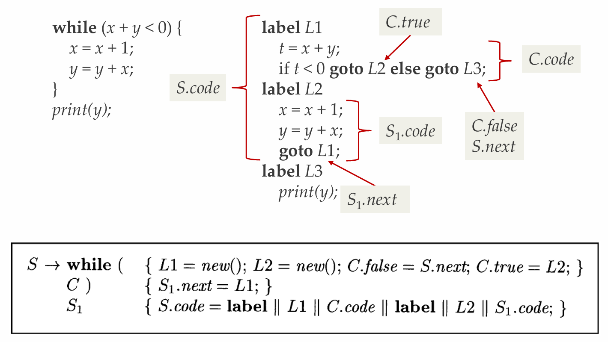

**NJU-CourseNote: Principles and Techniques of Compilers - Ch05 Syntax-Directed Translation / Semantic Analysis.**

<!--more-->

## 使用上下文无关文法引导语言的翻译

- CFG的非终结符号代表了语言的某个构造
- 程序设计语言的构造由更小的构造组合而成
- 一个构造的语义可以由小构造的含义综合而来
  - 比如：表达式`x+y`的类型由`x, y`的类型和运算符`+`决定
- 也可以从附近的构造继承而来
  - 比如: 声明`int x`中`x`的类型由它左边的类型表达式决定

> **Tips: 为什么语法分析技术不能检查语义?**
>
> 语法分析基于CFG, 而语义分析往往与语法元素的上下文密切相关.
>
> 

## 语法制导定义和语法制导翻译

- **语法制导定义:**
  - 将文法符号和某些属性相关联，并通过语义规则来描述如何计算属性的值
    - $E \rightarrow E_1 + T$, 则有$E.code = E_1.code\ ||\ T.code\ ||\ '+'$
  - 属性code代表表达式的逆波兰表示，规则说明加法表达式的逆波兰表示由两个分量的逆波兰表示并置，然后加上'+'得到(中缀表达式=>后缀表达式)
- **语法制导翻译:**
  - 在产生式体中加入语义动作，并在适当时候执行动作
    - $E \rightarrow E_1 + T$ 对应 `{print'+';}`

## 语法制导的定义(SDD)

- **Syntax-Directed Definition(SDD)** 是上下文无关文法和属性/规则的结合
  - SDD三要素：文法、属性、规则
  - 属性和文法符号相关联，按照需要来确定各个文法符号需要哪些属性
  - 规则和产生式相关联
- 对于文法符号$X$和属性$a$，我们用$X.a$表示分析树中某个标号为$X$的结点的值
  - 一个分析树结点和它的分支对应一个产生式规则，而对应的语义规则确定了这些结点上属性的取值和计算

> **Example:**
>
> 
>
> 

### 综合属性&继承属性

- **综合属性(synthesized attribute)** [自底向上]
  - 结点$N$的属性值由$N$的产生式所关联的语义规则来定义
  - 通过$N$的子结点或$N$本身的属性值来定义
- **继承属性(inherited attribute)** [自顶向下]
  - 结点$N$的属性值由$N$的父结点所关联的语义规则来定义
  - 依赖于$N$的父结点, $N$本身和$N$的兄弟结点上的属性值
- **约束**
  - 不允许$N$的继承属性通过$N$的子结点上的属性来定义，但允许$N$的综合属性依赖于$N$本身的继承属性
  - 终结符号有综合属性(来自词法分析)，但无继承属性

> **Example:**
>
> 

## 语法分析树上的SDD求值

- 实践中很少先构造语法分析树再进行SDD求值，但在分析树上求值有助于翻译方案的可视化，便于理解
- **注释语法分析树(Annotated Parse Tree)**
  - 包含了各个结点的各属性值的语法分析树
- **步骤**
  - 对于任意的输入串，首先构造出相应的分析树
  - 给各个结点(根据其文法符号)加上相应的属性
  - 按照语义规则计算这些属性的值
- 按照分析树中的分支对应的文法产生式，应用相应的语义规则计算属性值
- **计算顺序**
  - 如果某个结点$N$的属性$a$为$f(N_1.b_1, N_2.b_2, ..., N_k.b_k)$, 那么我们需要先算出$N_1.b_1, N_2.b_2, ..., N_k.b_k$的值
- 如果可以给各个属性值排出计算顺序，那么就可以计算得到这个注释分析树
  - S属性的SDD一定可以按照自底向上的方式求值
- 下面的SDD不能计算(循环定义)
  - $A \rightarrow B\ \ \ \ \ A.s = B.i\ \ \ \ \ B.i = A.s + 1$

> **Example: 注释语法分析树**
>
> 

> **Additional: 适用于自顶向下分析的SDD**
>
> - 前面的文法存在左递归，我们无法用自顶向下的分析方法进行处理
> - 但消除左递归之后，我们无法直接使用属性val进行处理(语法树结构与抽象语法不匹配)
>   - 比如规则: $T \rightarrow F T'\ \ \ \ \ T' \rightarrow * F T'\ |\ \epsilon$
>   - $T$对应的项中，第一个因子对应$F$，而运算符却在$T'$中
>   - 需要用**继承属性**来完成这样的计算
>
> - 
>
> - **3\*5的注释分析树**
>
> > 
>
> - **消除直接左递归时语义规则的处理**
>
> > 

### SDD的求值顺序

- 在对SDD的求值过程中
  - 如果结点$N$的属性$a$依赖于结点$M_1$的属性$a_1$, $M_2$的属性$a_2$, ...那么我们必须先计算出$M_i$的属性$a_i$, 才能计算$N$的属性$a$
- 使用**依赖图(Dependency Graph)** 来表示计算顺序
  - 这些值的计算顺序形成一个**偏序关系**，如果依赖图中出现了环，表示属性值无法计算

#### 依赖图

- 描述了某棵特定的分析树上各个属性之间的信息流(计算顺序)
  - 从实例$a_1$到实例$a_2$的有向边表示计算$a_2$时需要$a_1$的值
- 对于分析树结点$N$, 与$N$关联的每个属性$a$都对应依赖图的一个结点$N.a$

> **Example:**
>
> 

#### 属性值的计算顺序

- 各个属性值需要按照依赖图的**拓扑排序(Topological Sort)**的顺序进行计算
  - 如果依赖图中存在环，则属性计算无法进行(无法排序)
- 给定一个SDD，很难判定是否存在一棵分析树，其对应的依赖图包含环
- 特定类型的SDD一定不包含环，且有固定的计算顺序
  - 如：S属性的SDD，L属性的SDD

## S属性的SDD

- 只包含综合属性的SDD称为S属性的SDD
  - 每个语义规则都根据产生式体中的属性值来计算头部非终结符号的属性值
- S属性的SDD可以和LR语法分析器一起实现
  - 栈中的状态/文法符号可以附加相应的属性值
  - 归约时，按照语义规则计算归约得到的符号的属性值
- 语义规则不应该有复杂的副作用
  - 要求副作用不影响其它属性的求值
  - 没有副作用的SDD称为**属性文法(Attribute Grammar)**

### 计算S属性的SDD

- 每个属性都是综合属性，都是根据子构造的属性计算出父构造的属性
- 在依赖图中，总是通过子结点的属性值来计算父结点的属性值，可以与自底向上或自顶向下的语法分析过程一起计算
  - **自底向上**
    - 在构造分析树结点的同时计算相关的属性(此时其子结点的属性必然已经计算完毕)
  - **自顶向下**
    - 在递归子程序法中，在过程A()的最后计算A的属性(此时A调用的其它过程(对应于其子结构)已经调用完毕)

### 在分析树上计算SDD

### S属性SDD的局限

- S属性的SDD中每个属性都是综合属性
- 无法计算同时需要继承和综合属性的语义信息
  - 

## L属性的SDD

- 每个属性
  - 是**综合属性**，或
  - 是**继承属性**，且$A \rightarrow X_1X_2...X_n$中计算$X_i.a$的规则只用
    - $A$的继承属性，或
    - $X_i$左边的文法符号$X_j$的继承属性或综合属性，或
    - $X_i$自身的继承或综合属性(这些属性间的依赖关系不形成环)
- 特点
  - 依赖图中的边
    - 综合属性从下到上
    - 继承属性从上到下，或从左到右
  - 计算一个属性值时，它所依赖的属性值都已计算完毕

### L属性SDD和自顶向下语法分析

- 在递归子程序法中实现L属性
  - 对于每个非终结符号A，其所对应过程的**参数为继承属性，返回值为综合属性**
- 在处理规则$A \rightarrow X_1X_2...X_n$时
  - 在调用$X_i()$之前计算$X_i$的继承属性值，然后以它们为参数调用$X_i()$
  - 在该产生式对应代码的最后计算A的综合属性
  - 如果所有文法符号的属性计算按上面的方式进行，计算顺序必然与依赖关系一致

> **Example:**
>
> 
>
> 

> **Addtional:**
>
> L属性的例子: 基本类型和数组类型的L属性定义
>
> 非L属性的例子: $A \rightarrow BC\ \ \ A.s=B.b\ \ \ B.i=f(C.c, A.s)$

### 具有受控副作用的语义规则

- 属性文法没有**副作用**，但增加了描述的**复杂度**
  - 比如语法分析时，如果没有副作用，标识符表就必须作为属性传递
  - 可以把标识符表作为全局变量，然后通过函数来添加新的标识符
- **受控的副作用**
  - 不会对属性求值产生约束，即可以按照任何拓扑顺序求值，不会影响最终结果
  - 或者对求值过程添加简单的约束

> **Example:**
>
> - $L \rightarrow E_n\ \ \ \{print(E.val);\}$
>
> > 通过副作用打印出E的值; 总在最后执行，不影响其它属性的求值
>
> - **变量声明SDD中的副作用**
>
> > 

### 类型

- 非严谨的概括: 类型$\approx$数据$+$操作
  - **数据**: 一个类型包含的所有取值集合
  - **操作**: 一个类型支持的所有操作集合
- 类型检查
  - 计算各表达式的类型
  - 检查各个运算是否是相关类型所支持的合法操作

#### 类型系统

- 类型可视为一种属性，为程序中的元素（变量、语句、表达式…）赋予类型的一套规则称为**类型系统**
- 类型系统规定了每个类型的元素能支持的操作，违反规定的操作称为**类型错误(Type Error)**
- 检查程序中是否有违反类型错误的过程称为**类型检查(Type Checking)**

##### 静态&动态

- **静态类型**: 在编译期进行类型检查
- **动态类型**: 在运行时进行类型检查
- 并非绝对
  - 静中有动：反射(Reflection)
  - 动中有静：类型注解，Gradual Typing

##### 强类型&弱类型

- 并无精确定义，可理解为类型检查的严格程度
  - 强类型的类型规则更为严格
  - 一些在强类型的类型系统中被视为类型错误的行为可能在一个弱类型的系统中是被允许的
- 通常强类型的语言倾向于在编译器进行类型检查
  - 强类型!=静态类型

##### 类型系统的作用

- 编译器视角
  - 类型可以决定数据的大小(size)
  - 指导编译器生成操作数据的相应指令
  - 指导编译器进行正确的内存布局
- 程序员视角
  - 通常类型错误意味着程序逻辑错误
    - 整型与字符串相加、为接收整型的函数传入字符串参数...
  - 帮助找出程序中的bug

> **Example: 基本类型的变量声明**
>
> 

> **Example: 语句文法**
>
> 

#### 类型结构

### 类型表达式的生成过程

## SDD的应用

- 抽象语法树的构造
- 基本类型和数组类型的L属性定义

### 语法分析树(Parse Tree)

- **具体语法树(Concrete Syntax Tree)**
  - 保留所有词法元素(包含对分析无用的噪音)
  - 所有词法元素都有对应节点(节点数量大)
  - 完整地还原非终结符到串的推导过程(包含所有中间推导过程, 引入大量中间节点)
  - 严格符合源语言的上下文无关文法(可根据文法自动生成)
- **抽象语法树(Abstract Syntax Tree)**
  - 只保留必要的词法元素
  - 某些词法元素信息存入父节点的属性
  - 移除没有实质信息的中间推导过程
  - 不符合源语言的上下文无关文法

> **AST的优势**
>
> - 更少的结点数量与种类
> - 更易于分析和处理
> - 独立于具体文法

> **Example:**
>
> 

### 构造抽象语法树的SDD

- **抽象语法树**
  - 每个结点代表一个语法结构，对应于**运算符**
  - 结点的每个子结点代表其子结构，对应于**运算分量**
  - 表示这些子结构按照特定的方式组成了较大的结构
  - 可以忽略掉一些标点符号等非本质的东西
- 抽象语法树的表示方法
  - 每个结点用一个对象表示
  - 对象有多个域
    - 叶子结点中只存放词法值
    - 内部结点中存放了op值和参数(通常指向其子结点)

#### 构造简单表达式的抽象语法树的SDD

## 语法制导的翻译方案

- **语法制导的翻译方案(SDT)** 是在产生式体中嵌入语义动作(程序片断)的上下文无关文法
- **SDT的基本实现方法**
  - 建立语法分析树
  - 将语义动作看作是虚拟结点
  - 从左到右、深度优先地遍历分析树(前序遍历)，在访问虚拟结点时执行相应的语义动作
- 用SDT实现两类重要的SDD(无需建分析树)
  - 基本文法是LR的，且SDD是S属性的
  - 基本文法是LL的，且SDD是L属性的

> **Example:**
>
> 

### 可在语法分析过程中实现的SDT

- 实现SDT时，实际上并不会真的构造语法分析树，而是在分析过程中执行语义动作
- 即使基础文法可以应用某种分析技术，仍可能因为动作的缘故导致此技术不可应用
- 判断是否可在分析过程中实现
  - 将每个语义动作替换为一个独有的非终结符号$M_i$，其产生式为$M_i \rightarrow \epsilon$
  - 如果新的文法可以由某种方法进行分析，那么这个SDT就可以在这个分析过程中实现

> **Example:**
>
> 

### 后缀翻译方案

- 文法可以自底向上分析(即LR的)且其SDD是S属性的，必然可以构造出后缀SDT
- **后缀SDT**: 所有动作都在产生式最右端的SDT
- **构造方法**
  - 将每个语义规则看作是一个赋值语义动作
  - 将所有的语义动作放在规则的最右端

> **Example:**
>
> 

#### 后缀SDT的语法分析栈实现

- 可以在LR语法分析的过程中实现
  - 归约时执行相应的语义动作
  - 定义用于记录各文法符号属性的union结构(可放指针)
  - 栈中的每个文法符号(或状态)都附带一个这样的union类型的值
  - 在按照产生式$A \rightarrow XYZ$归约时，$Z$的属性可以在栈顶找到，$Y$的属性可以在下一个位置找到，$X$的属性可以在再下一个位置找到

##### 分析栈实现的例子

- 假设语法分析栈存放在一个被称为`stack`的记录数组中，下标`top`指向栈顶
  - `stack[top]`指向这个栈的栈顶
  - `stack[top – 1]`指向栈顶下一个位置
- 如果不同的文法符号有不同的属性集合，我们可以使用`union`来保存这些属性值
  - 归约时能够知道栈顶向下的各个符号分别是什么，因此我们也能够确定各个`union`中存放了什么值

> **Example:**
>
> 

### 产生式内部带有语义动作的SDT

- 动作左边的所有符号(以及动作)处理完成后, 就立刻执行这个动作:
$B \rightarrow X\{a\}Y$
  - 自底向上分析时，在$X$出现在栈顶时执行动作$a$
  - 自顶向下分析时，在试图展开$Y$或者在输入中检测到$Y$的时刻执行$a$
- 对一般的SDT，都可以先建立分析树(语义动作作为虚拟结点), 然后进行前序遍历并执行动作
- 不是所有的SDT都可以在分析过程中实现
  - 后缀SDT以及L属性对应的SDT可以在分析时完成

### 消除左递归时SDT的转换

### L属性的SDT

- 除了通用的SDT实现技术，若基础文法是LL的，则可以将L属性SDD转换成一个SDT，该SDT可以在自顶向下的分析过程中实现
- 从L属性的SDD到SDT的转换
  - 将每个语义规则看作是一个赋值语义动作
  - 将赋值语义动作放到相应产生式$A \rightarrow X_1X_2...X_n$的适当位置
    - 计算$X_i$继承属性的动作插入到产生式体中$X_i$的左边
    - 计算产生式头$A$综合属性的动作在产生式的最右边

#### while语句的SDD和SDT

- 产生式$S \rightarrow while (C) S_1$
  - 为while语句生成中间代码
  - 主要说明语句控制流中的标号生成
- while语句的含义
  - 首先对$C$求值，若为真，则控制转向$S_1$的开始处
  - 若为假，则转向while语句的后续语句开始
  - $S_1$结束时，要能够跳转到while语句的代码开始处(此例子中仅有部分考虑)

##### while语句的L属性SDD

##### 转化为SDT

##### while语句的SDT

### L属性SDD的实现

- 使用递归下降的语法分析器
  - 每个非终结符号对应一个函数$S.next \rightarrow S(next)$
  - 函数的参数接受继承属性，返回值包含了综合属性
- 在函数体中
  - 首先选择适当的产生式
  - 使用局部变量来保存属性 **(避免副作用)**
  - 对于产生式体中的终结符号，读入符号并获取其(经词法分析得到的)综合属性
  - 对于非终结符号，使用适当的方式调用相应函数，并记录返回值

#### 递归下降实现L属性SDD的例子

#### 边扫描边生成属性

- 当属性值的体积很大，对其进行运算会效率很低
  - code可能是一个上百K的串，对其进行并置会很低效
- 可逐步生成属性的各个部分，并增量式地添加到最终的属性值中(如数组或输出文件中)
- 三个条件
  - 存在一个主属性，且其为综合属性
  - 在产生式中，主属性是通过产生式体中各非终结符号的主属性连接而得到，同时还会连接一些其它元素
  - 各个非终结符号的主属性的连接顺序与它们在产生式体中的顺序相同
- **基本思想**
  - 在适当的时候发出元素，并拼接到适当的地方

> **Example1:**
>
> 

> **Example:**
>
> 
>
> 