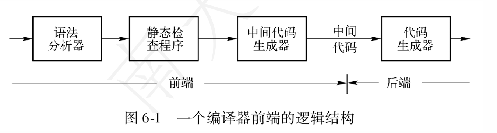
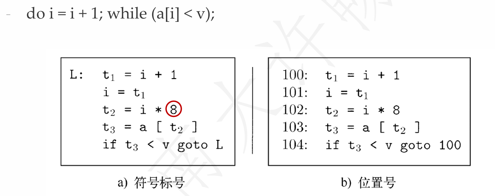
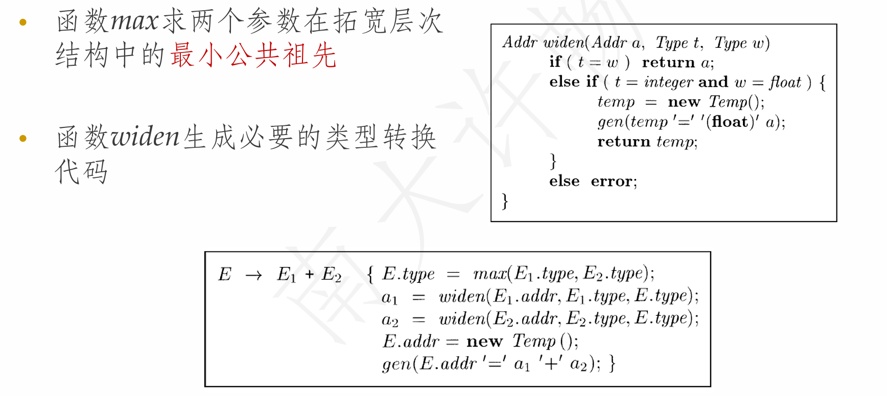
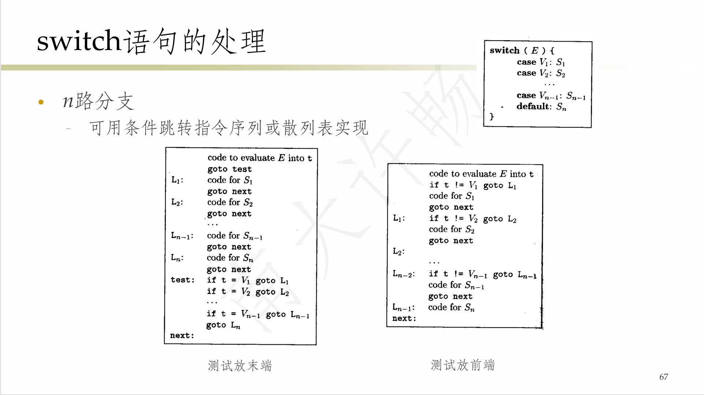

**NJU-CourseNote: Principles and Techniques of Compilers - Ch06 Intermediate Code Generation.**

<!--more-->

## 编译器前端的逻辑结构

- 前端是对源语言进行分析并产生中间表示
- 处理与源语言相关的细节，与目标机器无关
- 前端后端分开的好处：不同的源语言、不同的机器可以得到不同的编译器组合(`m * n`)

## 中间代码表示

- **形式**
  - 多种中间表示，不同层次
  - 抽象语法树, 三地址代码
- **重定位**
  - 为新的机器建编译器，只需要做从中间代码到新的目标代码的翻译器**(前端独立)**
- **高层次的优化**
  - 优化与源语言和目标机器都无关

### 中间代码的实现

- **静态类型检查**和**中间代码生成**的过程都可以用语法制导的翻译来描述和实现

#### 生成抽象语法树的语法制导定义

#### 表达式的有向无环图

- 语法树中，公共子表达式每出现一次，就有一颗对应的子树
- 表达式的**有向无环图(Directed Acyclic Graph, DAG)**能够指出表达式中的公共子表达式，更简洁地表示表达式

##### DAG构造

- 可以用和构造抽象语法树一样的SDD来构造
- **不同的处理:** 在函数Leaf和Node每次被调用时，构造新节点前先检查是否存在同样的结点(值编码+散列表)，如果已存在，则返回这个已有结点

## 三地址代码

- 每条指令右侧最多有一个运算符
  - 一般情况可以写成`x = y op z`
- 允许的**运算分量**(地址)
  - 名字：源程序中的变量名字作为三地址代码的地址
  - 常量：源程序中出现或生成的常量
  - 编译器生成的临时变量

### 指令集合

|指令|形式|
|---|------------|
|运算/赋值指令|`x = y op z` / `x = op y`|
|复制指令|`x = y`|
|无条件转移指令|`goto L`|
|条件转移指令|`if x goto L` `if False x goto L` `if x relop y goto L`|
|过程调用/返回|`param x1 \\设置参数` `param x2 ` `...` `param xn` `call p, n \\调用过程p,n为参数个数(可能嵌套调用)`|
|带下标的复制指令|`x= y[i]` `x[i] = y` `\\i表示距离数组位置i个内存单元(字节),不是数组的第i个元素`|
|地址/指针赋值指令|`x = &y` `x = *y` `*x = y`|

> **Example:**
>
> 

### 三地址码表示

- 在实现时，可使用**四元式/三元式/间接三元式/静态单赋值**来表示三地址指令

#### 四元式表示

- **四元式(quadruple):** 可以实现为记录(或结构)
  - 格式(字段): `op arg1 arg2 result`
  - op：运算符的内部编码
  - arg1, arg2, result是地址
  - **Example:** `x = y + z -> + y z x`
- 单目运算符不使用arg2
- param运算不使用arg2和result
- 条件/非条件转移将目标标号放在result字段

> **Example:**
>
> 

#### 三元式表示

- **三元式(triple):** `op arg1 arg2`
- 使用三元式的位置来引用三元式的运算结果
- 优化时经常需要移动/删除/添加三元式，导致三元式运算结果的位置变化(四元式无此问题)
- `x = y op z`转化为`? op y z` `= x (?)`, 其中`?`为位置
- `x[i] = y`需要拆分为两个三元式, 求`x[i]`的地址，然后再赋值

  > |exp|op|arg1|arg2|result|
  > |---|---|---|---|---|
  > |`x[i] = y`|`[]=`|`i`|`y`|`x`|
  > |`y = x[i]`|`=[]`|`x`|`i`|`y`|

> **Example:**
>
> 

#### 间接三元式表示

- **间接三元式(indirect triple):** 包含了一个指向三元式的指针的列表
- 可对该列表进行操作(重新排序)，完成优化功能，操作时不影响三元式本身

> **Example:**
>
> `a = b * -c + b * -c`
>
> 

#### 静态单赋值形式

##### SSA的构造

- 为每个变量维护一个计数器
- 从函数入口开始遍历函数体
- 遇到变量赋值时，为其生成新名字，并替换
- 将新变量名传播到后续相应的使用处，并替换

> **Tips:** 通常只针对函数内的变量(即局部变量) 计算SSA, 而全局变量的SSA在实际当中难以计算

##### SSA对分支的处理

##### SSA对循环的处理

##### SSA的作用

- 每个变量只被赋值一次，相当于都变成const变量
- 简化了数据流分析和某些优化
- 使得定义-使用链(def-use chain)易于计算
  - 关联每个变量的定义(赋值)及其相应的使用
  - 许多分析和优化所需的关键信息
  - SSA形式中，定义-使用关系非常清晰，且可以线性复杂度进行计算

## 类型和声明

- **类型检查(type checking)**
  - 利用一组规则来检查运算分量的类型和运算符的预期类型是否匹配
- 类型信息的用途
  - 查错、确定名字需要的内存空间、计算数组元素的地址、类型转换、选择正确的运算符

### 类型分类

- **基本类型**
  - 程序设计语言中的原子类型
    - 如: `boolean, char, integer, float, void, ...`
  - 通常这些类型的运算都有对应的机器指令
- **复合类型**
  - 由基本类型或其它复合组合而成的类型，为程序设计语言提供更强的抽象和表达能力
    - 如: 结构体, 数组, 函数, ...
- **类型表达式(Typeexpression):** 表示类型的表达式
  - 基本类型：类型名字
  - 复合类型：通过类型构造算子作用于类型表达式得到

#### 数组类型

- 表示同类型数据的聚合
- 类型构造算子array，有两个参数
  - 数字：表示数组的长度
  - 类型：表示数组元素的类型

> **Example:** `int [2][3]`
>
> 对应类型表达式`array(2, array(3, integer))`

#### 记录类型

- 表示不同类型数据的聚合(结构体、类)
- 类型构造算子record，有多组字段
  - 字段名：字段名字，可用于在记录中引用该字段
  - 类型：字段对应数据的类型
- 记录的基本构造算子是笛卡尔积`×`
  - 如果`s`, `t`是类型表达式，其笛卡尔积`s × t`也是类型表达式
  - 在记录类型的构造中起组合作用
    - 组合字段名与相应类型
    - 组合多组字段

> **Example:** `struct{int a[10]; float f;} st;`
>
> 对应类型表达式`record((a × array(10, int)) × (f × float))`

#### 函数类型

- 表示程序中函数的类型
- 类型构造算子$\rightarrow$，接收参数类型与返回值类型，并构造出函数类型

> **Example:** `int foo(float x, long[5] y) {...}`
>
> 对应类型表达式`(float × array(5, long)) -> int`

### 类型等价

- 不同的语言有不同的类型等价的定义
- **名等价(name equivalence)**
  - 类型表达式t与u等价当且仅当它们对应的类型名字相同
- **结构等价(structurally equivalent)**
  - 对于基本类型，比较它们名字是否相同
  - 对于复合类型，比较类型构造算子; 若相同, 递归比较构造算子的各参数分量

### 类型的声明

- 处理基本类型、数组类型或记录类型的文法
  - 
- 应用该文法及其对应的语法制导定义，除了得到**类型表达式**之外，还得进行各种类型的**存储布局**

#### 局部变量的存储布局

- 变量的类型可以确定变量需要的内存
  - 即类型的宽度(该类型一个对象所需的存储单元的数量)
  - 可变大小的数据结构(如动态数组)只需要考虑指针
  - 特殊：对齐(aligned)、补白(padding)、压缩(pack)
- 函数的局部变量总是分配在连续的区间
  - 因此给每个变量分配一个相对于这个区间开始处的相对地址
- 变量的类型信息保存在符号表中

##### 内存补齐(Padding)

- 提升内存访问效率的一种技术
- 内存（通常）不能“跨行”访问

### 表达式翻译

#### 计算T的类型和宽度的SDT

> **Example:**
>
> 

#### 声明序列的SDT

- 在处理一个过程/函数时，局部变量应该放到单独的符号表中去
- 这些变量的内存布局独立
  - 相对地址从0开始，变量的放置和声明的顺序相同
- SDT的处理方法
  - 变量offset记录当前可用的相对地址
  - 每分配一个变量，offset增加相应的值(加宽度)
- $top.put(id.lexeme, T.type, offset)$
  - 在符号表中创建条目，记录标识符的类型和偏移量

> **Example:**
>
> 
>
> 

#### 记录和类中的字段

- 记录变量声明的翻译方案
- 约定
  - 一个记录中各个字段的名字必须互不相同
  - 字段名的偏移量(相对地址)，是相对于该记录的数据区字段而言的
- 记录类型使用一个**专用的符号表**，对其各个字段的类型和相对地址进行编码
- 记录类型$record(t):record$是类型构造算子, $t$是符号表对象，保存该记录类型各个字段的信息

##### Env环境

- 当程序中的作用域发生嵌套时，用一个栈Env辅助维护各作用域对应的符号表，栈中存储指向各符号表的指针
- 进入一个新作用域时，保存上一作用域(压栈)
- 从一个作用域退出时，恢复上一作用域(出栈)

> **Example:**
>
> 

#### 表达式代码的SDD

#### 增量式翻译方案

#### 数组元素的寻址

- 假设数组元素被存放在连续的存储空间中, 元素从$0$到$n−1$编号, 第$i$
个元素的地址为: $base + i * w$
- k维数组的寻址: 假设数组按行存放, 首先存放$A[0][i_2]...[i_k]$, 然后
存放$A[1][i_2]...[i_k]$, ...那么$A[i_1][i_2]...[i_k]$的地址为
  - $base + i_1 * w_1 + i_2 * w_2 + ... + i_k * w_k$

##### 数组引用的翻译

- 为数组引用生成代码要解决的主要问题
  - 数组引用的文法和地址计算相关联
- 假定数组编号从0开始，基于宽度来计算相对地址
- 数组引用相关文法
  - 非终结符号L生成数组名，加上一个下标表达式序列
  - $L \rightarrow [L]\ |\ id\ [E]$

##### 数组引用生成代码的翻译方案

> **Example:**
>
> 

## 类型检查和转换

- **类型系统(type system)**
  - 给每一个组成部分赋予一个类型表达式
  - 通过一组逻辑规则来表达类型表达式必须满足的条件
  - 可发现错误、提高代码效率、确定临时变量的大小
- 类型检查可以分为动态和静态两种
- 如果编译器中的类型系统能够保证它接受的程序在运行时刻不会发生类型错误，则该语言的这种实现称为**强类型**的

> **Addtional:**
>
> 也有说法按照类型系统严格性进行强弱区分，如C/C++允许通过指针操作绕过常规类型检查，因此被认为是**弱类型语言**

### 类型系统的分类

- **类型综合(type synthesis)**
  - 根据子表达式的类型构造出表达式的类型
  - 如果`f`的类型为`s->t`且`x`的类型为`s`, 则`f(x)`的类型为`t`
- **类型推导(type inference)**
  - 根据语言结构的使用方式来确定该结构的类型
  - 如果`f(x)`是一个表达式, 则对于某些类型`α`和`β`, `f`的类型为`α->β`且`x`的类型为`α`

### 类型规则

#### 函数/运算符重载

### 类型转换

#### 类型转换规则

#### 处理类型转换的SDT

## 布尔表达式的控制流翻译

- 生成的代码执行时跳转到两个标号之一
  - 表达式的值为真时，跳转到$B.true$
  - 表达式的值为假时，跳转到$B.false$
- $B.true$和$B.false$是两个继承属性，根据B所在的上下文指向不同的位置

### 控制流语句的翻译

#### 语法制导的定义

### 布尔表达式的翻译

> **Example: 短路求值**
>
> 

#### 布尔值和跳转代码

### 指令的标号与索引

#### 一趟完成

### 回填

- 为布尔表达式和控制流语句生成目标代码
  - 关键问题：某些跳转指令应该跳转到哪里？
- **基本思想**
  - 翻译过程中，若遇到跳转目标未知的情况，则先生成**跳转指令坯**，备用`goto __/if ... goto __`
  - 将指令坯并向父结点传递(综合属性)
  - 翻译过程中，若遇到某条指令是跳转目标，则记录其索引，备用如`S -> if (B) ▲ S1`
  - 当父结点收集齐跳转指令坯及其跳转目标索引时，将索引填入指令坯

#### 控制转移语句的回填

##### 回填与非回填对比

#### 布尔表达式的回填翻译

##### 回填与非回填对比

> **Example: 布尔表达式回填**
>
> 

#### Break & Continue的处理

- 虽然break、continue在语法上是一个独立的句子，但是它的代码和外围语句相关
- 方法：(break语句)
  - 跟踪外围循环语句S
  - 生成一个跳转指令坯
  - 将这个指令坯的索引加入到S的nextlist中

#### Switch Case的处理

