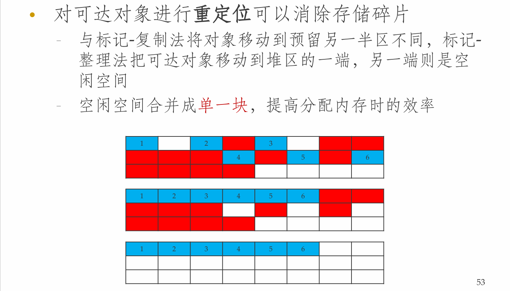

**NJU-CourseNote: Principles and Techniques of Compilers - Ch07 Runtime Environments.**

<!--more-->

## 运行时刻环境

- **运行时刻环境**
  - 为数据分配安排存储位置
  - 确定访问变量时使用的机制
  - 过程之间的连接、参数传递
  - 和操作系统、输入输出设备相关的其它接口
- **主题**
  - 存储管理：栈分配、堆管理、垃圾回收
  - 对变量、数据的访问

## 存储分配的典型方式

- 目标程序的代码放置在代码区
- 静态区、堆区、栈区分别放置不同类型生命期的数据值

> **Example:** C++内存模型
>
> 

### 静态和动态存储分配

- **静态分配**
  - 编译器在编译时刻就可以做出存储分配决定，不需要考虑程序运行时刻的情形
  - 全局常量、全局变量
- **动态分配**
  - **栈式存储**：和过程的调用/返回同步进行分配和回收，值的生命期与过程生命期相同
  - **堆存储**：数据对象可比创建它的过程调用更长寿
    - 手工进行回收
    - 垃圾回收机制

### 栈式分配

- 活动树
- 活动记录
- 调用代码序列
- 栈中的变长数据

#### 活动树

- 过程调用(过程活动)在时间上总是嵌套的
  - 后调用的先返回
  - 因此用栈来分配过程活动所需内存空间
- **活动树(Activation Tree)**
  - 表示程序运行期间的所有过程活动
  - 每个结点对应于一个过程活动
  - 根结点对应于main过程的活动
  - 过程p的某次活动对应的结点的所有子结点
    - 表示此次活动所调用的各个过程活动
    - 从左向右，表示调用的先后顺序
  - 又称为**调用树(Call Tree)**

> **Example:**
>
> 

#### 活动记录

> **Example: 运行时刻栈**
>
> 

##### 活动记录的布局原则

#### 调用/返回代码序列

- **调用代码序列(Calling Sequence)**为活动记录分配空间，填写记录中的信息
- **返回代码序列(Return Sequence)**恢复机器状态，使调用者继续运行
- 调用代码序列会分割到调用者和被调用者中
  - 根据源语言、目标机器和操作系统的限制，可以有不同的分割方案
  - 把代码尽可能放在被调用者中

##### 调用/返回代码序列的要求

- **数据方面**
  - 能够把参数正确地传递给被调用者
  - 能够把返回值传递给调用者
- **控制方面**
  - 能够正确转到被调用过程的代码开始位置
  - 能够正确转回调用者的调用位置(的下一条指令)
- 调用代码序列与活动记录的布局相关(见[**[活动记录的布局原则]**](#活动记录的布局原则))

##### Call & Return

- **Calling Sequence**
  - 调用者计算实在参数的值
  - 将返回地址和原`top_sp`存放到被调用者的活动记录中；调用者增加`top_sp`的值(越过了调用者的局部数据和临时变量、以及被调用者的参数和机器状态字段)
  - 被调用者保存寄存器值和其它状态字段
  - 被调用者初始化局部数据，开始运行
- **Return Sequence**
  - 被调用者将返回值放到与参数相邻的位置
  - 被调用者恢复`top_sp`和其它寄存器，跳转到返回地址

> **调用者/被调用者活动记录**
>
> 

#### 栈中的变长数据

### 栈式运行过程

#### 非局部数据的访问(无嵌套过程)

- C语言中，每个函数能访问的变量
  - **函数的局部变量:** 相对地址已知，且存放在当前活动记录内，`top_sp`指针加上相对地址即可访问
  - **全局变量:** 在静态区，地址在编译时刻可知
- 很容易将C语言的函数作为参数进行传递
  - 参数中只需包括函数代码的开始地址
  - 在函数中访问非局部变量的模式很简单，不需要考虑过程是如何激活的

#### 非局部数据的访问(有嵌套过程)

- PASCAL中，如果过程A的声明中包含了过程B的声明，那么B可以使用在A中声明的变量
- 当B的代码运行时，如果它使用的是A中的变量，必须通过**访问链**访问

##### 嵌套深度

#### 访问链

- **访问链(Access Link)**被用于访问非局部的数据
  - 如果过程p在声明时(直接)嵌套在过程q中，那么p活动记录中的访问链指向上层最近的q的活动记录
  - 从栈顶活动记录开始，访问链形成了一个链路，嵌套深度沿着链路逐一递减
- 设深度为$n_p$的过程$p$访问变量$x$，而变量$x$在深度为$n_q$的过程$q$中声明
  - $n_p – n_q$在编译时刻已知: 从当前活动记录出发, 沿访问链前进$n_p–n_q$次找到活动记录
  - $x$相对于这个活动记录的偏移量在编译时刻已知

##### 访问链的维护

> **Example:**
>
> 

###### 过程指针型参数

#### 显示表

- 用访问链访问数据，访问开销与嵌套深度差有关
  - 使用显示表可以提高效率，访问开销为常量
- **显示表(display):** 为每个嵌套深度保留一个指针
  - 指针`d[i]`指向栈中最近的、嵌套深度为`i`的活动记录
  - 如果过程`p`访问嵌套深度为`i`的过程`q`中声明的变量`x`，那么`d[i]`直接指向相应的活动记录(`i`在编译时刻已知)
- **显示表的维护**
  - 调用过程`p`时，在`p`的活动记录中保存`d[n_p]`的值，并将`d[n_p]`设置为当前活动记录(即`p`)
  - 从`p`返回时，恢复`d[n_p]`的值

> **Example:**
>
> 

#### 非局部变量的作用域

- **静态作用域(Static Scoping)**
  - 又称词法作用域(Lexical Scoping)
  - 根据函数声明时的位置寻找变量定义(静态时决定)
  - 优点：程序行为易于推理
- **动态作用域(Dynamic Scoping)**
  - 根据函数运行时的上下文寻找变量定义(动态时决定)
  - 优点：易于实现

#### 闭包

### 堆管理

- **堆空间**
  - 用于存放生命周期不确定、或生存到被明确删除为止的数据对象
  - 例如：`new`生成的对象可以生存到被`delete`为止，`malloc`申请的空间生存到被`free`为止
- **存储管理器(Memory Manager)**
  - 分配/回收堆区空间的子系统
  - 根据语言而定
    - C/C++需要手动回收空间
    - Java可以自动回收空间(垃圾收集)

#### 存储管理器

- 基本功能
  - **分配:** 为内存请求分配一段连续、适当大小的堆空间
    - 首先从空闲的堆空间分配
    - 如果不行则从操作系统中获取内存、增加堆空间
  - **回收:** 把被回收的空间返回空闲空间缓冲池，以满足其它内存需求
- 评价存储管理器的特性
  - **空间效率:** 使程序需要的堆空间最小，即减小碎片
  - **程序效率:** 运用内存系统的层次，使程序运行更快
  - **低开销:** 使分配/收回内存的操作尽可能高效

> **计算机存储层次结构(Memory Hierarchy)**
>
> 

#### 程序局部性

- 程序具有高度的局部性(locality)
  - **时间局部性:** 一个程序访问的存储位置很可能将在一个很短的时间段内被再次访问
  - **空间局部性:** 被访问过的存储位置的临近位置很可能在一个很短的时间段内被访问
- 90%的时间用来执行10%的代码
- 局部性这一特性恰好可以充分利用计算机的存储层次结构

#### 堆空间的碎片问题

- 随着程序分配/回收内存，堆区逐渐被割裂成为若干空闲存储块(窗口)和已用存储块的交错
- 分配一块内存时，通常是把一个窗口的一部分分配出去，其余部分成为更小的块
- 回收时，被释放的存储块被放回缓冲池；通常要把连续的窗口接合成为更大的窗口

#### 堆空间分配方法

- **Best-fit**
  - 总是将请求的内存分配在满足请求的最小的窗口中
  - 好处：可以将大的窗口保留下来，应对更大的请求
  - 坏处：慢 + 碎片
- **First-fit**
  - 总是将对象放置在第一个能够容纳请求的窗口中
  - 放置对象时花费时间较少，但是总体性能较差(破坏性)
  - 通常具有较好的**数据局部性**: 同一时间段内生成的对象经常被分配在连续的空间内

##### 使用容器的堆管理方法

- 设定不同大小的块规格，相同的块放入同一容器
- 较小的(较常用的) 尺寸设置较多的容器
- GNU的C编译器gcc中使用的存储管理器Lea
  - **空闲块的大小**
    - 16, 24, 32, 40, ... , 512: 容器大小为8字节整数倍
    - 大于512的按对数划分：每个容器大小是前一容器的两倍
    - 荒野块(wilderness chunk):可以扩展的内存块
  - **分配方法**
    - 小尺寸的请求，直接在相应容器中找
    - 大尺寸的请求，在适当的容器中寻找适当的空闲块
    - 可能需要分割内存块，可能需要从荒野块中分割

##### 管理和接合空闲空间

- 当回收一个块时，可以把这个块和相邻的块接合起来，构成更大的块
- 支持相邻块接合的数据结构
  - **边界标记:** 在每个存储块的两端，分别设置一个`free/used`位，并在相邻的位置上存放字节总数
  - 双重链接的空闲块列表：列表的指针存放在空闲块中、用双向指针的方式记录了有哪些空闲块

> **Example:**
>
> 

#### 处理手工存储管理

- **内存泄露(memory-leak):** 未能删除不可能再被引用的数据
- **悬空指针引用(dangling-pointer-dereference):** 引用已被删除的数据
- **访问非法地址:** 空指针访问/数组越界访问

### 垃圾回收

- **垃圾**
  - 广义：不需要再被引用的数据
  - 狭义：不能被引用(不可达)的数据
- **垃圾回收**
  - 自动回收不可达数据的机制，解除了程序员的负担
  - 使用的语言：Lisp、Java、C#、ML、Python、Prolog、Smalltalk

#### 垃圾回收器的设计目标

- 基本要求(静态或动态确定数据的类型)
  - 语言必须**类型安全(typesafe):** 保证回收器能够知道数据元素是否为一个指向某内存块的指针
  - 类型不安全(unsafe)的语言: C/C++
- 性能目标:
  - **总体运行时间:** 不显著增加应用程序的总运行时间
  - **停顿时间:** 当垃圾回收机制启动时，可能引起应用程序的停顿，这个停顿应该比较短
  - **空间使用:** 最大限度地利用可用内存
  - **程序局部性:** 改善空间局部性和时间局部性

#### 可达性

- **可达性**就是指一个存储块可以被程序访问到
- **根集:** 不需要指针解引用就可以直接访问的数据
  - Java：静态成员、栈中变量
- **可达性**
  - 根集的成员都是可达的
  - 对于任意一个对象，如果指向它的一个指针被保存在可达对象的某字段或数组元素中，那么这个对象也是可达的
- **性质**
  - 一旦一个对象变得不可达，它就不会再变成可达的

##### 改变可达对象集合的操作

- **对象分配:** 返回一个指向新存储块的引用
- **参数传递/返回值:** 对象引用从实参传递到形参，从返回值传递给调用者
- **引用赋值 u = v :** v的引用被复制到u中，u中原有引用丢失；使u原来指向的对象变得不可达，并递归使更多对象变得不可达
- **过程返回:** 活动记录出栈，局部变量消失，根集变小，使一些对象变得不可达

### 垃圾回收方法

- 引用计数垃圾回收(关注不可达)
  - 跟踪相关操作，捕获对象变得不可达的时刻，回收对象占用的空间
- 传递地跟踪所有的引用(关注可达)
  - 在需要时，标记出所有可达对象，回收其它对象

#### 基于引用计数的垃圾回收器

- 每个对象有一个用于存放引用计数的字段，并按如下方式维护
  - **对象分配:** 引用计数设为1
  - **参数传递:** 引用计数加1
  - **引用赋值:** `u = v`，u指向的对象引用减1，v指向的对象引用加1
  - **过程返回:** 局部变量指向对象的引用计数减1
- 如果一个对象的引用计数为0，在删除对象之前，此对象中各个指针所指对象的引用计数减1
- 开销较大，但不会引起停顿，也能及时回收垃圾

> **Example: 引用计数**
>
> 

> **Example: 循环垃圾**
>
> 

#### 基于跟踪的垃圾回收

不在垃圾产生时回收，而是周期性地运行

- 标记-清扫式垃圾回收
- 标记-拷贝式垃圾回收
- 标记-整理式垃圾回收
- 分代式垃圾回收

> **存储块抽象分类**
>
> 

##### 标记-清扫式垃圾回收

> **Example:**
>
> 

##### 标记-复制式垃圾回收

##### 标记-整理式垃圾回收

##### 垃圾回收算法比较

- **标记-清扫式垃圾回收**
  - 回收效率不高，易造成碎片
- **标记-复制式垃圾回收**
  - 将可达对象复制到预留半区，只需遍历可达对象
  - 管理区域内大部分对象为垃圾对象时效率高(只需移动少量可达对象)，反之则效率低
- **标记-整理式垃圾回收**
  - 将可达对象移动到堆区的一端，需遍历整个区域
  - 管理区域内大部分对象为可达对象时效率高(经过之前的整理、大部分对象已经到位)，反之则效率低

##### 分代式垃圾回收

