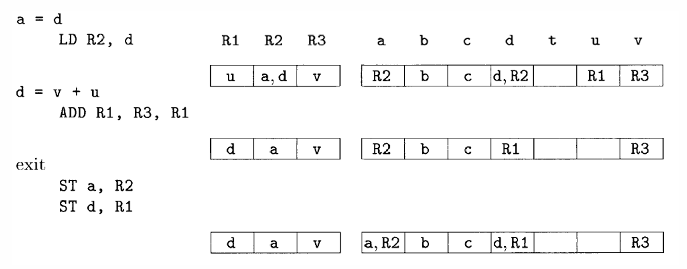
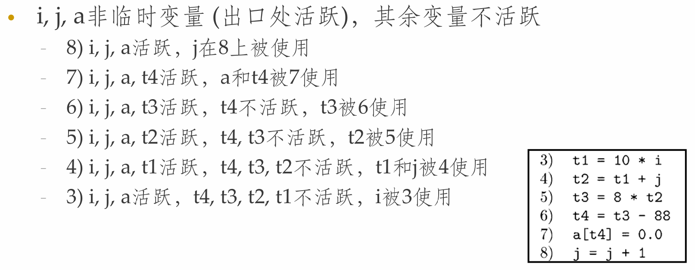

**NJU-CourseNote: Principles and Techniques of Compilers - Ch08 Code Generation.**

<!--more-->

## 代码生成器的位置

- 根据中间表示(IR)生成代码
- 代码生成器之前可能有一个优化组件
- 代码生成器的三个任务
  - **指令选择:** 选择适当的指令实现IR语句
  - **寄存器分配和指派:** 把哪个值放在哪个寄存器中
  - **指令排序:** 按照什么顺序安排指令执行


## 代码生成要解决的问题

- **正确性:** 正确的机器指令
- 易于实现、测试和维护
- **输入IR的选择**
  - 四元式、三元式、字节代码、堆栈机代码、后缀表示、抽象语法树、DAG图...
- 输出
  - RISC(目标机)、CISC(寻址方式)
  - 可重定向代码、汇编语言

### 目标机模型

#### 三地址机器模型

- 与三地址码的关键区别: **寄存器**
  - 位于CPU内部，用于存放数据的小型高速存储区域
  - 几乎所有CPU计算都需要寄存器参与(存放参数/结果)
  - 几乎所有参与计算的程序数据都位于内存中(使用外存数据也须先读入内存)
  - 机器码需要频繁地在寄存器与内存之间搬运数据

#### 指令

- **加载:** `LD dst, addr`, 把地址addr中的内容加载到dst所指的寄存器
- **保存:** `ST x, r`, 把寄存器r中的内容保存到x中
- **计算:** `<OP> dst, src1, src2`, 把src1和src2中的值运算后将结果存放到dst中
- **无条件跳转:** `BR L`, 控制流转向标号L的指令
- **条件跳转:** `B<cond> r, L`, 对r中的值进行测试，如果为真则转向L

### 寻址模式

- **变量x:** 指向分配x的内存位置
- **a(r):** 地址是a的左值加上寄存器r中的值
  - `a + r`
- **constant(r):** 寄存器r中内容加上前面的常数即其地址
  - `constant + r`
- **\*r:** 寄存器r的内容所表示的位置上存放的内容位置
  - `解引用r`
- ***constant(r):** 寄存器r中内容加上常量所代表的位置上的内容所表示的位置
  - `解引用(constant + r)`
- **常量#constant**

> **Example: 指令翻译**
>
> 
>
> 
>
> 

### 程序及指令的代价

- 不同的目的有不同的度量
  - 最短编译时间、运行时间、目标程序大小、能耗
- 不可判定一个目标程序是否最优
- 假设每个指令有固定的代价，设定为1加上运算分量寻址模式的代价
  - `LD R0, R1`：代价为1
  - `LD R0, M`：代价是2
  - `LD R1, *100(R2)`：代价为2

### 目标代码中的地址

- 如何为过程调用和返回生成代码?
  - 静态分配(活动记录)
  - 栈式分配(活动记录)
- 如何将IR中的名字(过程名或变量名)转换成为目标代码中的地址?
  - 不同区域中的名字采用不同的寻址方式

### 活动记录的静态分配

- 每个过程静态地分配一个数据区域，其开始位置用**staticArea**表示
- **call callee实现**
  - `ST callee.staticArea, #here + 20  //存放返回地址`
  - `BR callee.codeArea`
- **callee中的语句return**
  - `BR *callee.staticArea`


### 活动记录的栈式分配

- 寄存器SP指向栈顶
- 第一个过程(main)初始化栈区
- **过程调用指令序列**
  - `ADD SP, SP, #caller.recordSize //增大栈指针`
  - `ST 0(SP), #here + 16 //保存返回地址`
  - `BR callee.codeArea //转移到被调用者`
- **返回指令序列**
  - `BR *0(SP) //被调用者执行，返回调用者`
  - `SUB SP, SP, #caller.recordSize //调用者减小栈指针`


### 名字的运行时刻地址

- 在三地址语句中使用名字(实际上是指向符号表条目) 来引用变量

> **Example:** `x = 0`
>
> 如果x分配在静态区域，且静态区开始位置为static
>
> - `static[12] = 0  LD 112, #0  // static = 100`
>
> 如果x分配在栈区，且相对地址为12，则
>
> - `LD 12(SP), #0`

## 代码生成器

- 根据三地址指令序列生成机器指令
  - 假设每个三地址指令只有一个对应的机器指令
  - 有一组寄存器用于计算基本块内部的值
- 主要的目标是减少加载(LD) 和保存(ST) 指令，即最大限度地利用寄存器
- **寄存器的使用方法**
  - 执行运算时，运算分量必须放在寄存器中
  - 存放临时变量
  - 存放全局的值
  - 进行运行时刻管理(比如栈顶指针)

### 基本思想 & 数据结构

- 依次考虑各三地址指令，尽可能把值**保留在寄存器中**，以减少**寄存器/内存**之间的数据交换
- 为一个三地址指令生成机器指令时
  - 只有当运算分量不在寄存器中时，才从内存载入
  - 尽量保证只有当寄存器中值不被使用(称之为不活跃)时，才覆盖掉
- **数据结构(编译期)**
  - **寄存器描述符:** 跟踪各个寄存器都存放了哪些变量的当前值
    - $R_1 \rightarrow \{x\}, R_2 \rightarrow \{a, b\}$
  - **地址描述符:** 各个变量的当前值存放在哪些位置(包括内存位置和寄存器) 上
    - $x \rightarrow \{R_1\}, a \rightarrow \{a, R_2\}$

### 代码生成算法

- **重要子函数: getReg(I)**
  - 根据寄存器描述符和地址描述符等数据流信息，为三地址指令I选择最佳的寄存器
  - 得到的机器指令的质量依赖于`getReg`函数选取寄存器的算法
- 代码生成算法逐个处理三地址指令
- **运算语句:** `x = y + z`
  - `getReg(x = y + z)`为`x, y, z`选择寄存器`Rx, Ry, Rz`
  - 检查`Ry`的寄存器描述符，如果`y`不在`Ry`中则生成指令
    - `LD Ry, y' // y'表示存放y值的当前位置`
    - 类似地确定是否生成`LD Rz, z'`
    - 生成指令`ADD Rx, Ry, Rz`
- **复制语句:** `x = y`
  - `getReg(x = y)`为`x`和`y`选择相同的寄存器(运行后值相同)
  - 如果`y`不在`Ry`中，则生成指令`LD Ry, y`
- **基本块的收尾**
  - 如果变量`x`活跃，且不在内存中，则生成指令`ST x, Rx`
- **代码生成同时更新寄存器和地址描述符**
  - 1 处理指令时生成的`LD R, x`
    - `R`的寄存器描述符：只包含`x`
    - `x`的地址描述符：`R`作为新位置加入到`x`的位置集合中
    - 从任何不同于`x`的变量的地址描述符中删除`R`
  - 2 生成的`ST x, R`
    - `x`的地址描述符：包含自己的内存位置(新增)
  - 3 `ADD Rx, Ry, Rz`
    - `Rx`的寄存器描述符：只包含`x`
    - `x`的地址描述符：只包含`Rx`(不包含`x`的内存位置)
    - 从任何不同于`x`的变量的地址描述符中删除`Rx`
  - 4 处理`x = y`时
    - 如果生成`LD Ry, y`，按照规则1处理
    - 把`x`加入到`Ry`的寄存器描述符中(即`Ry`同时存放了`x`和`y`的当前值)
    - `x`的地址描述符：只包含`Ry`(不包含`x`的内存位置)

> **Example: 代码生成示例**
>
> a, b, c, d在line5后仍活跃; u, v, w是临时变量
>
> ```C
> t = a - b
> u = a - c
> v = t + u
> a = d
> d = v + u
> ```
>
> 
>
> 

#### getReg函数

- 目标：减少LD/ST指令
- 任务：为运算分量和结果分配寄存器
- 为`x = y op z`的运算分量`y`和`z`分配寄存器
  - 如果`y`已经在某个寄存器中，不需要进行处理，选择这个寄存器作为`Ry`
  - 如果`y`不在寄存器中，且有空闲寄存器，选择一个空闲寄存器作为`Ry`
  - 如果不在寄存器中, 需要选择一个非空闲寄存器存放值
  - 替换非空闲寄存器`R`时, 存在变量`v`的值在`R`中
    - 如果`v`的地址描述符表明可在别的地方找到`v` -> DONE
    - `v`就是`x`(即结果)，且`x`不是运算分量`z`-> DONE
    - 如果`v`在此之后不会被使用(不活跃) -> DONE
    - **溢出操作(spill):** 生成保存指令`ST v,R`并修改`v`的地址描述符
      - 如果`R`中存放了多个变量的值，那么需要生成多条ST指令
- 为`x = y op z`的结果`x`选择寄存器`Rx`
  - 方法基本上和`y`, `z`相同,但是
    - 只存放`x`值的寄存器总是可接受的
    - 如果`y/z`在指令之后不再使用，且`Ry/z`仅仅保存了`y/z`的值，那么`Ry/z`同时也可以作为`Rx`
- 处理`x = y`时
  - 先选择`Ry`
  - 然后让`Rx = Ry`

### 确定活跃变量

逆向分析代码执行路径, 确定变量生存周期

> **Tips: 静态分析**
>
> 推荐学习[**Tai-e|静态分析**](https://tai-e.pascal-lab.net/lectures.html)中的**活跃变量分析**章节(DataFlow Analysis)

- **变量值的使用**
  - 三地址语句`i`向变量`x`赋值，如果另一个语句`j`的运算分量为`x`，且从`i`开始有一条路径到达`j`，且路径上没有对`x`赋值，那么`j`就使用了`i`处计算得到的`x`的值
  - 则称变量`x`在语句`i`之后**活跃(live)**
    - 程序执行完语句`i`时，`x`中存放的值将被后面的语句使用
    - 不活跃是指变量的值不会被使用，而不是变量不会被使用
  - 如果`x`在`i`处不活跃，且`x`占用了一个寄存器，可以把这个寄存器用于其它目的

> **Additional: 直观上的活跃变量**
>
> 

#### 流图 & 基本块

- 中间代码的**流图(Flow Graph)**表示法
  - 中间代码划分成为**基本块(Basic Block)**
    - 控制流只能从基本块的第一条指令进入
    - 除基本块的最后一条指令外，控制流不会跳转/停机
  - 流图的结点是基本块，流图的边指明了哪些基本块可以跟在一个基本块之后运行
- 流图可以作为优化的基础
  - 它指出了基本块之间的**控制流(Control Flow)**

> **Additional: 直观上的BB**
>
> 

##### 划分基本块算法

- 输入：三地址指令序列
- 输出：基本块的列表
- 算法:
  - 确定首指令leader(基本块的第一个指令)
    - 第一个三地址指令
    - 任意一个(条件或无条件)转移指令的目标指令
    - 紧跟在一个(条件或无条件) 转移指令之后的指令
  - 确定基本块
    - 每个首指令对应于一个基本块：从首指令开始到下一个首指令

> **Example: BB**
>
> 

##### 活跃变量确定算法

- 输入: 基本块B，开始时B中的所有非临时变量都是活跃的
- 输出: 各个语句i上变量的活跃性、后续使用信息
- 算法:
  - 从B的最后一个语句开始**反向扫描**
  - 对于每个语句`i：x = y + z`
    - 令语句`i`和`x`, `y`, `z`的当前活跃性信息/使用信息关联
    - 设置`x`为"不活跃"和"无后续使用"
    - 设置`y`和`z`为"活跃", 并指明它们的下一次使用设置为语句`i`

> **Example**
>
> 

##### 流图的构建

- 流图的结点是基本块
  - 两个结点B和C之间有一条有向边iff基本块C的第一个指令可能在B的最后一个指令之后执行
- 存在边的原因
  - B的结尾指令是一条跳转到C的开头的条件/无条件语句
  - C紧跟在B之后，且B的结尾不是无条件跳转语句
  - 称B是C的**前驱(predecessor)**, C是B的**后继(successor)**
- **入口(entry)/出口(exit)**
  - 不和任何中间指令对应
  - 入口到第一条指令有一条边
  - 任何可能最后执行的基本块到出口有一条边

## 生成代码优化

### 基本块的优化

- 针对基本块的优化可以有很好的效果(局部优化)
- 许多局部优化技术需要先将基本块内的指令转化为**有向无环图(Directed Acyclic Graph, DAG)**
- DAG可反映变量及其值对其他变量的依赖关系
  - 结点表示变量的值
  - 边表示计算值形成的依赖关系

#### DAG图的构建

- 每个变量都有一个对应的DAG结点表示其初始值
- 每个语句s有一个相关的结点N, 代表此计算得到的值
  - N的子结点对应于(得到其运算分量当前值的) 其它语句
  - N的标号是s中的运算符, 同时还有一组变量被关联到N, 表示s是最新对这些变量进行定值的语句
- **算法:**
  - 为基本块中出现的每个变量建立结点(表示初始值)，各变量和相应结点关联
  - 顺序扫描各三地址指令，进行如下处理
    - 指令`x = y op z`
      - 为该指令建立结点N，标号为op，令x和N关联
      - N的子结点为y、z当前关联的结点
    - 指令`x = y`
      - 假设y关联到N，那么x现在也关联到N
  - 扫描结束后，对所有在出口处活跃的变量x，将x所关联的结点设置为输出结点

> **Example: DAG**
>
> 

#### DAG的作用

- DAG图描述了基本块运行时各变量的值(和初始值)之间的关系
- 以DAG为基础，对代码进行转换
  - 寻找局部公共子表达式
  - 消除死代码
  - 代数恒等式的使用
  - 数组引用的表示
  - 指针赋值和过程调用

##### 局部公共子表达式


##### 消除死代码


##### 代数恒等式优化


##### 数组引用


> **Example:**
>
> 

##### 指针赋值/过程调用


### 基本块重组

- **重组的方法**
  - 每个结点构造一个三地址语句，计算对应的值
  - 结果应该尽量赋给一个活跃的变量
  - 如果结点有多个关联的变量，则需要用复制语句进行赋值
- **重组的规则(求值顺序)**
  - 指令顺序必须遵守DAG中结点的顺序
  - 对数组赋值(write)要跟在原来之前的赋值/求值之后
  - 对数组求值(read)要跟在原来之前的赋值指令之后
  - 对变量的使用必须跟在所有原来在它之前的过程调用和指针间接赋值之后
  - 任何过程调用或指针间接赋值必须跟在原来在它之前的变量求值之后
  - **如果两个指令之间相互影响，它们的顺序就不该改变**

> **Example:**
>
> 

### 窥孔优化

- **窥孔优化(peephole optimization):** 使用一个滑动窗口(窥孔)来检查目标指令，在窥孔内实现优化
  - 冗余指令消除
  - 控制流优化
  - 代数化简
  - 机器特有指令的使用

> **Tips:**
>
> 滑动窗口(窥孔)并无准确定义, 可理解为只需关注少量相关指令即可完成的优化

### 冗余指令消除

- 多余的LD/ST指令
  - `LD R0, a`
  - `ST a, R0 //可删除`
- 级联跳转代码
  - `if debug == 1 goto L1; goto L2;  L1: ...;  L2: ...;`
    - 如果已知`debug`一定是0, 那么替换成为`goto L2`

### 控制流优化


### 代数化简和机器特有指令

- 应用代数恒等式
  - 消除`x = x + 0`, `x = x * 1`, ...
  - 用`x * x`替换`x ^ 2`
- 使用机器特有指令
  - INC, DEC, ...

### 树重写指令选择

- 在某些机器上，同一个三地址指令可以使用多种机器指令实现，有时多个三地址指令可以使用一个机器指令实现
- **指令选择**
  - 为实现中间表示形式中出现的运算符选择适当的机器指令
  - 用树来表示中间代码，按照特定的规则不断覆盖这棵树并生成机器指令

> **Example:**
>
> 

#### 目标指令选择


#### 重写规则


> **Example: 规则覆写**
>
> 

#### 树翻译方案的工作模式

- 给定一颗输入树，树重写规则中的模板被用来匹配输入树的子树
- 如果找到一个匹配的模板，那么输入树中匹配的子树将被替换为相应规则中的替换结点，并执行相应的动作，这可能是生成相应的机器指令序列
- 不断匹配，直到这颗树被规约成单个结点，或找不到匹配的模板为止
- 在此过程中生成的机器指令代码序列就是树翻译方案作用于给定输入树而得到的输出

#### 通过扫描进行模式匹配


