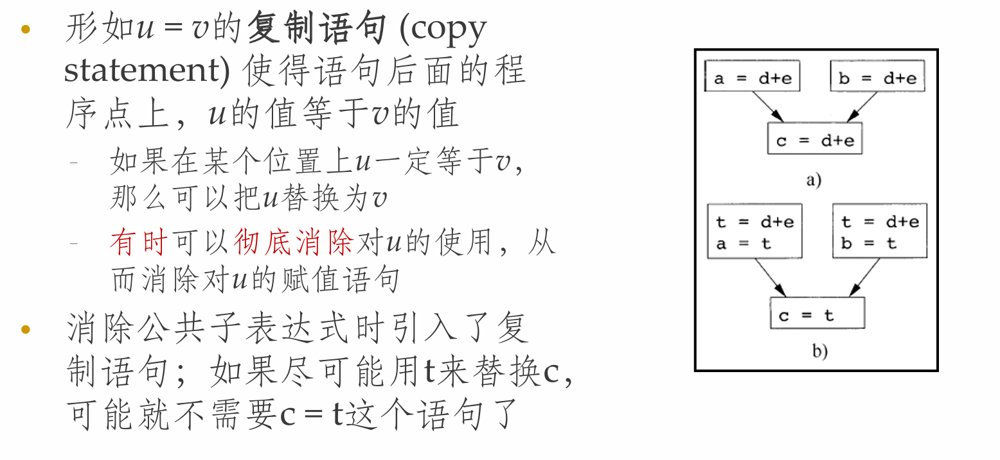
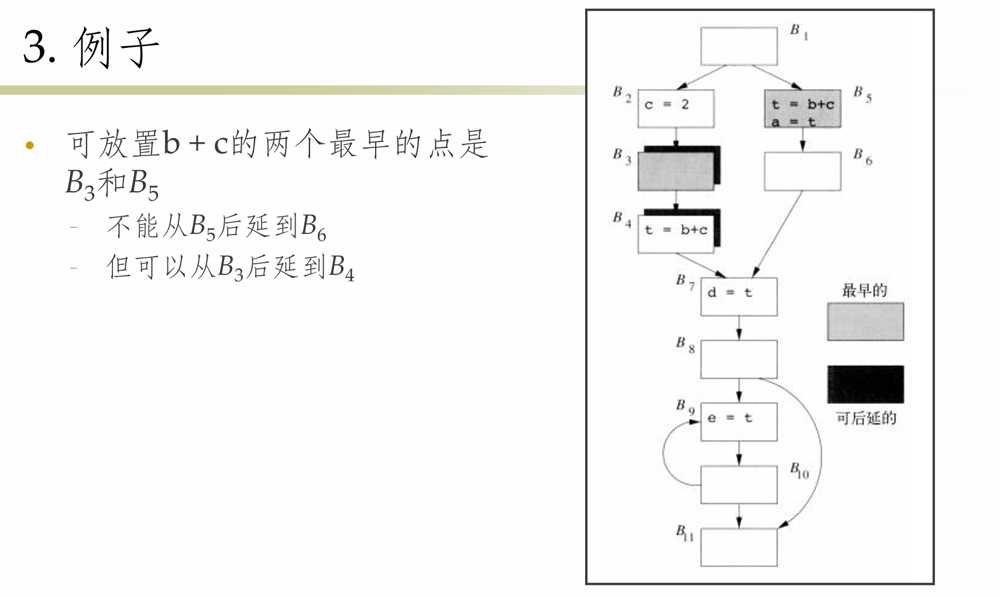

**NJU-CourseNote: Principles and Techniques of Compilers - Ch09 Machine-Free Optimization.**

<!--more-->

> **Tips:**
>
> 强烈建议修习李樾和谭添老师开设的《静态分析》课程. 该部分的理论知识更贴近于静态分析的内容, 因此本笔记会略去相关内容.
>
> **课程链接** <https://tai-e.pascal-lab.net/lectures.html>

## 引言

- 代码优化或者代码改进
  - 在目标代码中消除不必要的指令
  - 把一个指令序列替换为一个完成相同功能的更快的指令序列
- 全局优化
  - 具体的优化实现基于数据流分析技术
  - 用以收集程序相关信息的算法

### 优化的主要来源

- 编译器只能通过一些相对低层的语义等价转换来优化代码
  - **冗余运算的原因**
    - 源程序中的冗余
    - 高级程序设计语言编程的副产品，如`A[i][j].f = 0; A[i][j].k = 1;`
  - **语义不变的优化**
    - 公共子表达式消除
    - 复制传播
    - 死代码消除
    - 常量折叠

## 基本优化技术

### 控制流图

- **控制流图(Control Flow Graph)**
  - 表示程序控制流的有向图(简称流图)
  - 流图的结点是基本块
  - 流图的边指明了哪些基本块可以跟在一个基本块之后运行
    - 若基本块`Bi`最后一条指令执行后紧跟着执行的指令可能为基本块`Bj`，则图上有一条边`Bi -> Bj`
  - 图上的路径表示程序执行的路径，可作为优化与分析的基础
    - 它给出了程序的控制流
    - 可以根据流图了解到一个值是否会被使用等信息

> **Exmaple:**
>
> 

### 全局公共子表达式

- **公共子表达式(Common Subexpression)**
  - 在某次出现之前必然已被计算过
  - E的运算分量在该次计算之后没有被改变
- 如果上次公共子表达式E值赋给了x，且x值没有被修改过，那么我们可使用x，而无需计算E

> **Example**
>
> 

### 复制传播



> **Example**
>
> ```
> x = t3
> a[t4] = x
> ```
> 可以被优化为
>
> ```
> x = t3
> a[t4] = t3
> ```

### 死代码消除


### 代码移动

- 循环中的代码会被执行很多次
  - **循环不变表达式:** 循环的同一次运行的不同迭代中，表达式的值不变
- 把循环不变表达式移动到循环入口之前计算可以提高效率
  - **循环入口:** 进入循环的跳转都以这个入口为目标

> **Example:** `while (i <= limit – 2){...}`
>
> 如果`limit`在循环体内不会改变, 则可在循环外计算`limit - 2`
>
> 可以优化为`t = limit - 2; while(i <= t){...}`

### 归纳变量和强度消减


## 数据流分析

本处略, 参见静态分析中的数据流分析

<https://cs.nju.edu.cn/tiantan/software-analysis/DFA-AP.pdf>

<https://cs.nju.edu.cn/tiantan/software-analysis/DFA-FD.pdf>

## 部分冗余消除

### 懒惰代码移动

- **目标**
  - 所有不复制代码就可消除的冗余计算都被消除
  - 优化后的代码不会执行原程序中不执行的任何计算
  - 表达式的计算应该**尽量靠后**，以利于寄存器的分配
- **冗余消除**
  - 完全冗余
  - 部分冗余：在流图中放置表达式`x + y`的拷贝，使得某处的`x + y`成为完全冗余，从而删除
- **基本步骤**
  1. 找出各程序点上预期执行的所有表达式
  2. 在表达式被预期执行但是不可用的程序点上，放置表达式的计算
  3. 把表达式尽量后延到某个程序点，在到达这个点的所有路径上，这个表达式在这个程序点之前被预期执行，但是还没有使用这个值
  4. 消除只使用一次的临时变量

#### 预期执行表达式


#### 可用表达式

- 和前面的可用表达式类似，但假设代码已经被复制到了预期执行点上
- 表达式在基本块的出口处**可用(available)**的条件
  - 在基本块的入口处可用，或在基本块的入口处的预期执行表达式中
  - 且没有被这个基本块杀死

> **Exmaple:**
>
> 

#### 可后延表达式


> **Tips:**
>
> 粗略地说，一个表达式将被放置在边界上，即一个表达式从可后延变成不可后延的地方

> **Example:**
>
> 

#### 被使用的表达式

- 确定一个被引入的临时变量是否在它所在基本块之外的其它地方**被使用(used)**
  - 对表达式的活跃性分析
  - 如果从程序点p出发的一条路径在表达式被重新求值之前使用了该表达式，那么该表达式在点p上被使用


## 流图中的循环

- 循环的重要性
  - 程序的大部分执行时间都花在循环上
  - 也是数据流分析需要经过若干次迭代的原因

### 支配结点


#### 支配结点树

- **支配结点树(Dominator Tree)**可以表示支配关系
  - 根结点：入口结点
  - 每个结点d支配且只支配树中的后代结点
- **直接支配结点(Immediate Dominator)**
  - 从入口结点到达`n`的任何路径(不含`n`)中，它是路径中最后一个支配`n`的结点
  - `n`的直接支配结点`m`具有如下性质：如果`d != n`且`d dom n`，那么`d dom m`

> **Example: 支配节点树**
>
> 

#### 寻找支配结点算法


> **Example:**
>
> 

### 深度优先生成树

- **深度优先搜索(Depth-First Search)**
  - 搜索过程从入口结点开始，并首先访问离入口结点最远的结点
- **深度优先生成树**
  - 一个深度优先过程中的搜索路线形成了一个**深度优先生成树(Depth-First Spanning Tree, DFST)**

> **Example:**
>
> 

#### 深度优先排序

- **前序遍历**
  - 先访问一个结点，然后从左到右递归地访问该结点的子结点
- **后序遍历**
  - 首先递归地从左到右访问一个结点的子结点，然后访问该结点
- **深度优先排序(Depth-First Ordering)**
  - 首先访问一个结点，然后访问该结点的最右子结点，再访问这个子结点左边的子结点，依次类推(与后序遍历的顺序相反)

> **Example:**
>
> 
>
> 此处的遍历顺序是对于右边的深度优先生成树来说的

#### 深度优先排序算法


#### 流图中边的分类


#### 回边和可归约性


#### 流图的深度


## 自然循环

- 自然循环的性质
  - 有一个唯一的入口结点，即**循环头(header)**，这个结点支配循环中的所有结点
  - 必然存在进入循环头的回边
- **自然循环(Natural Loop)**的定义
  - 给定回边`n -> d`的自然循环是`d`，加上不经过`d`就能够到达`n`的结点的集合
  - `d`是这个循环的头

### 自然循环构造算法


> **Example:**
>
> 

### 自然循环的性质


### 循环头上头(Preheader)

- 每个自然循环都有一个循环头header
- 一些循环相关的优化(如循环不变量移动)需要在循环头之前插入代码
- 常见做法是在循环头之前插入一个基本块(称为preheader)，用于存放相关的代码

