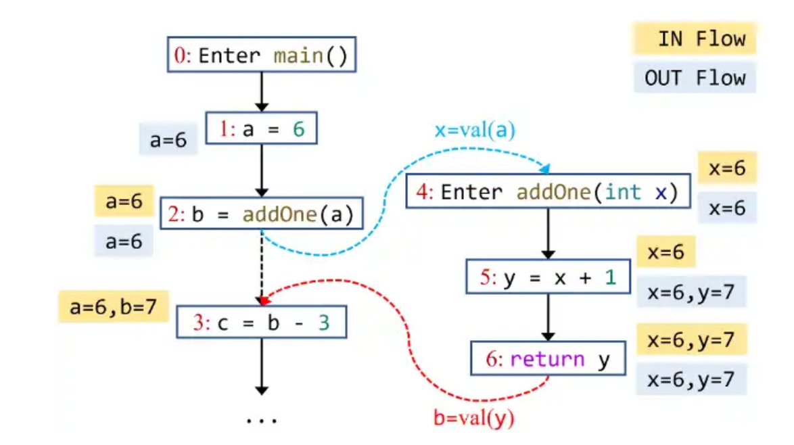

**NJU Static Program Analysis | Assignment-4 Class Hierarchy Analysis & Interprocedural Constant Propagation.**

<!--more-->

## 实验信息&食用指南

见本博客A1-A3.

> **手册的手册不能替代手册, 看不懂的话请回去看手册. ——** [**RicoloveFeng|SPA-Freestyle-Guidance**](https://github.com/RicoloveFeng)

## 实验目标

基于**Tai-e** 框架实现 **CHA** & **Inter Constprop**.

~~真的还有必要在记录里补充这个吗~~

## 实验简析

其实没什么好说的, 课程 & ppt & 指南已经讲的比较明确了, 笔者在此补充一些手册写的不明确或是略去的部分.

**不过本次实验涉及不少新东西, 烦请耐心阅读相关代码API.**

## Preparation

从Assignment2中将`ConstPropogation.java` copy到本次实验目录对应位置.

**需要注意的是, A2中不完全正确的实现可能会影响本次实验的本地测试.**

## CHABuilder

这部分tt老师贴心的在ppt中给好了算法框架, 对应本次的框架代码复刻即可.

需要注意的是, 只有在完成了该部分后, **Tai-e**框架才能正确构建`ICFG`, 否则使用`Assignment`分析的结果只会为空.

推荐完成顺序 `dispatch` -> `resolve` -> `buildCallGraph`

### dispatch()

可以选择递归或者循环完成该部分.

- `dispatch()`可能会失败, 此时可以返回`null`, 但要确保`resolve()`中可以正确处理这一情况.

    > **Additional:** 为什么可能会失败?
    >
    > `resolve()`中, 假设我们要处理一个`Interface`或者`Abstract`类型声明的类方法, 首先我们需要`dispatch`这个声明类本身, 易见此时应当得到`null`(接口中的方法和抽象方法无法被实例化)

- `dispatch()`得到的`JMethod`如果是`Abstract`, 同样需要返回`null`.

    > **Tips:** 由于OOP的机制, 当`JMethod`是`Abstract`时, 不需要继续`dispatch`了. 如果对此感到困惑可以去查阅相关的OOP资料.

### resolve()

- 遍历的方式自选, 笔者采用较好实现的BFS.

- 尽管课上将`Interface`归入了**Virtual Invoke**, 但按照代码框架, 这部分单独作为一个需要处理的`CallKind`. 不过处理起来也并非难事, 因为处理方式和`VIRTUAL`没有实质性区别.

- 需要注意的是, 框架中处理**Interface**和**Class**分别有专门的API方法, 具体使用什么API, 可以阅读`ClassHierarachy`, `CHABuilder`中也提供了访问`ClassHierarachy`的成员`private ClassHierarchy hierarchy`.

- `STATIC`方法的获取在框架中没有专门的API, 但可以使用`dispatch()`获取, 因此`STATIC`和`SPRECIAL`也可以一起处理.

### buildCallGraph()

实现和ppt中的算法没有区别.

- 判断是否可达在框架中集成到了`Class CallGraph`的`addReachableMethod()`方法中了, 可以阅读API注释获取更详细的信息.

- 得到`callSite`, `callKind`的方法也可以通过`Class CallGraph`获取.~~(我看看是谁不想去读API注释)~~

## InterSovler

由于框架代码在`InterSovler`这一部分进行了较大幅度的重构, 因此笔者推荐先完成该部分使得对`InterConstantPropopagation`有一个自顶向下的认识.

同手册所说, 该部分比起A2的`worklistSovler`没有太大的区别, 跟着手册做即可.

**注意:** 该部分实例化的`private final InterDataflowAnalysis<Node, Fact> analysis`继承自`Class AbstractInterDataflowAnalysis`, 该部分的源码阅读是必不可少的.~~(这里不读在完成InterConstantPropopagation的时候也要读)~~

### initialize()

- 除去icfg的入口方法使用`BoundaryInit`外, 其余节点均使用`NormalInit`. 可以通过`icfg.entryMethods()`方法获取入口方法.

> **Tips:** 需要注意的是`icfg.entryMethods()`返回的是`Stream`类型, 遍历该类型可以使用`forEach`. 更多关于`forEach`的信息可以查阅java的文档.

```java
icfg.entryMethods().forEach(method -> {
    ...
});
```

> **Confusion:** 笔者在此比较困惑为何可能会出现多个入口, 虽然在网络上查询得知java中可能不止一个`main()`方法, 但不知如何在tai-e框架中复现, 以及本次实验中的"多个入口"是否对应该特性.

### dosolve()

与A2相比, 只需要修改处理`pred Node`部分为`pred Edge`, 可以通过`getInEdgesOf()`方法获得`pred Edge`信息, 与`analysis.transferNode()`对应, 可通过`analysis.transferEdge()`来处理`pred Edge`.

## InterConstantPropopagation

部分API在框架中已经给出了实现, 在该部分只需要实现6个API即可.

**善用A2中完成部分进行本次实验, 过程间常量传播并不影响计算常量的逻辑.**

### transferCallNode() & transferNonCallNode()

含义同方法名, 如果这个`Node`(即`Stmt`)是`Invoke`, 就称该`Node`为`CallNode`, 否则为`NonCallNode`.

- 需要注意的是, 过程间处理的大部分操作都在`Edge`上而非`Node`上, 因此我们在`transferCallNode()`中并不会进行 add/kill def 的操作. 这一点与指南上的图片逻辑相同.



> 如图片所示, `Node 2`在经过`transferCallNode()`后并没有把`b`添加进`outFact`.
>
> 尽管我们可以在这里处理, ~~但这样有可能会让你过不去oj~~, 但这样会造成逻辑上的混乱, 所有的**interprocedural** 操作都在`Edge`上进行在逻辑上是一致的. 接下来对四种`transferEdge`的处理中会解释这一点.

- 所以对于非call Node, 可以直接使用过程内分析的`transferNode()`方法, 对于call Node, `transferCallNode()`只需要把`inFact` 赋值给 `outFact`即可.

### transfer**Edge

在完成该部分前, 要先知道该部分会在什么地方使用, 通过阅读`Class AbstractInterDataflowAnalysis`的源码API, 可以发现四种`transfer**Edge` 统一为了一个方法`transferEdge()`.(如果阅读的足够仔细, 会发现两个`NodeTransfer`的方法也被统一为了`transferNode()`)

**注意:** 如手册所言, 由于java的引用机制, 不应当对第二个参数`CPFact out`做任何修改. 返回值也不应是第二个参数本身, 需要深拷贝一个`out`或者`new CPFact()`.

#### transferNormalEdge()

对于普通节点, 不需要对`OutFact`中的内容做修改, 直接传给`Edge`的`target`即可.

> 对应上文图片中的**黑色实线**.

#### transferCallToReturnEdge()

在这里要处理**def kill**工作, 根据框架代码, 这里的`Stmt`一定是`Invoke`, 请阅读源码API获取使用信息.

- `Invoke`继承自`DefinitionStmt`, 如何获取`def`在之前的实验中已有涉及.

> 对应上文图片中的**黑色虚线**.

#### transferCallEdge()

负责传参中的`Var`转换.

- 对于`Invoke invoke`, 可以通过`invoke.getInvokeExp().getArgs()`获取传入**实参**的信息.

- 对于`JMethod callee`, 可以通过`callee.getIR().getParams()`获取调用方法的**形参**信息.

- 在tai-e框架中, 保证上述形参与实参列表顺序是一一对应的. 可以根据这一特性维护传参的转换过程.

> 对应上文图片中的**蓝色虚线**.

#### transferReturnEdge()

负责将调用方法的返回值传回`callSite`.

- `Class ReturnEdge`的`getReturnVars()`的API说明讲明了为什么可能有多个返回值, 需要注意的是, 如果有多个返回值, 需要使用`cp.meetValue()`.

> 对应上文图片中的**红色虚线**.

## 总结

过程间常量传播的思想还是比较巧妙的, 值得细心品味.
