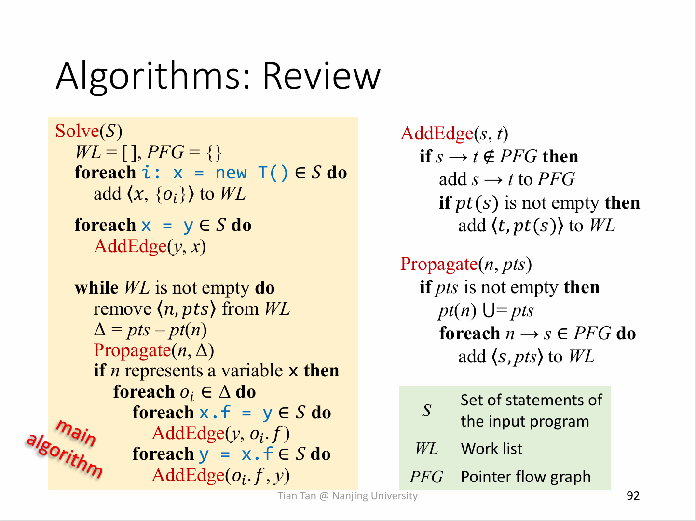
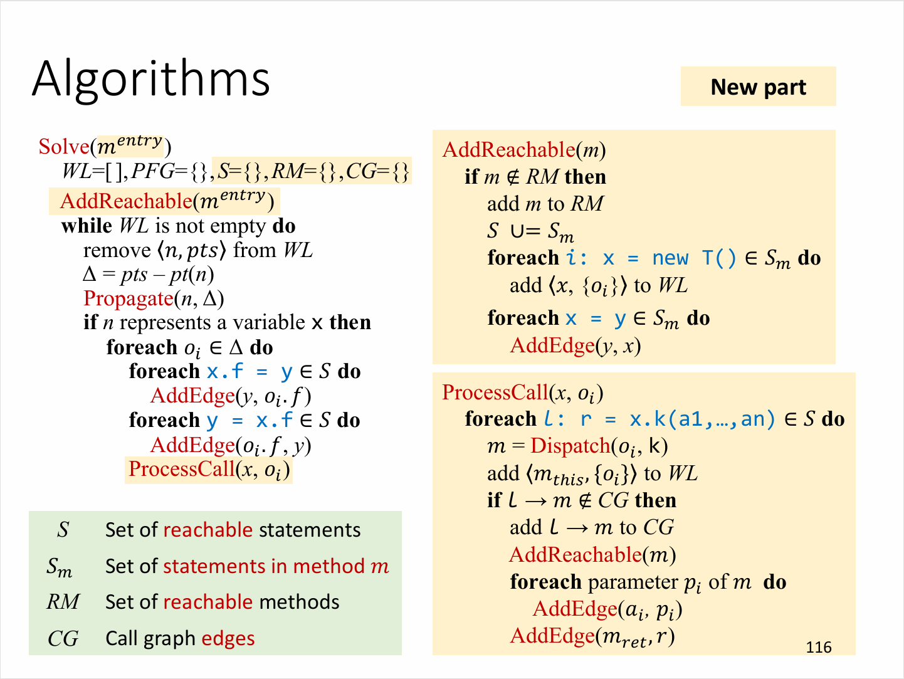
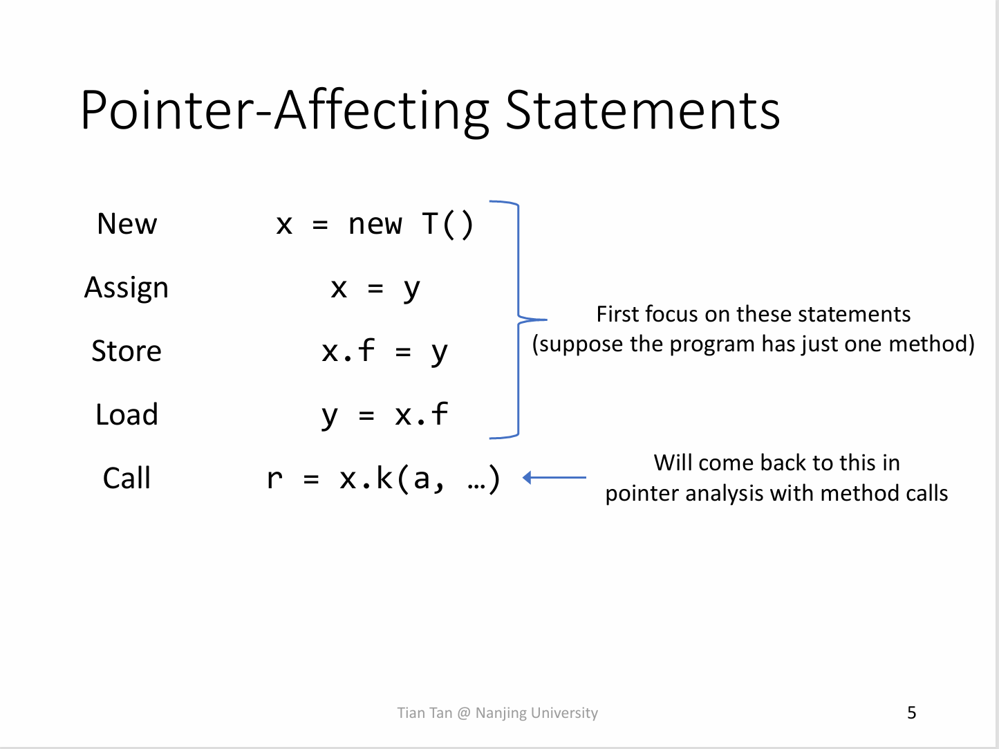
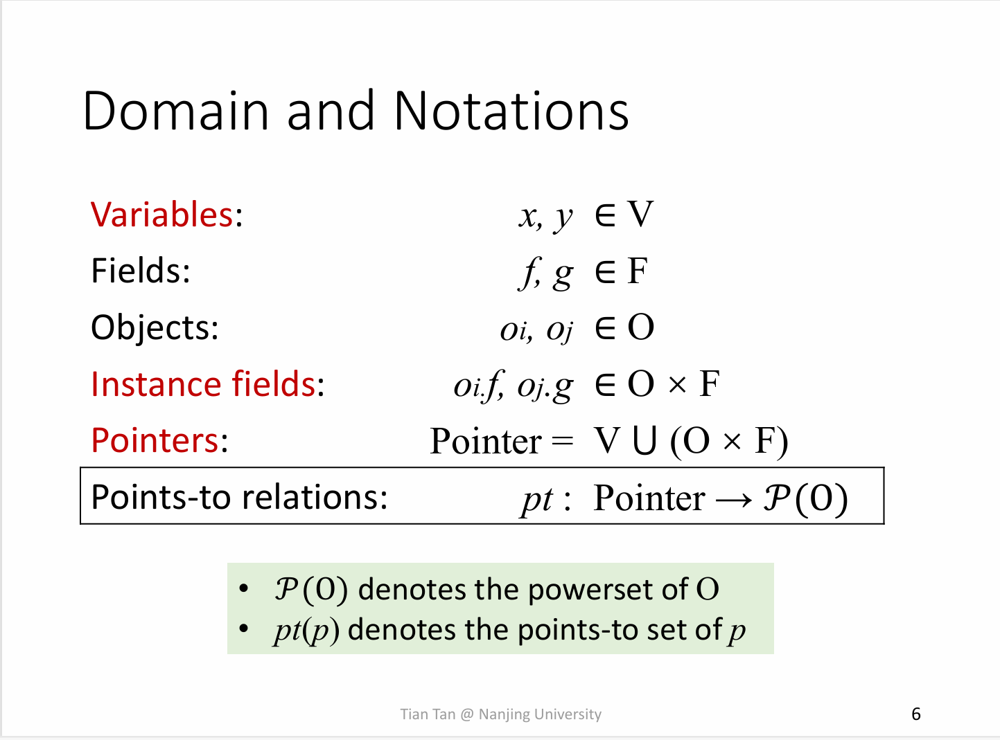
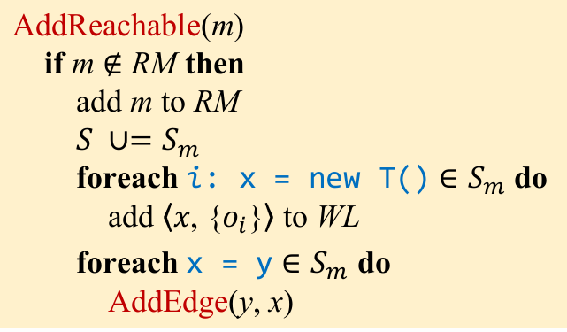

**NJU Static Program Analysis | Assignment-5 Context Insensitive Pointer Analysis.**

<!--more-->

> 这些规则与你在课上所学到的规则非常相似 **（甚至更简单）**.  ——A5实验指南

对......对吗？

## 实验目标

基于**tai-e**框架实现非上下文敏感的指针分析.

## Preparation

**Hint:** A5和A6不再像之前的实验般友好, 没有理解上课时所讲算法, 实验指南或框架代码的人会被这两次实验狠狠地拷打.(笔者已感到有些汗流浃背了)

## 算法理论

### 算法伪代码





### 规则形式化表述

#### 分析语句类型



#### 符号体系



#### 对象传递规则

|Kind|Stmt|Rule|PFG Edge|
|:---:|:---:|:---:|:---:|
|New|`i : x = new T()`|$\dfrac{}{o_i \in pt(x)}$|$\text{N/A}$|
|Assign|`x = y`|$\dfrac{o_i \in pt(y)}{o_i \in pt(x)}$|$x \leftarrow y$|
|Field Store|`x.f = y`|$\dfrac{o_i \in pt(x),\ o_j \in pt(y)}{o_j \in pt(o_i.f)}$|$y \leftarrow o_i.f$|
|Field Load|`y = x.f`|$\dfrac{o_i \in pt(x),\ o_j \in pt(o_i.f)}{o_j \in pt(y)}$|$y \leftarrow o_i.f$|
|Static Store|`T.f = y`|$\dfrac{o_i \in pt(y)}{o_i \in pt(T.f)}$|$T.f \leftarrow y$|
|Static Load|`y = T.f`|$\dfrac{o_i \in pt(T.f)}{o_i \in pt(y)}$|$y \leftarrow T.f$|
|Array Store|`x[i] = y`|$\dfrac{o_u \in pt(x),\ i_v \in pt(y)}{o_v \in pt(o_u[*])}$|$o_u[*] \leftarrow y$|
|Array Load|`y = x[i]`|$\dfrac{o_u \in pt(x),\ o_v \in pt(o_u[*])}{o_v \in pt(y)}$|$y \leftarrow o_u[*]$|
|Call|`l : r = x.k(a1, ..., an)`|$\dfrac{\begin{array}{c} o_i \in pt(x),\ m = Dispatch(o_i,\ k),\\ o_u \in pt(aj),\ i \leq j \leq n,\\ o_v \in pt(m_{ret})\end{array}}{\begin{array}{c} o_i \in pt(m_{this}),\\ o_u \in pt(m_{pj}),\ 1 \leq j \leq n,\\ o_v \in pt(r)\end{array}}$|$\begin{array}{c}a1 \rightarrow m_{p1} \\ ... \\ an \rightarrow m_{pn} \\ r \leftarrow m_{ret}\end{array}$|
|Static Call|`r = T.k(a1, ..., an)`|$\dfrac{\begin{array}{c} o_u \in pt(aj),\ i \leq j \leq n,\\ o_v \in pt(m_{ret}) \end{array}}{\begin{array}{c} o_u \in pt(m_{pj}),\ 1 \leq j \leq n,\\ o_v \in pt(r) \end{array}}$|$\begin{array}{c} a1 \rightarrow m_{p1} \\ ... \\ an \rightarrow m_{pn} \\ r \leftarrow m_{ret} \end{array}$|

## 部分框架代码带读

该部分是为分析实际伪代码的书写, 因为课程上的算法和框架中的实现不完全一致, 主要体现在 **Stmt in Method** 这一部分. 笔者就部分关键框架代码进行讲解.

### 概览

`graph.callgraph`, `ir`包中的大部分文件在先前的实验中已经了解, 如有遗忘或模糊可以参考先前的实验指南或自行阅读相关框架代码.

**着重注意** `Stmt`的层次结构和`Stmt`中包含的信息类型的继承关系(如`Var`, `LValue`等), 以及`JMethod`和`IR`相关信息, 较为重要的是在A4中如何获取形参和实参.

新的文件主要集中在`pta`包中, 笔者在此着重介绍该部分.

### Pointer & PointsToSet

指针分析中最重要的两个类型, 前者是在指针流图中的节点, 后者存储指向信息.

在框架代码中, 每个`Pointer`包含一个`PointsToSet`实例, 包含该指针指向的对象信息.

通过阅读`pointsToSet`源码, 不难看出是由基本的`Set`实例化得到, 支持`Set`的常规基本操作.

#### VarPtr & InstanceField & StaticField & ArrayIndex

代表了四种指针类型, 均继承自`Pointer`.

与`Pointer`相比没有太大的不同, 仅根据类型不同添加了如何获取指针信息的API.

### PointerFlowGraph

本次实验中最重要的类之一, 存储了指针分析过程中的指针流信息.

其实现运用了多个`Map`, 其提供的API包括两类:

- 图结构的`addEdge()`和`getSuccOf()`, 这两个API可以修改和遍历**PFG**.

- 图信息的四种`get`方法, 由于`JMethod`,`IR`以及`Obj`与`Pointer`并不是直接关联, 该类方法提供了一个获取对应类型指针的API.
    > **Tips:** 举个例子, 对于`Stmt`类型的Assign语句`x = y`, 可以解析得到`Var`类型的`x`和`y`, 通过`getVarPtr()`方法就可以得到`Var`类型的`x`,`y`在**PFG**中对应的指针.

### CIPTA & CIPTAResult & ResultProcessor

这些类与实现的核心逻辑联系不大, 这三个类负责处理指针分析算法的前后工作, 提供了初始化, 执行指针分析和解析指针分析结果的API. 更具体的信息可以阅读框架代码.

### HeapModel & Obj

该部分对应了指针分析原理中的**堆抽象**部分.

内部涉及的API比较简单, 且大多数不需要关注, 需要注意的是

```java
class HeapModel{
    ...
    /**
     * @return the abstract object for given new statement.
     */
    Obj getObj(New allocSite);
    ...
}
```

该方法提供了获取`Stmt New`语句创建的对象的API.

> **Tips:** 指针分析中最特殊的语句便是`New`, 只有`New`语句可以创建对象, 指针流图中所有的对象均是由`New`方法创建出来的. 因此只有`New`语句需要通过与**抽象堆**交互获取对象, 其余语句获取对象均由**PFG**中传递得到.

### Stmt Package

本次实验所涉及的`Stmt`类型继承关系为`Stmt->AbstractStmt->DefinitionStmt->AssignStmt->(FieldStmt)`

其中大部分API在之前的实验中已经熟悉了. 以下介绍一些本实验中可能涉及的细节.

#### FieldStmt

该类提供了`getFieldAccess()`和`getFieldRef()`, 其中后者比较重要, 可以通过`fieldStmt.getFieldRef().resolve()`获得`JField field`.(实验指南中已指出)

#### accept() *可选

详见[**StmtVisitor**](#stmtvisitor-可选)

### WorkList

对应算法伪代码中的WorkList. (笔者较为疑惑为何其内部节点称为`Entry`)

### CallGraph & AbstractCallGraph & DefaultCallGraph

CallGraph在实验A4中已经接触过了, 笔者在此不再赘述.

### StmtVisitor *可选

访问者模式不是完成本实验必要的部分, 如果不打算使用访问者模式, 可以跳过这一部分.

`Solver`中的`class StmtProcessor`继承自该类, 用以实现**访问者设计模式**. 内部重载了多个`visit()`方法, 用以访问不同的类型.

需要注意的是, 访问者模式需要被访问的类支持这一设计, 具体表现为其包含`accept()`方法.

访问者用以优雅地替代大量`instanceof`的判断, 由**访问类**(本次实验中为`class StmtProcessor`)的函数重载巧妙地避开大量的类型判定.

笔者在此以`New`,`Copy`和`StmtProcessor`为例具体说明.

在本次实验中, `addReachable()`需要遍历新方法中的所有语句, 对不同语句做不同处理.



显然这些处理从封装的角度看不应当嵌入到`New`和`Assign`类的内部, 而是应当放在外部进行处理, 那么如果不使用访问者模式, 写出来的代码大概是长这样的:

```java
for(Stmt stmt : method.getIR().getStmts()){
    if (stmt instanceof New newStmt){
        ...
    }
    else if(stmt instanceof Assign assignStmt){
        ...
    }
    else{
        ...
    }
}
```

这样的代码一点也不优雅, 充斥着大量的冗余判断. 访问者模式可以很好的解决这个问题.

```java
class New{
    ...

    public <T> T accept(StmtVisitor<T> visitor) {
        return visitor.visit(this);
    }
}
//此处略去Assign
public interface StmtVisitor<T> {
    T visit(New stmt);
    T visit(Assign stmt);
    ...
}
class StmtProcessor implements StmtVisitor<Void>{
    Void visit(New stmt){
        //handle new stmt
    }
    Void visit(Assign stmt){
        //handle assign stmt
    }
}
```

此时将遍历`Stmt`的代码改为

```java
for(Stmt stmt : method.getIR().getStmts()){
    stmt.accept(stmtProcessor); // 已经实例化过了
}
```

这段代码的逻辑应该是不难理解的, 在`instanceof`实现的遍历中, 就好像是一个提供多种服务的公司, 挨个询问客户购买的是什么服务然后提供服务(在这里简单假设每家只购买了一种服务).而访问者模式中, 客户向公司发送"请求", 公司从多个服务中选择正确的为客户进行服务(函数重载).

在访问者模式中, `New`和`Assign`通过`accept()`方法向`StmtProcessor`提供了自己的类型, 并在该方法中调用来自`StmtProcessor`的处理方法`visit()`. 从面向对象设计角度来看, 是一种优于前者的设计模式.

## 框架代码中的算法

### S & S_m

> 这里部分参考了[**RicoloveFeng|SPA-Freestyle-Guidance**](https://github.com/RicoloveFeng)中的内容.

这里是与课上讲述的算法区别最大的地方. 阅读`Sovler`中的代码, 发现该部分是不存在对应关系的.

重读定义`Var`的文件, 会发现一些之前没有用到的函数在本次实验中利用了起来, 如`addLoadField()`, `getLoadFields()`.

这些方法就是"隐式"维护S和S_m的API(说**隐式**是因为对于完成实验来说, 该部分不需要详细了解).

这部分实现了S和S_m的"自动"维护, 即通过生成**IR**, 和`CallGraph`中的`addMethod()`进行维护. 具体的细节可以阅读源码.

对于完成本次实验来说, 只需要知道不需要处理有关S和S_m的工作了, 在需要获取相关信息时, 直接通过`Var`中的`getXXX()`获取即可.

### 基于框架代码的算法伪代码

**Tips:** 该部分的代码不会严格遵循框架代码中的API, 仅作示例.

**推荐完成顺序:** 优先实现顶层方法`analysis()`

#### analysis()

```java
void analysis(){
    // 所有的初始化工作框架代码中已经完成, 包括添加Entry Method
    // 这里只需要处理while WorkList NOT Empty即可
    while(WorkList.isNotEmpty()){
        <n, pts> = WorkList.poll() // <Pointer, PointsToSet>
        delta_pts = propagate(n, pts)
        if(n instanceof VarPtr x){
            foreach oi in delta_pts do{
                foreach x.getStoreFields() do
                    // x.f = y
                    addEdge(y, oi.f)
                foreach x.getLoadFields() do
                    // y = x.f
                    addEdge(oi.f, y)
                foreach x.getStoreArrays() do
                    // x[i] = y
                    addEdge(y, oi[*])
                foreach x.getLoadArrays() do
                    // y = x[i]
                    addEdge(oi[*], y)

                processCall(x, oi);
            }
        }
    }
}
```

该部分的逻辑比较简单, 照着算法写就行, 获取跟`Var x`相关的`Stmt`的方法在[**S & S_m**](#s--s_m)部分已经讲过, 此处不再赘述.

不要忘记依手册在此处完成对Array的处理.

#### addPFGEdge()

```java
void addPFGEdge(Pointer source, Pointer target){
    if (pointerFlowGraph.addEdge(source, target)){
        // form API: true mean not include
        if (source.getPointsToSet().isNotEmpty()){
            WorkList.add(<target, source_pts>) // <Pointer, PointsToSet>
        }
    }
}
```

同样是照着算法写即可.

#### propagate()

```java
PointsToSet propagate(Pointer pointer, PointsToSet pointsToSet){
    delta_pts = pointsToSet - pointer.getPointsToSet();

    pointer_pts += delta_pts;

    foreach pointerpointerFlowGraph.getSuccsOf(pointer) do
        //succ of pointer node
        WorkList.add(<succ, delta_pts>) // <Pointer, PointsToSet>
}
```

#### processCall

```java
void processCall(Var var, Obj recv) {
    foreach var.var.getInvokes() do
        // [invoke] l: r = x.k(a1,..., an)
        JMethod method = resolveCallee(recv, invoke)
        if(method thisVar is not empty){
            //means is not Static
            //also can use !invoke.isStatic()
            workList.add(<method_this, recv>);
            if(callGraph.addEdge(new Edge(callKind, invoke, method))){
                //transfer paramters & return Var
                foreach paramters : addEdge();
                returnVar : addEdge();
            }
        }
}
```

有一些细节需要注意:

- 如何处理`JMethod`在A4中已经接触过了, 可以通过`method.getIR().getThis()`获取该方法的this Var, 然后再通过**PFG**就能获取this Pointer了. 如果还有印象的话, A4中通过`CallGraphs.getCallKind()`来获取`CallKind`, 在本次实验沿用该方法即可.
- 在这里不处理Static Call, 通过判断是否存在this指针, `isStatic()`方法都可以判断(尽管从实际上分析, 此处不应该也不可能出现Static Call)
- 之后的处理参数和返回值同A4, 同样需要注意返回值是否被丢弃或有复数个返回值.

#### addReachable()

如果不使用访问者模式:

```java
void addReachable(JMethod method) {
    if (callGraph.addReachableMethod(method)){
        //form API : true means not include
        for(Stmt stmt : method.getIR().getStmts()){
            if(stmt instanceof New){
                WorkList.add(stmt_def, obj)
            }
            if(stmt instanceof Assign){
                addEdge(right, left)
            }
            if(stmt instanceof StoreField && isStatic){
                addEdge(right, left)
            }
            if(stmt instanceof LoadField && isStatic){
                addEdge(right, left)
            }
            if(stmt instanceof Invoke && isStatic){
                //same as processCall
                //except do not need to add <this, obj> to workList
            }
        }
    }
}
```

如果使用访问者模式:

```java
void addReachable(JMethod method) {
    if (callGraph.addReachableMethod(method)){
        for(Stmt stmt : method.getIR().getStmts()){
            stmt.accept(stmtProcessor);
        }
    }
}
```

逻辑同不使用访问模式的`instanceof`成立后执行的方法. 将这些方法写进`StmtProcessor`中的`visit()`即可.

> **Tips:** 为什么要在这里处理静态方法和字段?
>
> 在回答这个问题之前, 不妨思考一下为什么非静态指针要在`analysis()`中如此处理. 因为不论是字段还是方法, 都需要"resolve"到一个确定的结果时, 才能进行分析和对象传递. 而静态方法和静态字段的对象是唯一确定的, 在遍历到一个新方法时只需要处理一次.

- 框架代码中的`CallGraph`包含了`RM`, 阅读相关API以获取详细信息.
- 如何根据`Stmt`信息获取指针`Pointer`的方法在上文框架代码分析中已经指出. 如果该方法在后期完成, 此时应当已经知道如何获取所需参数和类型.
- 需要注意的是在此仍然需要通过`resolveCallee()`方法获得静态方法, 参数设置为`recv = null`即可.

## 总结

指针分析还是相当硬核的, 尽管实验框架已经化简了其中部分内容, 这仍然是一个较困难的实验.
