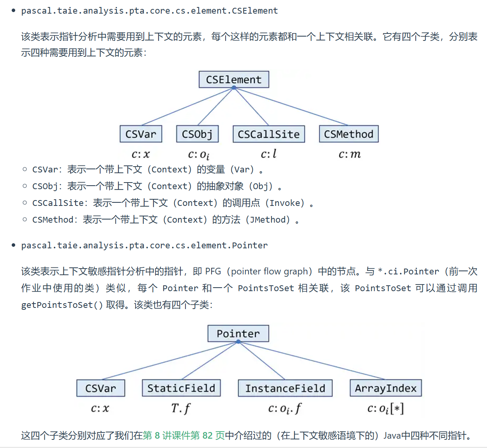
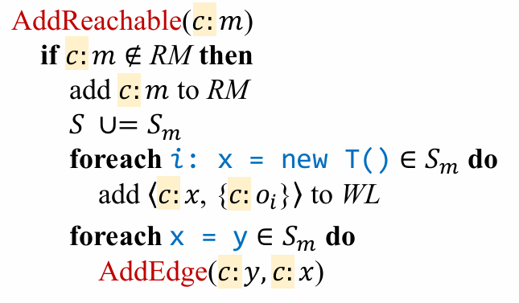
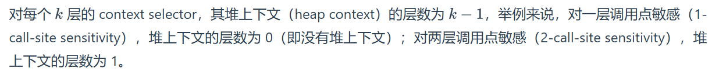

**NJU Static Program Analysis | Assignment-6 Context Sensitive Pointer Analysis.**

<!--more-->

笔者写该实验写了一个下午之后注意力涣散了😇(†升天†)

> **Tips:** 本次实验的指南中存在省略, 因此Debug过程可能会包含一些困难.

## 实验目标

基于**tai-e**框架实现上下文敏感的指针分析.

## Preparation

- **确保**理解了CI和CS的指针分析理论部分知识, 笔者不负责讲解课程中已经讲述过的理论知识.

- **确保**理解了实验指南中的注意事项和框架中新增以及修改的源码, 否则在阅读本实验记录可能会遇到"共识"缺失的问题.

## 理论部分

总体来说, 上下文敏感指针分析算法和理论与上下文非敏感指针分析区别不大, 大体框架是一致的. 笔者不再像A5中整理, 不同的部分会在下文需要时给出.

## 框架代码

比起A5的框架代码变动并不大, 笔者在此简要解释一些要点.

- 手册中该部分提及了上下文敏感指针分析中最重要的部分之一, `CSElement`和`Pointer`是本次实验主要操作的对象.

- 在正式写实验之前请思考这两者间的不同, 如有混淆可能会影响实验的完成.(明晰两者的区别才知道该去哪里找API, 该调用什么方法, 毕竟ppt上的算法是类型"模糊"的)

- 与A5相同, `Pointer`与`Obj`相对独立, 但请注意这里的`CSElement`与`Element`同样相对独立, `Element`与`Context`组合形成了`CSElement`, 因此许多API需要先取出`Context`或`Element`才能使用. 具体如何取出请参阅框架代码.

- `PointsToSets`的实例化需要调用`PointsToSetsFactory`, 这点与A5不尽相同.

- 上下文敏感指针信息不再通过`PointerFlowGraph`获取而是`CSManager`.

- `Solver`中提供了`private final ContextSelector contextSelector`来获取算法中的`select()`方法, 该部分的实现对应实验指南的**Task2**. 对于**Task1**, 只需要知道可以调用其中的方法获取$c^t$上下文即可.

## Task1 实现上下文敏感指针分析

与A5相同, 推荐先完成顶层方法`analysis()`.

> **Tips:** 在写代码时**一定一定**要注意上下文, 变量命名时要有区分度, 否则**DEBUG**时会充满痛苦.

**重要:** 虽然`Stmt`中不包含上下文信息, 但框架代码中提供了丰富的API来根据`Stmt`的信息获取上下文信息. 同时可以确定的已知的相同上下文可以直接拿过来使用. 框架代码和算法原理确保了上述两点都是正确的.

### analysis()

- 逻辑上与上下文非敏感一致, 区别在于需要做例如`Var`与`CSVar`的转化, 传入`addPFGEdge()`的参数需要附上上下文, 可通过`csManager.getXXX()`获取.
- 别忘了处理**Array Store/Load**, 以及判断`Field`是否为静态字段.

### addPFGEdge()

- 该函数内不涉及对上下文的关注, 与A5中的`addPFGEdge()`字符级一致, 可以直接`Crtl + C/V`.

### propagate()

- 同样不关注上下文信息, 逻辑一致, 但不同的是`PointsToSet`的实例化, 需要通过`PointsToSetFactory`完成.

### processCall()

- 注意该过程涉及三个不同的上下文: `CSVar recv`的上下文$c$, `CSObj recvObj`的上下文$c'$, 和通过`select`选择出的上下文$c^t$. 在使用上下文时请确保使用的是正确的上下文.
- 上下文$c^t$的获取可通过`contextSelector.selectContext()`方法获取.
- Callee的`thisVar`以及参数和返回值的获取在A4, A5中已经指出, 如有遗忘请进行复习.
- `callGraph.addEdge()`中需要新建`Edge`, 其中参数`CallKind`可以通过`CallGraphs.getCallKind()`获取(通过A4了解). 需要注意的是, `CallGraphs`类虽然在本次实验中并未显式放在`src\`目录下, 但仍然可以使用.
- 其余要点在A4和A5中已经提到过, 在此不再赘述.

### addReachable()

- 使用访问者模式时代码依旧简洁, 但是需要注意的是此次使用`StmtProcessor`类时需要为每个方法实例化一个`StmtProcessor`.

    > **Tips:** 原因比较直接, 为了区分上下文信息. 本次实验中处理语句需要用到`CSMethod`的上下文信息.

#### Class StmtProcessor

实现访问者模式的类, 在完成该部分时存在一些注意事项.

- `Copy`, `Static StoreField`和`Static LoadField`与A5几乎没有区别, 注意传入的参数转换为带上下文的即可.
- 算法伪代码中对`New`的处理和实际代码略有出入, 主要体现在上下文$c$上. `Obj`的上下文要通过`contextSelector.selectHeapContext()`获取.

    > 笔者在此简要的解释一下.
    >
    > 
    >
    > 算法中将$x$和$o_i$的上下文均描述成$c$, 这其实表明$x$和$o_i$的上下文来源相同, 而不代表这两个$c$是一致的, 主要原因是限制两者的`k`不一定相同.为了区分, 令其为$c_x$和$c_o$, 笔者通过一个例子说明原因.
    >
    > 假设使用**CallSite敏感**策略, `k = 2`, 令堆上下文为`k - 1 = 1`. 那么传入的`c:method`的上下文为`[3, 9]`, 在该Method中有`15: y = new T()`, 对于`y`, 其上下文为`[3, 9]`, 但对于`o15`, 其上下文为`[9]`. 即二者上下文均来自`c:method`的上下文$c$, 但由于层数不同, 上下文也可能是不同的.

- 对于**静态**`Stmt Invoke`的处理, 最好调用`Context selectContext(CSCallSite, JMethod)`而不是`Context selectContext(CSCallSite, CSObj, JMethod)`, 这是更符合框架代码API的描述的用法. 当然, 也可以选择在Task2中的后者加入静态调用的处理, 这样就可以在`Solver`中统一使用同一个方法.

## Task2 实现常见的上下文敏感策略

- 注意手册上的要求和明确根据**哪个参数**获取上下文即可. 该部分并不难实现.

- 另外需要注意的是框架中将四个参数合并为三个, `CSCallSite`中包含了`Context`和`Invoke`两个参数.

- 注意手册中对静态方法的处理要求, **CallSite**和**Object**, **Type**的要求并不一致.

- 对于`selectContext()`处理方法调用的上下文, 需要根据参数新生成一层; 但对于`selectHeapContext()`处理堆的上下文, 则直接根据参数截取即可.

### \_1CallSelector & \_2CallSelector

对于**CallSite敏感**策略, 上下文自然在参数`CSCallSite callSite`中获取.

如果`k = 2`, 枚举`Context`的层数选择最后一个和新上下文组合即可.

### \_1ObjSelector & \_2ObjSelector

对于**Object敏感**策略, 上下文需要在`CSObj recv`中获取.

### \_1TypeSelector & \_2TypeSelector

对于**Type敏感**策略, 上下文也需要在`CSObj recv`中获取. (想一想`Type`上下文选取是如何来的)

根据**Type敏感**的定义, 可以在框架代码中找到一个对应的API: `Obj.getContainerType()`. 通过该方法获取`Type`即可.

## 总结

如果理解了CI指针分析, 本次CS指针分析实验的原理和逻辑就不难理解, 但细节处理上比A5要麻烦很多, 还请小心仔细.