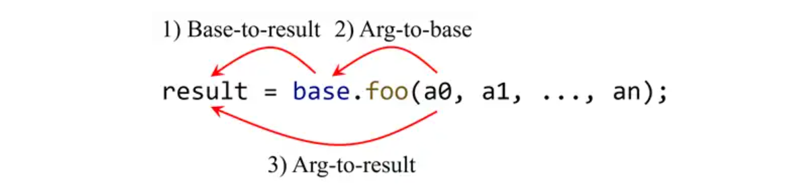
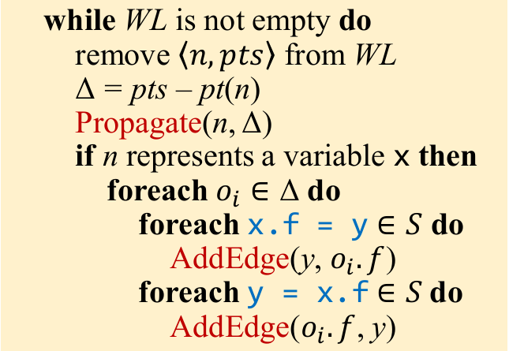
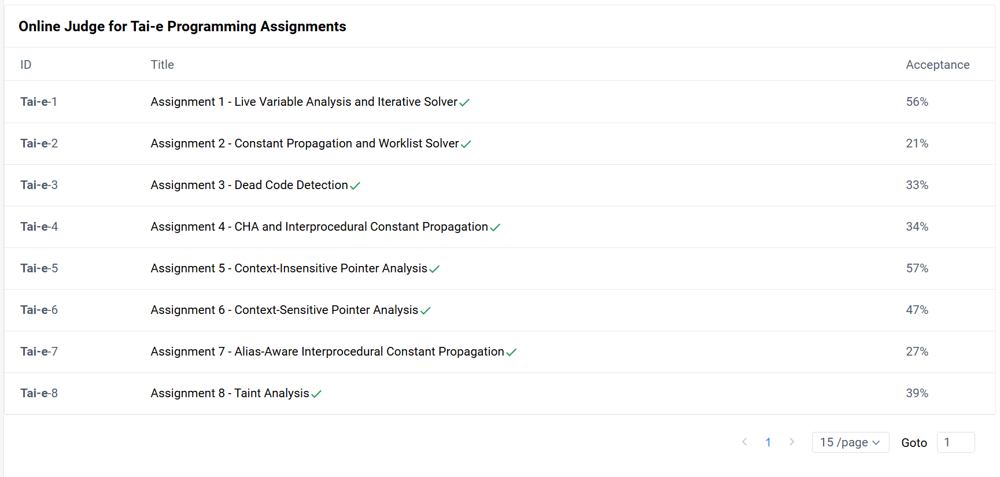

**NJU Static Program Analysis | Assignment-8 Taint Analysis.**

<!--more-->

## 实验目标

基于**tai-e**框架实现污点分析.

## Preparation

将A6的代码复制到此处.

**注意:** A8的`Solver`中额外加入了污点分析所需的字段, 因此不能直接替换A8的`Solver`.

## 部分框架代码带读

在上过课程和阅读了实验指南后, 对于怎么做这个实验会有一个大概的思路, 那么不妨先阅读一下框架代码, 看看Tai-e提供了什么样的工具和API.

### Source & Sink

分别代表了污点分析中的Source和Sink语句, 结构为`Source<JMethod, Type>`和`Sink<JMethod, index>`.

> **Tips:** `record`的用法在之前的实验已经接触过了, 简单来说, 可以通过`source.method()`获取其中的`JMethod method`信息.

### TaintTransfer

对应污点传播的类, 即实验指南中的:

具体规则实验指南和框架代码已足够清晰.

### TaintManager

实验框架中用来管理污点对象的类(或许命名为`TaintObjManager`更合适).

类内采用简单的Map实现`<(Invoke, Type), TaintObj>`的查找.

**注意: 笔者为了方便表述, 使用`TaintObj`表示污点对象, 该类在框架代码中并不存在.**

其中包含三个方法:

- `Obj makeTaint(Invoke source, Type type)`返回一个污点对象实例.

    > **Tips:** 注意到污点对象也是`obj`, 即`taintObj`可以使用`obj`的方法进行操作.

- `boolean isTaint(Obj obj)`判断一个`Obj`是否为`TaintObj`.

- `Invoke getSourceCall(Obj obj)`返回该对象实例化对应的`Invoke`.

### TaintFlow

表示`Source -> Sink`的污染流, 也即污点分析的结果(TT老师在本次课程中一嘴带过的可以追踪的`Source -> Sink`).

### TaintConfig

~~碎碎念: 不是为什么要把管理污点分析所需的数据结构和设置污点分析的配置两个功能都塞进来啊喂!!! 阅读类名谁能知道会把数据结构放在这里啊喂!!!~~

存储污点分析所需的信息, 可以通过`getSources()`, `getSinks()`, `getTransfers()`获取, 注意返回的类型是`Set`, 请使用`Set`的API对其进行操作.

可以看出, TaintSources和TaintSinks以及TaintTransfers的规则在该类中已经配置 完成, 可以在实验中**直接使用**.

> **Tips** 其余部分都是有关配置污点分析的工具, 本次实验不需要过多了解, 读者若有兴趣可以自行阅读框架代码.

### TaintAnalysis

> **Tips:** 实验指南解释了为何是`TaintAnalysiss`, 笔者在此使用更容易理解的表述.

本次实验主要的逻辑实现部分, `Solver`可以根据其中的`taintAnalysis`字段调用`TaintAnalysis`中的API, 从代码规范角度, 处理污点分析的代码应当在此处完成, `Solver`中仅调用API.

先看看该类具有哪些字段:

- `TaintManager manager`
- `TaintConfig config`
- `Solver solver`
- `CSManager csManager`
- `Context emptyContext`

注意到除了污点分析相关组件, `TaintAnalysis`也可以和`Solver`和`CSManager`通信, 并且给出了一个`emptyContext`, 以供直接使用.

以上字段均在实例化时被初始化.

接着看看类中的方法:

- `void onFinish()`, 向外部(这里是`Solver`)给出污点分析结果`taintFlows`.

- `Set<TaintFlow> collectTaintFlows()`, 该部分等待完成, 用以计算所有的污染流.

### Solver

到此已经知道所有污点分析相关类了, 现在从顶层`Solver`中看看污点分析的使用.

- `void solve()`是指针分析的步骤, 可以看到相比A6, 最后一步设置了污点分析结果. 换句话说, 本次实验中只需要考虑污点分析的实现, 污点分析的前置工作和结果存储框架都已经做好了.

## 算法设计

### 基本假设

在本次实验的污点分析中, 有几个基本假设:

- `TaintObj`只会由`Source`产生, 依据`TaintTransfer`的规则, 最终传播到`Sink`. 其中`Source`的语句类型均为`Invoke`.

- 本次实验不考虑**隐式污染**(详见[**课程ppt**](https://cs.nju.edu.cn/tiantan/software-analysis/Security.pdf#page=44)), 这大大简化了本次实验分析难度.

- `TaintObj`是以`Obj`的方式进行封装的, 这意味着`TaintObj`可以像`Obj`一样在指针流图`PointerFlowGraph`中传递.

    > **Tips: 这意味着什么?**
    >
    > 这意味着除了**TaintTransfer**和**Source Invoke**的传播途径外, `TaintObj`的其余传播途径都可以在之前的指针分析实现中完成.(如果感到难以理解可以试试推一下`Assign`, `Store`和`Load`语句的传播)

- `TaintObj`的上下文被简单的处理成`emptyContext`, 即来自同一个`Index: Invoke`的`TaintObj`在堆中被抽象为一个对象.

- ***(存疑)*** Online Judge上似乎所有的`Source`相关语句**均是静态方法**, 因此理论上不需要进行**dispatch**也可以通过测试.

### Source & Sink & TaintTransferFlow

三者均是在`Invoke`上进行操作, 因此需要修的地方有`processCall`和`addReachable`.

- 对于`Source`, 只需要按实验指南上的规则处理即可. 但需要注意的是, 只有当`Invoke`存在返回值时, 才执行`Source`的处理.

- 对于`Sink`, 可以选择边迭代边处理. 但因为**Pointer Analysis**不依赖于`Sink`, 也可以在算法跑完后遍历所有的`Sink`语句的参数的`PointsToSet`是否包含`TaintObj`. 也就是说, 这部分代码可以在`collectTaintFlows()`中统一完成.

- 对于`TaintTransferFlow`, 同样只需要小心的按照指南规则处理即可. 但需要注意的是, 由于污点数据流向目标时可能会有类型转换, 因此需要创建一个新的`TaintObj`实例赋值给目标的`PointsToSet`.

### 污点数据的广播

污点数据的传播逻辑处理是本次实验相对简单的部分, 困难的是想清楚如何传播污点数据.

想知道答案, 就要先回顾一下指针分析的广播.

这个大循环中当`n`是变量`x`时, 对相关语句进行广播.

如在A5, A6中, 需要对`Array`和`Filed`以及`processCall`进行广播.

污点分析也是一种指针分析, 那么其理应也在这里广播.

`from -> to`的情况有三种, `from`的取值只有`Arg`和`Base`两种情况.

- `Base`的广播可以在`processCall`中进行, 因为二者中变量`x`都作为`Base`出现.

- `Arg`的广播没有现成的方法, 那么就考虑与其余情况并列, 若`x`是某条`Invoke`的实参时, 则需要广播到此处, 为该`Invoke`执行`TaintTransferFlow`

特别的, 因为这样的特性, 你也可以考虑将`TaintTransferFlow`拆开来写. 这样更符合其广播逻辑.

## 拾遗

本次实验几乎不涉及新的方法和工具(当然你也可以选择使用一些隐藏API来完成本次实验, 例如对于**Instance Invoke**, 可以通过`((InvokeInstanceExp)(invoke.getInvokeExp())).getBase()`来获取`base`信息).

**All you need has already in Tai-e.**

## 总结

完结撒花啦!

