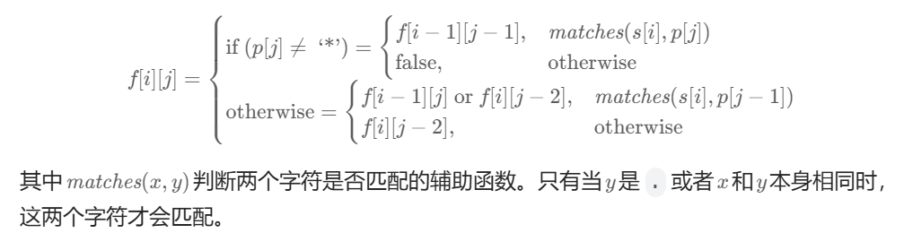

**题目链接:** [**LeetCode|10.正则表达式匹配**](https://leetcode.cn/problems/regular-expression-matching/description/)

<!-- more -->

---

## 题面解释

题目意思非常简单, 对字符串s和p进行匹配.(但写出来可一点都不简单啊)

不过需要注意的是, `"*"匹配一个或多个前一个元素`的释义是$a*\rightarrow a^*$, 其中箭头右侧为正则文法.

## 解法一 暴力回溯DFS

先考虑假设不包含`*`的匹配过程.

那么当`s.length() != p.length()`时可以直接给出`false`, 或者当`s[i] != p[i] && p[i] != '.'`时也可以直接给出`false`. 除非整个串匹配结束后则可以给出`true`.

因此难处理的部分应当是`*`的匹配过程.

下面用一个例子来分析`*`的匹配过程.

假设`s = abbbacc, p = ab*ab*cc`

- 对于`a`和`a`的匹配是自然的, 现在我们有:

    > ```
    > s = abbbacc
    >      ^
    > p = ab*ab*cc
    >      ^
    > ```

- 接下来注意到p的模式为`b*`, 那么考虑枚举`b*`可以匹配的模式.
  - `case1: ''` 假设重复0个`b`, 我们有:

    > ```
    > s = abbbacc
    >      ^
    > p = ab*ab*cc
    >        ^
    > ```
    >
    > 不难看出此时`b`无法匹配`a`, case1匹配到这里不得不停下了.

  - `case2: b | bb` 假设重复一个或两个`b`, 此时和case1相同, 同样面临`b`不能匹配`a`的问题.
  - `case3: bbb` 假设重复三个`b`, 此时有:

    > ```
    > s = abbbacc
    >         ^
    > p = ab*ab*cc
    >        ^
    > ```
    >
    > 此时可以继续`a`和`a`的匹配.

  - `case4: bbbb|...` 假设重复四个或以上的`b`, 显然是无法匹配的.
- 剩余部分的匹配与之前相似, 不难得出s和p匹配的结论.

这就是处理`*`最朴素的思想, 直接枚举不同的组合, 看有没有机会匹配, 在上述例子中, 因为case3直接可以得出匹配的结论, 因此不需要处理case4.

至于为何一定要写成递归的DFS, 笔者在此给出一个例子, 可以自行推演.

> **Example:** `s = abbbacc, p = ab*bbacc`.
>
> 实际上由于`.*`的存在, 会引起更加复杂的变化, 因此即便可以优化上述的例子, 此处最好的处理方式仍然是递归.

由此我们可以得知DFS递归的基本框架: 每一次的压栈递归都代表枚举相应的`*`, 那么p中包含多少`*`最多就可能压多少递归栈.

可以预见到, 当`p.length()`和`s.length()`的规模增大时, 时间复杂度将会爆炸.

## 解法二 动态规划DP

尽管上述的DFS性能堪忧, 但其思想还是很重要的, 有助于过渡到DP的方法. ~~虽然可以预见到一群大神一眼看出是DP, 还能顺手把转移方程写出来~~

在上述过程中有一个计算是十分不必要的, 那就是"枚举完所有的"`a*`可以匹配的模式.

### 状态转移方程求解

DFS的尝试是枚举所有的可能, 看是否能和后面的匹配上. 那么此时我们逆向思考这个问题, 对于`s[:i]`和`p[:j]`, 当得知哪些信息时可以判断是否匹配?

> 为方便后续表述, 此处定义一个辅助函数`match(c1, c2)`, 当`c1 == c2 || c2 == '.'`时返回`true`, 否则返回`false`.
>
> **注: 以下切片语法(`s[:i]`)遵循python的左闭右开原则, 字符串索引语法(`s[i]`)初始下标为0**

- 先从简单的部分开始考虑, 即`p[j - 1] != '*'`
  - 如果`match(s[i - 1], p[j - 1]) == false`, 字符串尾部不匹配, 显然`s[:i]`和`p[:j]`不匹配.
  - 如果`match(s[i - 1], p[j - 1]) == true`, 那么只要有`s[:i - 1]`和`p[:j - 1]`匹配, 则`s[:i]`和`p[:j]`匹配.
- 接下来考虑稍微复杂的部分`p[j - 1] == '*'`
  - 因为`*`具有左结合性, 因此`p[j - 2]`的信息对我们来说是重要的. 即`*`重复了哪一个字符.
  - 如果有`match(s[i - 1], p[j - 2]) == true`, 其含义相当于由`*`多重复一个`p[j - 2]`进行匹配. 那么此时只要`s[:i - 1]`和`p[:j]`匹配, 就有`s[:i]`和`p[:j]`匹配
  - 上述情况为`*`的扩展, 那么"零个"该如何处理? 只需要将p中的模式`a*`当作不存在, 考察`s[:i]`和`p[:j - 2]`是否匹配即可.

由此, 我们便得到了官方题解中的状态转移方程, 其中`f[i][j]`表示`s[:i]`和`p[:j]`是否匹配.



### 边界条件考察

状态转移方程已经有了, 接下来回归到base case, 来想想边界条件的处理.

- 显然`f[0][0] = true`, 因为空串和空串显然是匹配的.
- 对于`i != 0 && j == 0`, 即s中若干个字符和p中零个字符, 显然有`f[i][0] = false`, 因为非空的s不可能匹配空串.
- 对于`i == 0 && j != 0`, 即s中零个字符和p中若干个字符, 此时当且仅当p满足如下正则文法: $l \rightarrow .|a|b|...|z, \ p \rightarrow (l*)^*$ 时, 有`f][0][j] = true`.
- 此时已经处理了所有s为空串或p为空串的匹配情况, 因此在状态转移时, 只需要让初始时`i = 1, j = 1`即可.

### 参考代码

参考代码如下:

```C++
class Solution {
public:
    bool isMatch(string s, string p) {
        int n = s.length();
        int m = p.length();
        vector<vector<bool>> dp(n + 1, vector<bool>(m + 1, false));
        dp[0][0] = true;
        for(int j = 2; j <= m; j += 2){
            dp[0][j] = dp[0][j - 2] && p[j - 1] == '*';
        }
        for(int i = 1; i <= n; i++){
            for(int j = 1; j <= m; j++){
                if(p[j - 1] == '*'){
                    //输入样例保证p[j - 1] == '*'时 j-2>=0
                    dp[i][j] = dp[i][j] | dp[i][j - 2]; //match 0
                    //match multi
                    if(match(s[i - 1], p[j - 2])){
                        dp[i][j] = dp[i][j] | dp[i - 1][j];
                    }
                }else{
                    if(match(s[i - 1], p[j - 1])){
                        dp[i][j] = dp[i - 1][j - 1];
                    }
                }
            }
        }
        return dp[n][m];
    }
    bool match(char sc, char pc){
        if(pc == '.'){
            return true;
        }
        return sc == pc;
    }
};
```
