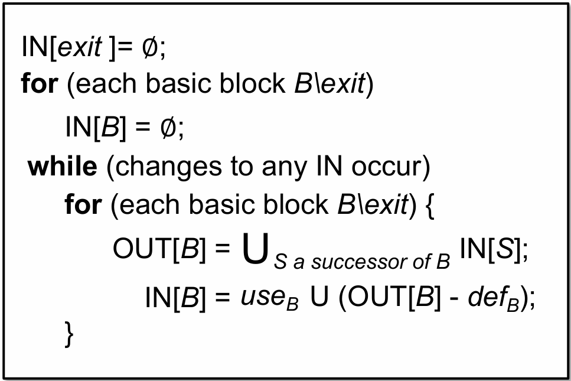
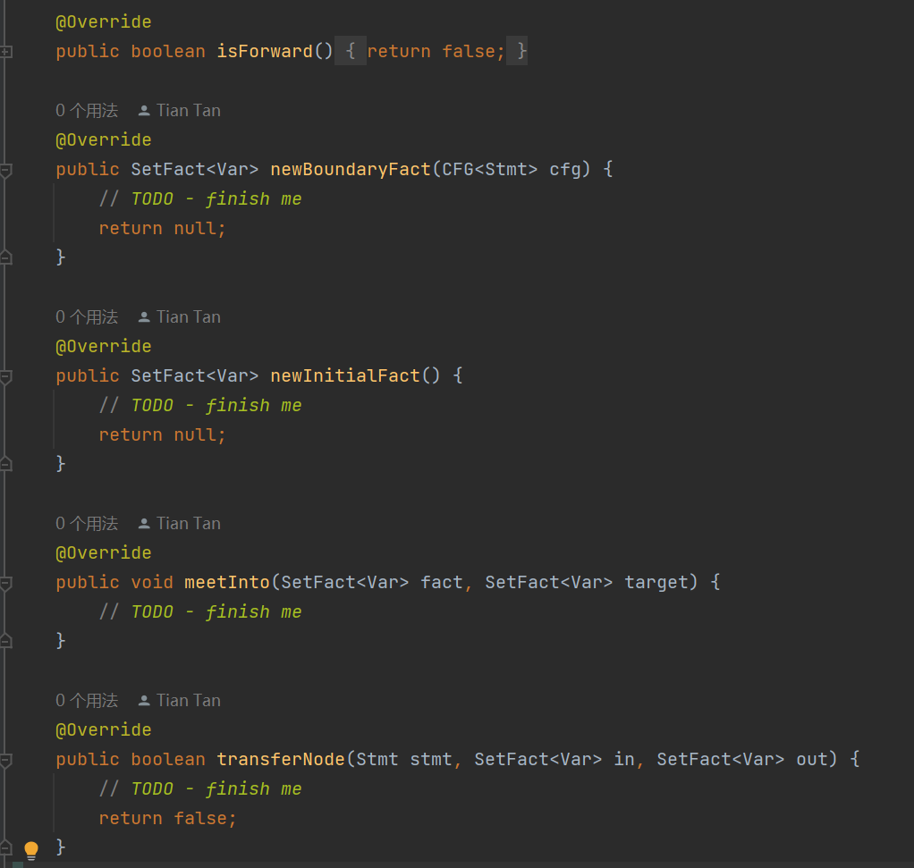
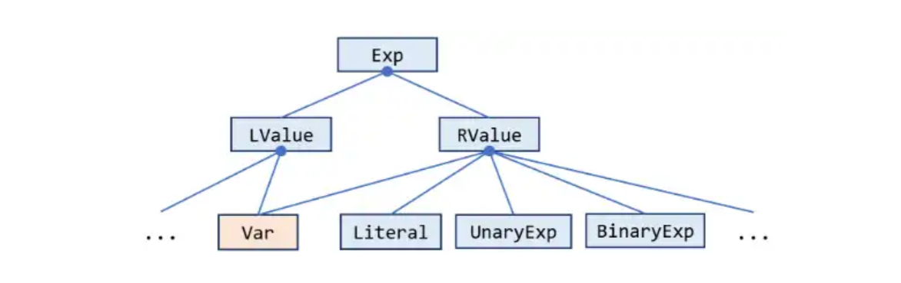

**NJU Static Program Analysis | Assignment-1 Live Variable Analysis & IterativeSolver.**

<!--more-->

## 实验信息

NJU软件分析, 实际上是静态分析(Static Program Analysis), 是由李樾和谭添老师开设的面向本科生和研究生的一门课程, 因为是本研共修选修课, 因此本课程内容较为基础, 比较适合对静态分析感兴趣的初学者快速入门. 课程网站[**[Static Program Analysis]**](https://tai-e.pascal-lab.net/lectures.html), 配套课程[**[Bilibili|南京大学《软件分析》]**](https://www.bilibili.com/video/BV1b7411K7P4).

本课程实验(Assignments)基于Tai-e教学版框架, 框架代码的获取和实验环境配置见课程网站, 笔者在约一年前曾自学过本课程, 现今跟随2024Fall课程进度再次学习, 由于上次学习中受到了多位前辈留下的实验记录帮助, 遂于此记录笔者对各个实验的理解和记录. 限于笔者个人能力水平, 恐难完整覆盖实验中的所有要点, 记录内容仅供参考, 如能帮助到您, 乃笔者荣幸.

鉴于 **学术诚信(Academic Integrity)** 要求, 笔者暂且 ***不*** 公开源代码.

## 食用指南

本试验记录 ***不会*** 从零开始讨论完成实验的知识点, 框架理解和注意事项. 食用前请确保观看并理解了课程的P1-4内容, 尤其是对活跃变量分析(Live Variable Analysis)的算法和原理的基本掌握; 完整阅读过[**实验指南**](https://tai-e.pascal-lab.net/pa1.html)和框架代码后, 再来参考本实验记录, 效果最佳.

## 任务目标

基于已有框架为java实现一个**活跃变量分析**, 使用**迭代求解器(Iterative Solver)**.

具体来说, 实现Your Task中涉及的三份文件中的6个`TODO API`.

涉及的主要算法如下图所示:



作为第一个实验, 总体难度不高, 关键在于熟悉Tai-e框架, 还望读者耐心阅读框架代码. 不妨善用Github Copilot或者ChatGPT帮助理解框架代码.

## LiveVariableAnalysis

活跃变量分析算法中需要用到的具体方法, 实验指南中已有较为详细的说明, 笔者在此不再赘述.



关于实现该部分所需的`API`, 请阅读`Class SetFact`源码.

笔者在此补充一些本实验所需java语法性质或语法糖.

### Class Optional

Java 8引入的性质, 详细信息可查询文档或教程, 笔者在此给出其一[**[菜鸟教程|Java Optional]**](https://www.runoob.com/java/java8-optional-class.html).

与之类似的还有`java.util.List`, 学习java语法来获得`Optional`和`List`中的内容.

使用示例:

``` java
LValue def = stmt.getDef().orElse(null);
```

### instanceof操作符

java中用于判断类型的操作符, 详细信息可参考[**[Baeldung|Java instanceof Operator]**](https://www.baeldung.com/java-instanceof).

使用示例:

```java
if(def instanceof Var)
```

需要注意的是, 如指南所示



`Exp`下的`LValue` `RValue`包括多种类型, 我们只需要关注`Var`类型的使用.

> **Tips:** 为什么不需要考虑别的类型?
>
> `LValue`只需要关注`Var`, 这是手册告诉我们的. `RValue`尽管有多种类型, 但可以通过`getUses()`方法将Exp中涉及的变量等信息全部获取, 此时右式是`UnaryExp`or`BinaryExp`对我们来说都不重要了, 只需要将`getUses()`中的`Var`筛选出来处理即可.

> **Additional:** `getUses()`究竟返回什么?
> 
> 笔者在此引用[RicoloveFeng](https://github.com/RicoloveFeng)在[SPA-Freestyle-Guidance](https://github.com/RicoloveFeng/SPA-Freestyle-Guidance)中的解释
>
> 你可能想知道 `getUses()` 除了 `x = y` 这条语句之外还返回些什么东西.我们举点例子吧:
>
> - `x = y op z`: `[y, z, y op z]`
> 
> - `x = m(n)`: `[mClass, n, invokevirtual mClass.m(n)]`

### java引用机制

```java
public boolean transferNode(Stmt stmt, SetFact<Var> in, SetFact<Var> out) {
        ...
        //in = out.copy();
        in.set(out);
        ...
}
```

尽管两行代码"看起来"是一致的, 但注释掉的代码只会改变形参`in`的取值, 不会改变实际的`Fact in`. 详细原理可以参考[**[知乎|java引用详解]**](https://zhuanlan.zhihu.com/p/453857961).

## Solver & IterativeSolver

本部分对应具体的算法流程.

实际上指南写的已足够详细, 包括如何从`cfg`中获取信息的方法和两处`TODO`对应的具体部分, 使得即便对框架不甚理解, 仍然能完成该部分.

唯一需要阅读代码知道的是可以通过`analysis.xx`的方式调用我们在上一节中实现的`API`.

`Solver`的`Init`需要注意的是由于我们`analysis.meetInto()`与算法中不完全相同, 在初始化阶段我们同样要对`out Fact`进行赋空初始化.

`IterativeSovlver`部分是算法的循环部分, 由于我们的分析器`BB`是`stmt`, 因此不需要考虑Block内部的执行顺序, 直接使用`analysis.transferNode`即可.

另外, 上课时遍历迭代顺序取的是较优结果, 我们不需要过多考虑性能问题, 因此以任意节点顺序迭代仍然可以得到结果, 这大大降低了代码实现的复杂性, 只需要使用简单的`for(Node node : cfg)`即可.

笔者同样补充一些可能对本实验理解有帮助的细节部分.

### DataflowResult

其本质是两个`Nodes`对应的`inFacts` `outFacts`的集合, 通过给定的API获取和设置其中的值, 其中`inFacts`和`outFacts`不过是`set`的封装, 在抽象层面上意义和课程中的那个代表变量的二进制串相同.

### `CFG<Node> cfg` 中的 `Node`具体指什么?

在本次实验中, `Node node`指的是`stmt`, 从指南中可以推测出这点. 通过阅读源代码, 也可以得知

```java
public class LiveVariableAnalysis extends
        AbstractDataflowAnalysis<Stmt, SetFact<Var>>
```

所以我们可以直接使用以下代码

```java
for(Node node : cfg){
    ...
    analysis.transferNode(node, in, out);
    ...
}    
```

## 总结

总的来说这次实验的难点在于框架代码的理解, 笔者在记录中提及了部分关键定义和代码理解, 只要耐心阅读框架代码, 相信一定会AC.
