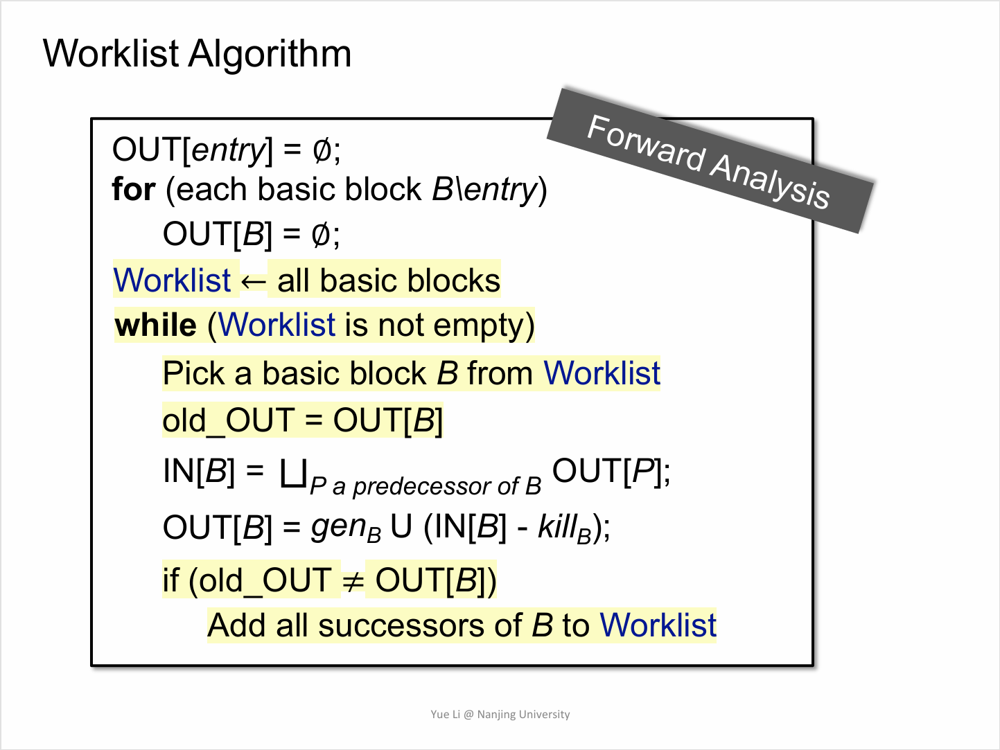
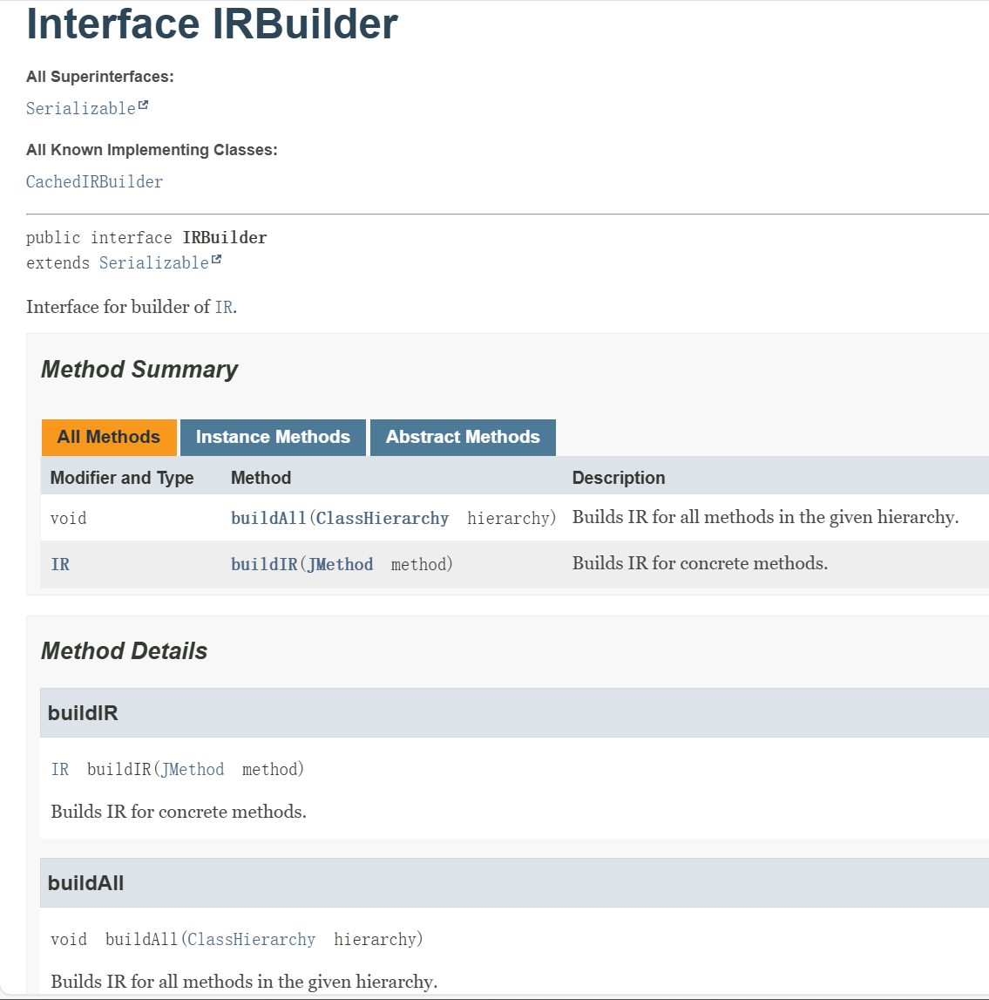
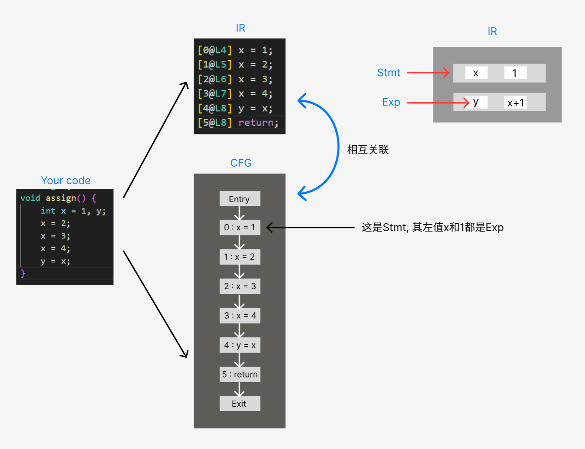
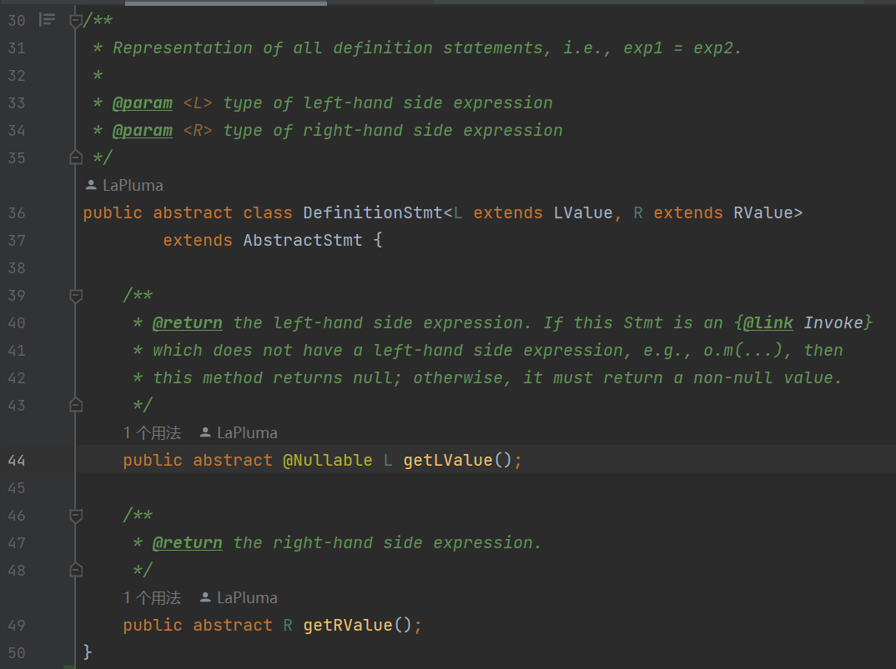
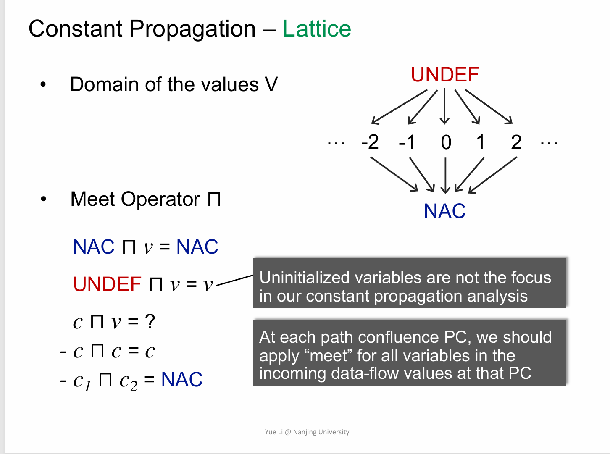
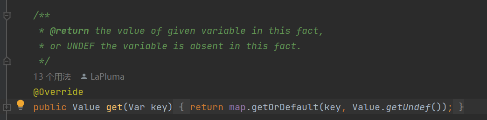
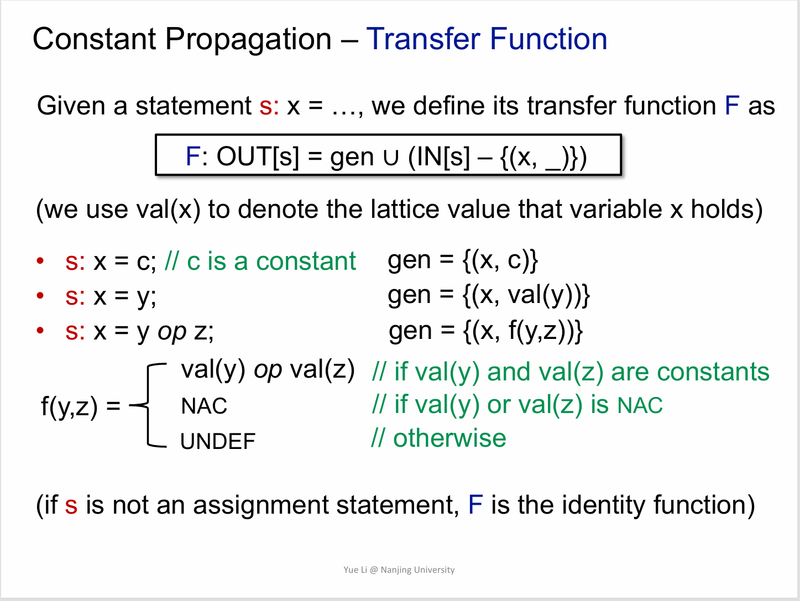

**NJU Static Program Analysis | Assignment-2 Constant Propagation & WorlistSolver.**

<!--more-->

## 实验信息与食用指南

请翻阅[**[NJU静态分析|A1-Live Variable Analysis]**](https://la-pluma.github.io/2024/10/20/SPA-A1/#more).

在此进行一点补充, 笔者的这份实验记录更像是Free Style版的**FAQ**. 因此请 ***确保*** 在理解了**理论知识**, **实验指南** 和 **框架代码** 后再参考本记录, 与A1相同, 本记录 ***不提供*** 源代码(~~或者说暂时没有~~).

~~如果您对本实验记录中的内容感到困惑, 可能是因为笔者能力不足或您未能理解实验指南和框架代码, 同时本试验记录难以涵盖所有的坑, 还望海涵.~~

## 实验目标

基于**Tai-e**框架实现**常量传播算法**和**worklist求解器**.

大致的框架代码如下:



注意常量传播算法是**Forward & Must analysis**.

## 部分重要框架代码带读

~~我知道你们有些人肯定是不看框架代码的, 除非不得不用或者报错的时候.~~

### IR & IRBuilder

Tai-e框架中的`IR`与课上教授的IR稍有不同, 以A2 test中的**Assign.java**为例,

```java
/*   From A2 test/Assign.java   */
class Assign {
    void assign() {
        int x = 1, y;
        x = 2;
        x = 3;
        x = 4;
        y = x;
    }
}
```

经过tai-e框架的分析后会得到

```java
-------------------- <Assign: void <init>()> (constprop) --------------------
[0@L1] invokespecial %this.<java.lang.Object: void <init>()>(); {}
[1@L1] return; {}

-------------------- <Assign: void assign()> (constprop) --------------------
[0@L4] x = 1;   {x=1}
[1@L5] x = 2;   {x=2}
[2@L6] x = 3;   {x=3}
[3@L7] x = 4;   {x=4}
[4@L8] y = x;   {x=4, y=4}
[5@L8] return;  {x=4, y=4}

```

结合**IR** & **IRBuilder**(可翻阅[**[官方手册]**](https://tai-e.pascal-lab.net/docs/index.html)),



~~IR我懒得贴了~~

`IR`的基本单元是**method** (请意识到java是oop语言), `IRBuilder`提供了分析单个方法的API`buildIR(JMethod method)`和分析整个`class hierarchy`(不明白, 等到A4就明白了, 笑)中的所有方法的API`buildAll()`

结合`Stmt` `Exp` 和 `CFG`, 我们可以得到这样的一个示意图(由于笔者未阅读全部的源码实现, 可能会有所出入, 但大致如此).



> **Tips:** 严格来说`CFG`并不存储`Node`(本实验中指`Stmt`, 见A1试验记录说明), 只存储`Stmt`的关联信息, 但为了方便图示遂如此展示. 至于为何左值和右值都是`Exp`, 请翻阅A1官方实验指南中对`Exp`的图示表示部分.

### DefinitionStmt

尽管理论上不需要这个类也可以完成实验(`Stmt`中的顶层方法足以实现), 但既然框架提供了这么好用的API, 方便我们写出更优雅的代码, 为什么不用呢?



`DefinitionStmt`为我们提供了两个非常好用的API, `getLValue()`和`getRValue`可以直接获取到左右式的`Exp`(希望你还记得`LValue`&`RValue` extends `Exp`), 而不需要像`Stmt`中的`getDef()` & `getUses()` 做较为繁琐的判断和筛选(如果对`getUses()`感到困惑, 也还请翻阅A1实验记录, 里面有解释和参考来源).

需要注意的是, `getLValue()`可能会返回`null`.

## ConstantPropagation

与活跃变量分析类似, 我们需要完成5个API的功能.

### newBoundaryFact() & newInitialFact()

需要注意的是, 本次存储分析结果的数据结构是`CPFact`, 与A1相同, 在完成本次实验代码之前需要了解相关API的用法.

既然是**Must Analysis**, 我们需要将初值赋为空, 但需要注意的是, 我们的**Analysis**仅分析语句, 在进入第一条语句之前, 是否有什么东西需要初始化?

这个问题就对应了指南中为什么`BoundaryInit` 要通过 `getIR().getParas()`获取参数并赋值`NAC`的提示.

在对`IR`的解释中我们提到过, `IR`的基本分析单元是**method**, 即函数, 函数就可能有传入的参数, 这些参数易见**不是Constant**, 因此要赋值为`NAC`

> **Tips:** 如果是Constant干嘛还要传参, 即便真的这么做了, 我们的分析也可以满足**safe-approximation**.

这部分是在方法体(函数语句)执行前就完成的初始化, 因此我们需要赋值给`Entry`的`outFact`.

### meetValue() & meetInto()

`meetValue()`的完成没有任何难点, 只需要照抄ppt中的规则即可.



同样的, 完成这部分代码需要阅读`Class Value`的源码API和注释.

关于`meetInto()`, 如果没有阅读`CPFact`中的`update()`方法注释, 就不知道可以写出如此优雅的代码来合并`Var`的`Value`值:

```java
target.update(var, meetValue(fact.get(var), target.get(var)));
```



### transferNode() & evaluate()

毫无疑问, 这是本次实验中最难最核心的一部分, 细节非常多, 当被卡hidden test的时候, 大概率寄在这里.

笔者建议在`transferNode()`中处理`Stmt`的左值def部分, 在`evaluate()`中处理右值exp部分. 这是比较符合功能分离的写法, 当然, 也可以选择在 `transferNode()`中处理`Var`和`IntLiteral`, `evaluate()`只负责处理`BinaryExp`的计算值. 笔者在此按第一种写法进行说明.

#### transferNode()

这个函数中你需要依次做(次流程可能存在可以优化的部分, 不必完全照做):

- 保存`outFact`原值, 将`inFact`赋值给`outFact`.

- 判断`Node`(`Stmt`)是否为`DefinitionStmt`

- 判断是否拥有**合法**左值, 包括`def`的类型`Var`和`Var`中的`ValueType`是否为`Int`, 如果不是, 本次实验中可以认为是`nop`空操作. 不需要为这个`Stmt`做任何分析, 直接将`inFact` copy给 `outFact`即可.

    > **Tips:** IDEA教给我一个很有意思的语法糖
    >
    ```java
    if(stmt instanceof DefinitionStmt def_stmt){
        LValue def = def_stmt.getLValue();
        ...
    }
    ```
    >
    > 这个用法可以避开繁琐的类型转化, 在判断类型时便做了类型转化.

- 计算`Stmt`的右值(通过`evaluate()`获得), 并更新`outFact`中的相应`Var def`(笔者在此并未使用`update`方法的返回值, 或许可从此处入手优化效率, 但笔者不能保证其正确性)

- 比较`outFact`是否更新返回布尔值.

#### evaluate()

为了完成这个方法, 代码的大致框架应该是这个样子:

```java
public static Value evaluate(Exp exp, CPFact in) {
    if(exp instanceof Var){
        ...
        return /*Value*/
    }
    if(exp instanceof IntLiteral){
        ...
        return /*Value*/
    }
    if(exp instanceof BinaryExp binary_exp){
        Value left = ...;
        Value right = ...;
        // Operand may not Int or may not Constant
        // you'd better do it first
        if(/*left HoldInt && right HoldInt*/){
            //you can get Condition Info form ppt
            if(/*left is Constant && right is constant*/){
                if (binary_exp instanceof ArithmeticExp arithmetic_exp){
                    ...
                    switch(op){
                        //also should attention to DIV 0 return Undef
                        case ADD: ...
                        ...
                    }
                }
                if (binary_exp instanceof BitwiseExp bitwise_exp){
                    ...
                    switch(op){
                        case AND: ...
                        ...
                    }
                }
                if(...)
                ...
            }
            else if(/*left is NAC || right is NAC*/){
                //you should do DIV & REM for 0 judgement there
                ...
            }
            else if(/*other condition*/){
                ...
            }
            else if(/*other condition*/){
                ...
            }
            ...
        }
        //for over-approximation
        return Value.getNAC();
    }
    //such as x = o.f()
    //for over-approximation
    return Value.getNAC(); 
}
```

其中二元表达式计算规则见ppt所示,



笔者在此给出一些细节和边界条件, 也可以通过阅读上述代码框架获得细节提示:

- `exp`中的操作数可能不是`IntType`, 所以你需要做一个`canHoldInt()`判断, 非法`exp`为了安全性应赋值为`NAC`

- 实验指南中提到, 对于`/`和`%`的除零错误, 应当给出`Undef`, **即使**被除数是`NAC`.

## Sovler & WorkListSolver

### Sovler Init

照着算法流程前三行写便是, 但这里要提到框架代码的"**robustness**".

尽管从分析流程上来看, 我们不应该分析`Node Entry`, 但是框架代码允许我们这样做. 这时框架代码会认为`Node Entry`是一条`nop Stmt`, 不会做constant update, 因此只要在`Init`部分对`Entry`的`inFact`和`outFact`都赋上初值, 就不需要在worklist中考虑`Entry`的处理了.

### WorkListSolver doSolveForward

**worklist**是一种非常简单的算法, 笔者在此不对算法实现过多赘述. 注意在实现worklist的时候可以使用java自带的容器`Queue` & `ArrayList`.

关于**worklist**的初始化问题, 需要注意的是应当为其加入所有的`Node`, 如果只加入`Entry`的后继, 会产生问题, 笔者在此给出一个例子. (感谢课程群中[**日居月诸**](https://github.com/rijuyuezhu)大佬和另一位不知道github链接的大佬构造的反例)

```java
-------------------- <Assign: void assign()> (constprop) --------------------
[0@L4] nop;     {}
[0@L4] x = 1;   {x=1}
[1@L5] x = 2;   {x=2}
[2@L6] x = 3;   {x=3}
[3@L7] x = 4;   {x=4}
[4@L8] y = x;   {x=4, y=4}
[5@L8] return;  {x=4, y=4}

```

在这个例子中, `Entry outFact`初始化为`{}`(没有参数), 然而`Stmt0` 的 `outFact` 同样初始化为`{}`, 如果只添加`Entry`的后继`{Stmt0}`, 会导致worklist在分析完`Stmt0`后错误终止.

## 总结

本次实验应该是所有Assignment中代码量最多的一次, 细节也是让人头皮发麻, 还望能静下心来看代码和debug, 祝早日AC!
