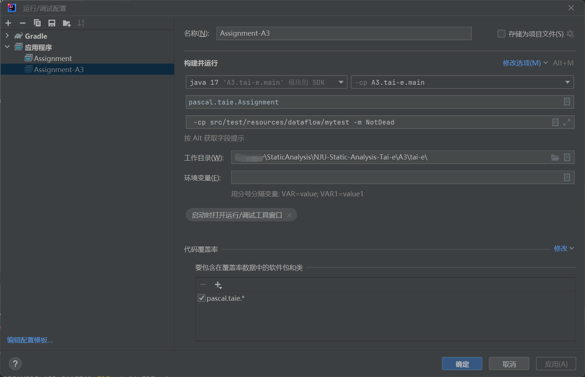
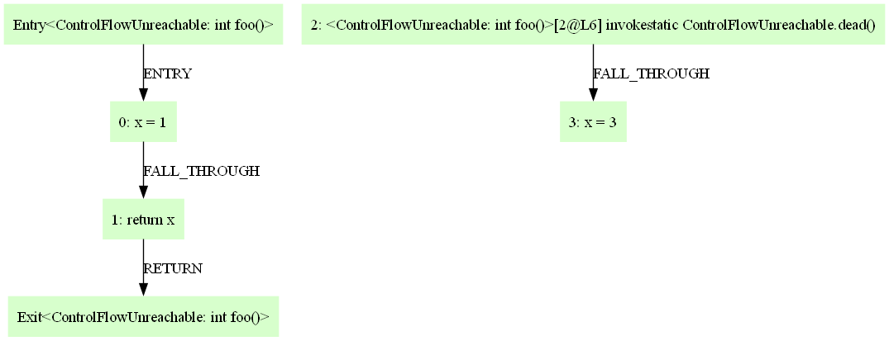
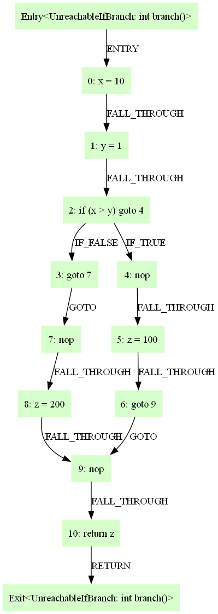
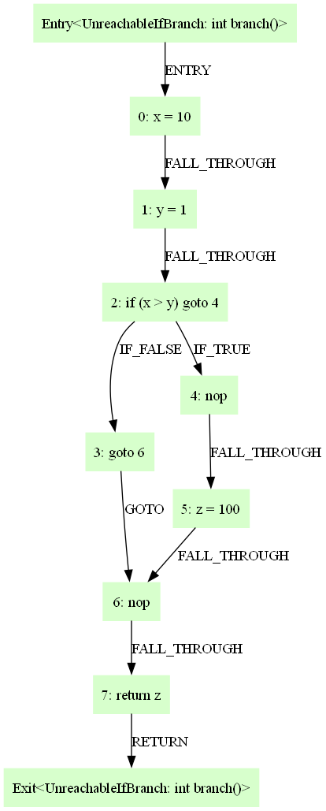
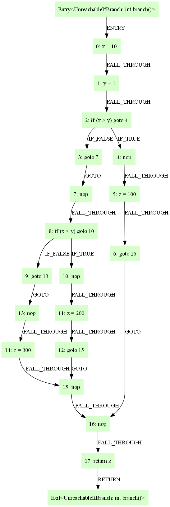
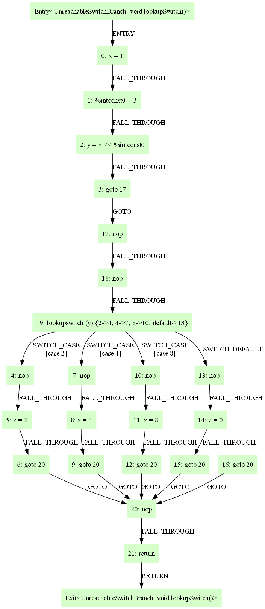
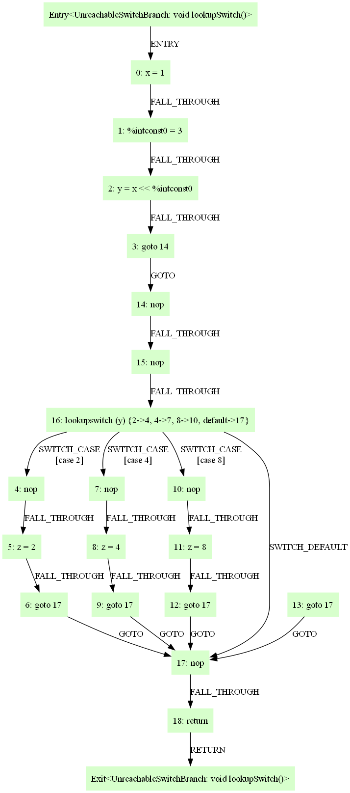
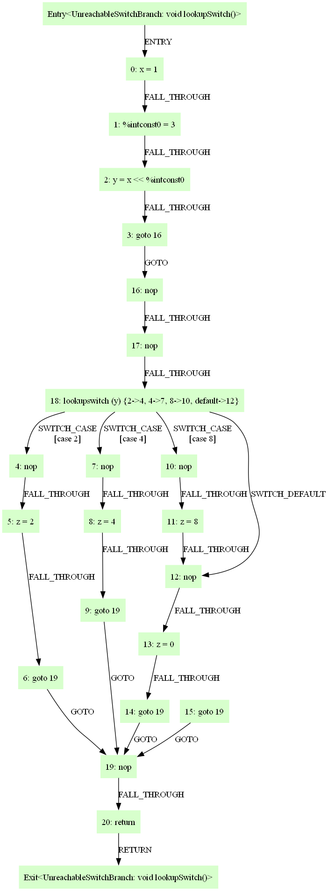

**NJU Static Program Analysis | Assignment-3 Dead-Code Detection.**

<!--more-->

## 实验信息&食用指南

见本博客A1 & A2

**Tips:** 实验指南和框架代码仍然是最一手最正确的资料, 对于实验指南中已涉及的信息, 本记录不会过多赘述.

## 实验目标

基于**Tai-e** 框架实现一个 **死代码检测** 算法.

## 实验简析

实验指南没有给出实现的框架, 因此至此已有完成本次知识的全部基础知识(活跃变量分析 & 常量传播算法).

故本次实验主要考察对A1, A2的实验理解, 有遗忘或有不清楚的读者还望移步至官方教学视频复习后再完成本次实验.

- 死代码检测是一个**Must Analysis** , 允许漏报而不允许错报.

- 由分支不可达的特性, 采用**Forward Analysis** 比较符合死代码检测的特性.

- 为了走一遍**CFG** 便得到结果, 我们可以将全部`Stmt`加入`DeadCodeSet`中, 将不是死代码的`Stmt`删去. 留下的便是死代码.

- 此处笔者采用**BFS**算法进行**CFG**遍历, 使用`Set Traveled`避免环路影响.

### 伪代码框架

死代码检测的大致框架伪代码如下:

```java
liveVarsResult <- LiveVarsAnalysis(IR)
constantResult <- ConstantAnalysis(IR)
DeadcodeSet <- all stmt in IR
TraveledSet <- empty
BFSlist <- entry
while(BFSlist is not empty){
    pickup a stmt from BFSlist
    TraveledSet <- stmt
    //handle jump Stmt
    if (stmt is if or switch){
        DeadcodeSet remove stmt
        // ConditionExp is Constant may cause Unreachable DeadCode
        if (if/switch ConditionExp is Constant by ConstantResult){
            BFSlist <- Target Stmt of Constant ConditionExp Path
        }
        else{
            BFS <- succ of stmt not in Travaled
        }
    }
    //handle Assign Deadcode
    else if (stmt is AssignStmt){
        if(stmt is not DeadAssign by LiveVarsResult || stmt has SideEffect){
            DeadcodeSet remove stmt
        }
        BFSlist <- succ of stmt not in Travaled
    }
    //normal Stmt
    else{
        DeadCodeSet remove stmt
        BFSlist <- succ of stmt not in Travaled
    }
}
```

## CFG生成细节

完成本实验最重要的部分莫过于**CFG** 的结构, 实验指南没有为我们提供所有的实现细节, 而且`CFGBuilder`部分的代码对我们来说是不公开的. 那我们该如何获取关于**CFG** 的细节?

### 框架代码提供的接口

好在**tai-e**框架为我们提供了`Class Assignment`来[**分析自测样例**](https://tai-e.pascal-lab.net/intro/selfmade-testcases.html), 输出`*.dot`文件到`./output/`目录下, 可以使用[**[Graphviz]**](https://graphviz.org/download/)可视化`*.dot`文件. 使用细节见上述链接中的官方文档.

笔者所使用的**IDE** 为**JetBrian IDEA 2023.1.4 Community**版本, `Class Assignment`运行配置如下.



在终端中进入工作目录(此处为`output/`)执行以下命令:

```Shell
$ dot -Tpng ClassMethod.dot -o ClassMethod.png
```

然后我们就可以得到`*.dot`文件的可视化**CFG** 结果.

### 根据自测样例推测CFG的生成逻辑

经过前两次的实验, 普通节点和跳转的关联顺序在**CFG** 中是简单的, `for`和`while`的循环结构在**tai-e**中转化为简单的`goto stmt`. 因此此处笔者着重说明`If`和`Switch`在**Tai-e** 框架中的处理方式.

#### 控制流不可达代码

源代码如下:

```java
public class ControlFlowUnreachable {

    static int foo() {
        int x = 1;
        return x;
        dead(); // unreachable
        x = 3; // unreachable
    }

    static void dead() {
    }
}
```

代码对应IR如下:

```java
-------------------- <ControlFlowUnreachable: int foo()> --------------------
[0@L4] x = 1;
[1@L5] return x;
[2@L6] invokestatic <ControlFlowUnreachable: void dead()>();
[3@L7] x = 3;
```

**CFG** 可视结果如下:



> 不难发现, 控制流不可达代码在可视化图中的表示是独立于**Entry**到**Exit** 路径的子图

#### If Stmt

我们先来看看最基础的情况:

```java
class UnreachableIfBranch {

    int branch() {
        int x = 10;
        int y = 1;
        int z;
        if (x > y) {
            z = 100;
        } else {
            z = 200; // unreachable branch
        }
        return z;
    }
}
```

```java
-------------------- <UnreachableIfBranch: int branch()> --------------------
[0@L4] x = 10;
[1@L5] y = 1;
[2@L7] if (x > y) goto 4;
[3@L7] goto 7;
[4@L7] nop;
[5@L8] z = 100;
[6@L7] goto 9;
[7@L7] nop;
[8@L10] z = 200;
[9@L10] nop;
[10@L12] return z;
```



> 可以从可视化**CFG** 中获取不少信息.
>
> - `[line]:if(ConditionExp) goto [line]` 是`if stmt`结构的入口(图中为`2: if(x > y) goto 4`), **tai-e**框架会为`if stmt`结构提供一个统一的`nop`出口(图中为`9: nop`).
> - `if`结构会根据`ConditionExp`的**T/F**取值生成`Edge`, 分为`IF_FALSE`和`IF_TRUE`, `Edge Target`分别为**T/F** 的代码块. 可以观测到框架会为**T/F**的代码块添加一个`nop stmt`作为代码块的起始(图中为`4: nop`和`7: nop`).

---

如果我们不显式指定`else`结构:

```java
class UnreachableIfBranch {

    int branch() {
        int x = 10;
        int y = 1;
        int z;
        if (x > y) {
            z = 100;
        }
        return z;
    }
}
```

```java
-------------------- <UnreachableIfBranch: int branch()> --------------------
[0@L4] x = 10;
[1@L5] y = 1;
[2@L7] if (x > y) goto 4;
[3@L7] goto 6;
[4@L7] nop;
[5@L8] z = 100;
[6@L8] nop;
[7@L13] return z;
```



> - 可以看到`if`结构的`IF_FALSE`对应的代码块消失, `IF_FALSE`直接跳转到`if`结构的结束`nop`语句.(图中为`6: nop`)
>
> > **Tips:**
> >
> > 如果显式写出`else`但`else`为空体, **tai-e**框架会生成一条`nop`语句对应该`else`空体, 感兴趣的读者可以自行测试, 笔者在此不再赘述.
> >
> > 通过阅读框架代码中的`Class If extends JumpStmt`和`Class JumpStmt`可以知晓, `If`将`JumpStmt`的成员变量`target`和对应方法(如`getTarget()`)和`If`结构中的`IF_TRUE`对应起来, 因此此时的`Edge IF_FALSE`其实等价于`FALL_THROUGH`, `IF_FALSE`的`target`是一条指向真正**False代码块**的`goto stmt`. 通过阅读框架代码, 便不难理解为何**CFG** 要这样处理`IF`结构.

---

`if-else`的嵌套等价于普通的`if-else`的组合.

```java
class UnreachableIfBranch {

    int branch() {
        int x = 10;
        int y = 1;
        int z;
        if (x > y) {
            z = 100;
        }
        else if(x < y) {
            z = 200; // unreachable branch
        }
        else{
            z = 300;
        }
        return z;
    }
}
```

```java
-------------------- <UnreachableIfBranch: int branch()> --------------------
[0@L4] x = 10;
[1@L5] y = 1;
[2@L7] if (x > y) goto 4;
[3@L7] goto 7;
[4@L7] nop;
[5@L8] z = 100;
[6@L7] goto 16;
[7@L7] nop;
[8@L10] if (x < y) goto 10;
[9@L10] goto 13;
[10@L10] nop;
[11@L11] z = 200;
[12@L10] goto 15;
[13@L10] nop;
[14@L14] z = 300;
[15@L14] nop;
[16@L14] nop;
[17@L16] return z;
```



#### Switch Stmt

与`If`一样, 我们先来看看一般情况:

```java
class UnreachableSwitchBranch {

    void lookupSwitch() {
        int x = 1;
        int y = x << 3;
        int z;
        switch (y) {
            case 2:
                z = 2;
                break;
            case 4:
                z = 4;
                break;
            case 8:
                z = 8;
                break;
            default:
                z = 0;
                break;
        }
    }
}
```

```java
-------------------- <UnreachableSwitchBranch: void lookupSwitch()> --------------------
[0@L4] x = 1;
[1@L5] %intconst0 = 3;
[2@L5] y = x << %intconst0;
[3@L7] goto 17;
[4@L7] nop;
[5@L9] z = 2;
[6@L10] goto 20;
[7@L10] nop;
[8@L12] z = 4;
[9@L13] goto 20;
[10@L13] nop;
[11@L15] z = 8;
[12@L16] goto 20;
[13@L16] nop;
[14@L18] z = 0;
[15@L19] goto 20;
[16@L7] goto 20;
[17@L7] nop;
[18@L7] nop;
[19@L7] lookupswitch (y) {2->4, 4->7, 8->10, default->13};
[20@L7] nop;
[21@L7] return;
```



> - 与`If`一致, `[line]: [method]switch([var]) {[branch]}`是`Switch`结构的起点(图中为`19: lookupswitch(y) {2->4, 4->7, 8->10, default->13}`). 同样会生成一条`nop stmt`表示`Switch`结构的出口.
> - 经过笔者的多次测试, **tai-e**框架的`Switch`语句处理有些的微妙的奇怪之处. 与`If`不同, `Switch`语句的入口在`line num`上位于`Switch`结构的最后部分, 到达该入口需要经过两条`nop stmt`, 并且会在`CASE`和`DEFAULT`代码块之外添加一个到`Switch`结构出口的`goto stmt`. 然而由于`DEFAULT`一定存在(下文会解释), 因此这条`goto`语句一定为死代码, 不存在一条从`Entry`到该语句的路径.
> 
> > **Tips:** 笔者认为这是一个非常奇怪的处理, 猜测可能跟Soot生成的字节码有关(**Tai-e**框架基于Soot搭建) **该猜想未证实**.
>
> - 笔者推测`CASE`和`DEFAULT`代码块中的第一条`nop`语句来源是`case 2:`和`default:`, 即**Tai-e**框架选择保留了原来的控制信息语句(控制信息在**CFG**中体现为`Edge`), 但将其替换成了`nop`语句(该推测在不显示指定`default`时得到部分证实).

---

不显式指定`default`时:

```java
class UnreachableSwitchBranch {

    void lookupSwitch() {
        int x = 1;
        int y = x << 3;
        int z;
        switch (y) {
            case 2:
                z = 2;
                break;
            case 4:
                z = 4;
                break;
            case 8:
                z = 8;
                break;
        }
    }
}
```

```java
-------------------- <UnreachableSwitchBranch: void lookupSwitch()> --------------------
[0@L4] x = 1;
[1@L5] %intconst0 = 3;
[2@L5] y = x << %intconst0;
[3@L7] goto 14;
[4@L7] nop;
[5@L9] z = 2;
[6@L10] goto 17;
[7@L10] nop;
[8@L12] z = 4;
[9@L13] goto 17;
[10@L13] nop;
[11@L15] z = 8;
[12@L16] goto 17;
[13@L7] goto 17;
[14@L7] nop;
[15@L7] nop;
[16@L7] lookupswitch (y) {2->4, 4->7, 8->10, default->17};
[17@L7] nop;
[18@L7] return;
```



> - 可以观测到**CFG** 会添加未被显式写出的`default`, 但不生成`default`指向的代码块(如果显示写出`default`但为空体, 会保留`nop`和`goto`跳转, 笔者在此不再赘述, 感兴趣的读者可以自行测试), 而是直接指向`Switch`结构的出口.

#### case & break

了解java语法性质的读者应该理解笔者在本小结的标题.

我们来看看如下代码:

```java
public class Main {
    public static void main(String[] args) {
        int option = 2;
        switch (option) {
        case 1:
            System.out.println("Selected 1");
        case 2:
            System.out.println("Selected 2");
        case 3:
            System.out.println("Selected 3");
        default:
            System.out.println("Selected other");
        }
    }
}
```

与预期不同, 这段代码的输出如下:

```Shell
> java Main
Selected 2
Selected 3
Selected other
```

当`switch`匹配2成功时, 如果不加`break`, 会顺次匹配在`case 2:`之后的所有`case`. 这称为`case`的**穿透性**.

---

我们来看看**CFG**是如何处理这种情况的:

```java
class UnreachableSwitchBranch {

    void lookupSwitch() {
        int x = 1;
        int y = x << 3;
        int z;
        switch (y) {
            case 2:
                z = 2;
                break;  // unreachable case
            case 4:
                z = 4;
                break; // unreachable case
            case 8:
                z = 8;
                //break;
            default:
                z = 0;
                break; // unreachable case
        }
    }
}
```

```java
-------------------- <UnreachableSwitchBranch: void lookupSwitch()> --------------------
[0@L4] x = 1;
[1@L5] %intconst0 = 3;
[2@L5] y = x << %intconst0;
[3@L7] goto 16;
[4@L7] nop;
[5@L9] z = 2;
[6@L10] goto 19;
[7@L10] nop;
[8@L12] z = 4;
[9@L13] goto 19;
[10@L13] nop;
[11@L15] z = 8;
[12@L15] nop;
[13@L18] z = 0;
[14@L19] goto 19;
[15@L7] goto 19;
[16@L7] nop;
[17@L7] nop;
[18@L7] lookupswitch (y) {2->4, 4->7, 8->10, default->12};
[19@L7] nop;
[20@L7] return;
```



> - 这是一个符合预期的处理, 也是一个非常自然而然的想法.

## DeadCodeDetection

本次实验只需要完成`Class DeadCodeDetection`中的`analysis()`方法.

### 准备工作

将A1, A2中完成的**活跃变量分析**和**常量传播**代码copy到本次实验A3的工作目录中. 需要注意的是, 本次活跃变量分析部分不使用`IteratorSovler`而是使用`BackwardWorklist`, 此部分代码需要额外完成.

> **Tips:** 不要过多的依赖诸如**ChatGPT**或**Copilot**的书写代码功能, 其生成的代码很可能存在潜在的不易发现的bug(~~你猜我为什么会加这个Tips~~). 实际上, `JetBrain IDEA`的成员变量和方法补全功能已经足够好使, 使用**Copilot**的代码补全反而可能造成一些不必要的麻烦.

### 控制流不可达代码实现细节

实验指南已写明该部分的具体原理, 此处涉及一些实现细节.

- 通过恰当的维护`BFSlist`可以仅遍历可达代码(主要处理`If`和`Switch`), 因此初始化所有的`Stmt`为`DeadCode`, 遍历到即排除其为死代码是一个不错的选择.
- 无论使用**BFS**还是**DFS**, 都要处理环路引起的**Infinity Loop**, 一个简单的方法是创建一个`Traveled Set`保证每个`Stmt`仅会被遍历到一次(同样的, 对于`BFSList`维护也可以通过类似的技巧提升效率).
- 遍历一次就能得到结果依托于**不需要处理由删除死代码产生的死代码**(例子可见实验指南).
- 关于图的遍历方式, 笔者在此推荐使用`CFG`的顶层方法`getSuccOf()`和`getOutEdge()`, 而不是`If Stmt`和`Switch Stmt`中的方法. 这两个跳转语句的实现因为继承自`JumpStmt`所以细节上可能与想象中有所差异, 如果一定要使用, 还请小心谨慎的阅读`API`注释以获取详细信息.
- 关于`ConditionExp`的处理, 可以复用A2中实现的`evaluate()`方法.

### 无用赋值代码实现细节

同上, 原理部分请参见实验指南.

- 继承`AssignStmt`的子类有足足十几个, 可以从lib反编译或者科研版代码中获取相关细节, 关于**副作用(Side Effect)**在框架代码中已给出`API`, 解释了哪些派生类可能引起副作用.

```java
/**
* @return true if given RValue has no side effect, otherwise false.
*/
private static boolean hasNoSideEffect(RValue rvalue) {
    // new expression modifies the heap
    if (rvalue instanceof NewExp ||
            // cast may trigger ClassCastException
            rvalue instanceof CastExp ||
            // static field access may trigger class initialization
            // instance field access may trigger NPE
            rvalue instanceof FieldAccess ||
            // array access may trigger NPE(None Pointer Exception)
            rvalue instanceof ArrayAccess) {
        return false;
    }
    if (rvalue instanceof ArithmeticExp) {
        ArithmeticExp.Op op = ((ArithmeticExp) rvalue).getOperator();
        // may trigger DivideByZeroException
        return op != ArithmeticExp.Op.DIV && op != ArithmeticExp.Op.REM;
    }
    return true;
}
```

- 小心, 不要忘记判断`lValue`是否为`Var`, 与之前相同, 我们只需要处理`Var`类型的语句.

## 总结

本次实验难度某种意义上低于A1, 是一个比较简单的实验, 旨在考察对分析结果的应用能力. 祝早日AC!
