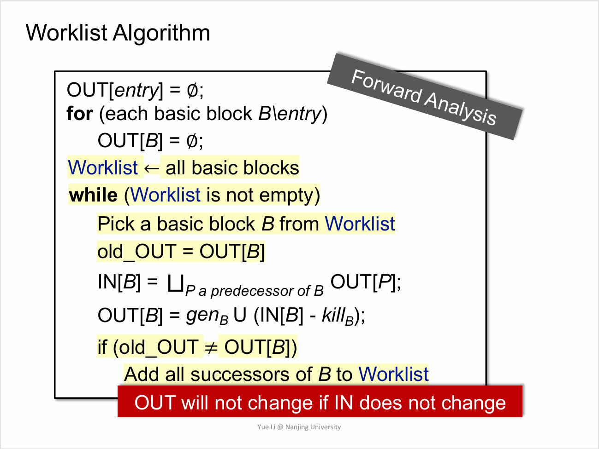
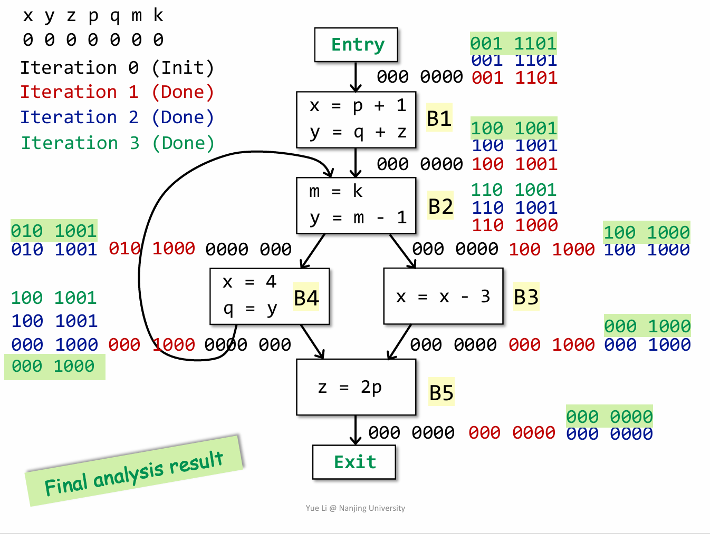
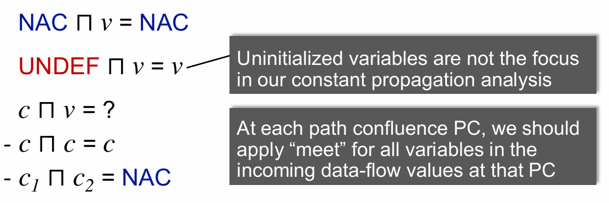
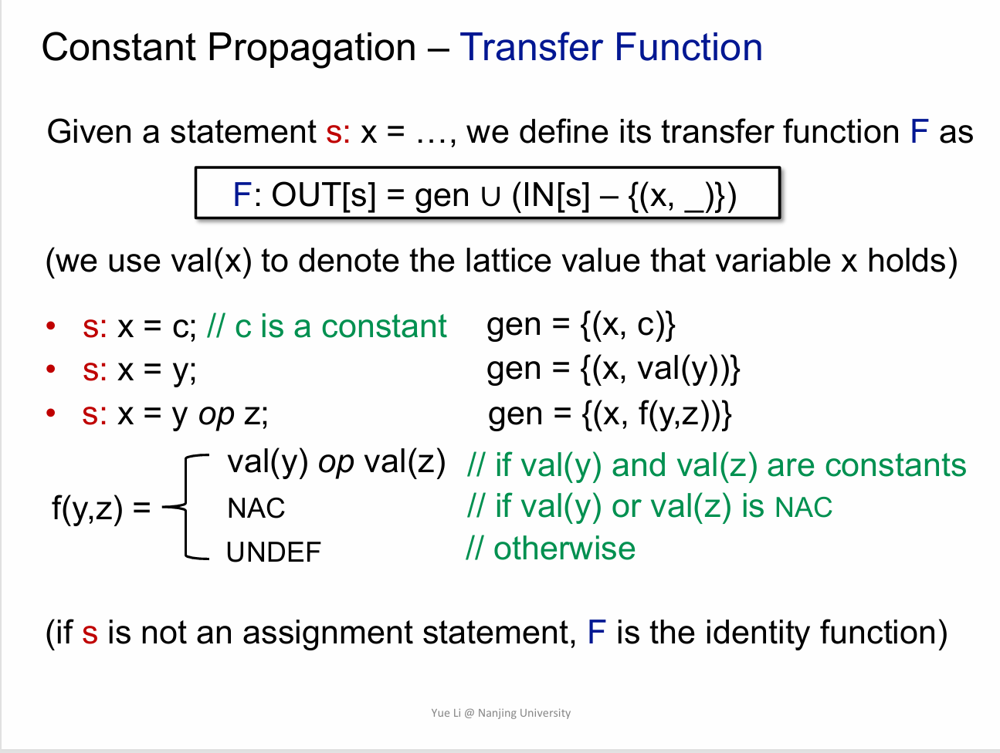
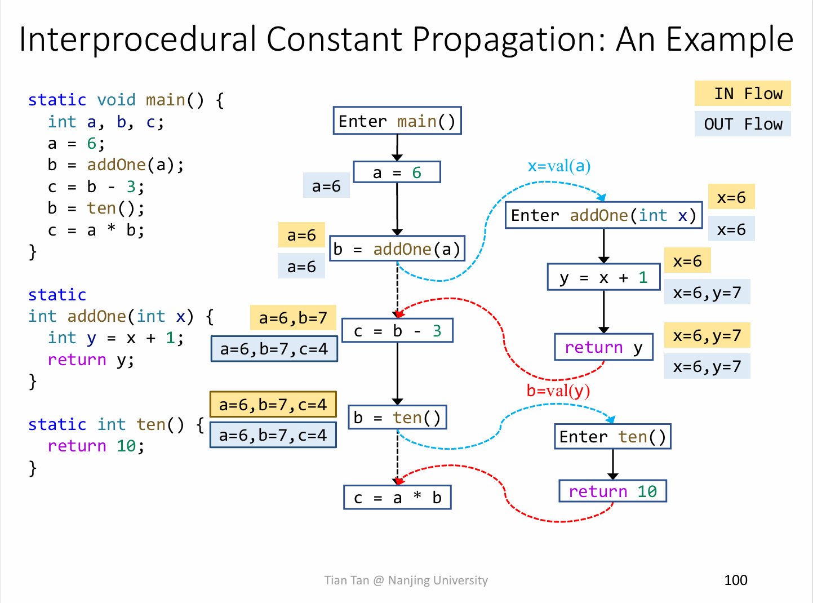

**NJU Static Program Analysis | Assignment-7 Alias-Aware Interprocedural Constant Propagation.**

<!--more-->

## 实验目标

基于**tai-e**框架实现带别名分析的过程间常量传播.

## Preparation

- 将`A2/.../ConstantPropagation`复制到`A7/.../ConstantPropagation`
- 将`A4/.../InterConstantPropagation`复制到`A7/.../InterConstantPropagation`
- 将`A4/.../InterSolver`复制到`A7/InterSolver`
- 将`A6/.../cs/Solver`复制到`A7/.../cs/Solver`
- 将`A6/.../_2ObjSelector`复制到`A7/.../_2ObjSelector`

    > **Tips:** `plan.yml`已经配置好了`cs: 2-obj`, 如果本地测试中想要使用其他策略, 需要将对应`Selector`复制到本次实验目录, 并配置`plan.yml`(方法已在A6实验指南中给出)

***注意:*** 除去指针分析的部分作为结果查询字段指向外, 其余文件都可以是本次实验的更改范围.

## Review

由于要设计算法, 不妨先复习一下A2和A4中常量传播算法和应用范围.

- 常量传播算法是**Forward & Must Analysis**. 迭代至收敛至"最大"不动点.

    > **Additional:**
    >
    > 迭代算法框架如下:
    >
    > 
    >
    > 活跃变量分析的迭代示例:
    >
    > 

- 常量传播算法中对数值的抽象为`UNDEF->CONST->NAC`.

- 由于数据流动的"单调性", **Meet**要满足

    > 

- 语句处理的**Transfer Function**

    > 

> 在A2中, 处理范围仅限于`DefinitionStmt`中的变量和表达式部分, 对于诸如**字段, 数组**部分采取保守策略, 赋值为`NAC`; 分析范围仅局限于**过程内分析**, 此时为方法调用的返回值采取保守策略, 赋值为`NAC`.
>
> 在A4中, 同样只处理变量, 但分析范围扩展为过程间分析, 需要完成对方法调用传参, 传返回值, 为了完成过程间的数据流传递, 加入了**Transfer Edge**.
>
> 由于方法调用的**动态时确认**, 需要知道在这个调用点`callsite`, 真正的`callee`是什么, 因此建立**CallGraph**为**ICFG(inter-procedural control-flow graph)** 提供调用图信息.(你应该还记得在A4的`CHABuilder`完成前, `Assignment`不会输出任何ICFG信息)
>
> 

## Requirement & Analysis

现在来看看实验要求和手上的工具, 看看如何处理新需求.

### 常量处理范围

在之前的实验中, 忽略了**字段Field**和**数组Array**的分析, 原因在本次实验已经指出, 是**别名Alias**所引起的, 由于多个变量(指针)可以指向同一个对象, 只有当明确指针所指向对象时, 才能为其赋值**常量Constant**.

需要指出的是, 本次实验仍然**只需要处理int类型的变量**. A2中已经提供了足够好用的`canHoldInt()`.

另外, 指南上讲述了实验框架中会忽略**静态字段的初始化**的情况, 因其在控制流图中不可达, 不需要对其进行额外的处理.

### 域分析范围

A4开始采用了一种精度较低的方法CHA构建**CallGraph**; A5, A6使用了精度更高的指针分析技术构建**CallGraph**.

本次实验仍然是处理**过程间常量传播**, 由于**CallGraph**更加精确, 分析精度相较于A4也会更进一步. 同时, 在Tai-e框架下完成实验不需要关注**ICFG**如何获得**CG**信息(如有兴趣可自行阅读框架代码).

### PointerAnalysisResult

框架代码提供了`class PointerAnalysisResult`用来获取指针分析的结果, 该部分的初始化在`InterConstantPropagation`中的`initial()`中完成.

其中包含的API说明都较为清晰, 笔者在此不过多赘述.

### 别名分析

该部分实验指南已经给出了一个比较简单的实现方法, **Pointer指向的PointsToSet存在交集, 则认为二者互为别名.**

换个说法, **存在两个或两个以上Pointer指向同一个Obj, 则认为二者互为别名.**

实验指南中讲述了为什么只需要`Pointer`而不是`CSPointer`的原因

笔者在此给出两个简单的算法思路:

- 遍历所有的`Pointer1`与`Pointer2`, 获取`PointsToSet`, 如果有交集就加入`Multiple Map`中, 简单地以`<Var, Var>`的形式维护alias信息.

- 遍历所有的`Pointer`和对应的`PointsToSet`, 维护一个`<Obj, Var>`结构, 对于`<Obj, Var1>`和`<Obj, Var2>`, `Var1`和`Var2`互为别名.

> **Tips: 框架代码的做法**
>
> 如果你有阅读过框架代码或者"意外"跳转到`class Maps`, 便会发现, Tai-e框架中已经配置了好了获取基本数据结构的API(被TT深不可测的代码力所折服). 可以通过简单的`Maps.newMultiMap()`获取实例化数据结构. 当然, 也可以选择自己实例化Map的结构.
>
> 不过需要注意的是, 该部分代码**不是显式给出的**, 而是封装在`tai-e-assignment.jar`中, 可以选择阅读科研版doc或者阅读反编译后的源码(该部分结构简单, 即便无注释也可以理解)

### Field处理

在这里会遇到第一个头疼的点: **ConstPropagation是流敏感的, 但PointerAnalysis是流不敏感的.**

尽管别名信息不依赖于常量传播, 但对象存储的值来源常量传播. 因此, 需要先理清楚如何处理`Load`和`Store`.(**注意:** 笔者以下论述基于InstanceField, SaticField的处理只会比InstanceField简单)

> **Try: 先收集所有的Store再更新给Load?**
>
> 这是符合流不敏感的思路, 但是在ConstPropagation的流敏感框架中非常难以实现. 在迭代过程中, Store的**右值**可能会改变, Store的变化也会引起非Field和Array变量的变化. 所以, Field和Array的更新也需要采用流敏感框架中的迭代方法.

现在来分析如何用迭代的方法处理Field.

- 对于Load, 因为迭代的缘故, 可以先假设后续的处理会正确的广播到此处, 更新Load的值. 因此只需要简单的传播到def即可.

- 对于Store, 假设已经有了一个对应的Load结构, Store产生了更新该如何广播? worklist加入`Load Stmt`迭代即可.

- 同时, 需要注意InstanceFiled的特性, 考虑别名信息进行更新即可.

### Array处理

Array可以理解成一种特殊的InstanceField, 不过需要注意何时互为别名, 只有在互为别名的情况下才考虑广播.

### 小结

至此已经有了一个对完成本次实验的一个基本思路了, 接下来开始考虑一些完成实验的细节.

## 算法设计

> **Tips:** 笔者在此章节不详谈实现上的细节, 该部分在[拾遗](#拾遗-tai-e-faq-you-need-to-know)章节分点给出. 并且, 由于框架代码的特性, 算法的实现可能与思路有所出入.

> **Question: 这次新写的代码和A4冲突吗?**
>
> 这个问题实际上是在问: Field和Array的传播是否会影响到过程间常量传播的**EdgeTransfer**.
>
> 答案自然是否定的, Field和Array可以理解成一种特殊的Var, 尽管其结果不需要呈现在`DataFlowResult`中. 可以自然地得出结论: 加入Field和Array并不会改变A4的算法框架.
>
> 也即, 本次实验所设计的算法是对**TransferNonCallNode(A2-IntraConstPropagation)**的补全.

所以, 本次算法的基本框架可以表示为:

```java
boolean transferNonCallNode(Stmt stmt, CPFact in, CPFact out){
    if (stmt instanceof LoadField){
        //handle
    }
    if (stmt instanceof StoreFiled){
        //handle
    }
    if (stmt instanceof LoadArray){
        //handle
    }
    if (stmt instanceof StoreArray){
        //handle
    }
    else{
        cp.transferNode(); //form A2
    }
}
```

当然, 你也可以选择将这些语句的处理直接整合进`ConstantPropagation`(前提是A2的实现最好确保是正确的).

> **Tips:** 还记得在A5和A6中是如何优雅地处理繁杂的`instanceof`判断吗? 对, 就是**访问者模式**, 在本次实验中, 仍然可以选择这样的方法实现算法. 所有的`Stmt`类中都已经内置了`accept()`API可供访问, 只需要新的访问类继承自`StmtVisitor`即可.

### `<Field, Value>`的存储和广播

> **Tips:** 在Tai-e框架中, 将Array等效抽象成Field, 并不对**Index**做具体的区分(对`a[i]`和`a[j]`的store操作视为对同一对象`a[...]`的store操作). 尽管如此, index信息也有助于分区`a[i]`和`a[j]`是否为别名, 从而决定是否需要广播. 因此, Array的维护会比Field更复杂, 但基本原理一致, 笔者在此章节**不再**赘述Array应如何处理.

在之前的分析中已经获知了[Alias信息](#别名分析), 该部分算法的实现依赖于别名信息.

笔者在此给出两个算法思路抛砖引玉:

#### 只考虑Alias层

这是个朴实但简单的想法: 所有的`y = x.f`来自也只来自`x.f = z`, 这句"废话"意味着什么?

**意味着其实根本就不需要考虑`x.f`或者说`oi.f`的取值, 如果想知道`y`可能的value值, 只需要`meet`所有的`z`就可以了.**

根据这个思路, 有:

- 对于`LoadField`, 找到所有与`x.f`相关的`x'.f = z`, 其中`x'`是`x`的别名, **meet** `z`的`value`值. 如果`y = meet(foreach(z))`有更新, 将其后续`Node`加入`workList`.

- 对于`StoreField`, 找到所有与`x.f`相关的`y = x'.f`, 其中`x'`是`x`的别名, 将这些`StoreField`加入`workList`.

这个算法的优点是实现简单, 但缺点是效率低, 展现着独属于暴力的美学魅力.

其关键在于如何维护`<Field, Stmt>`的结构, 框架代码中有不少细节需要关注.

#### 考虑`Map<Obj, Value>`

`x.f`中的`x`是`Pointer`, 真正存储Value值的是`Obj`, 因此可以考虑维护`<Var, Obj>`和`<Obj.field, Value>`两个Map, `Load`和`Store`均对Map进行操作.

该思路避免了之前算法中的大量冗余计算(笔者自测跑完本地测试需要近30s), 提高了效率, 但Map的维护较为复杂.

具体处理`LoadField`和`StoreField`时, 只需要将信息更新到`Map<Obj.field, Value>`即可, 广播逻辑与之前相同.

不过需要注意的是, 由于指针分析结果是流不敏感的, 对于`Store`操作只使用`meet`而不是`kill`.

> **Question: Store语句应该在何时广播?**
>
> 答案是当`outFact`改变的时候广播, 或者具体来说,是`x.f = y`的`y`的value值改变时进行广播.

## 拾遗: Tai-e FAQ You Need to Know

### CS & CI Pointer Analysis

CallGraph建立的ICFG是没有上下文的, 这和常量传播不关注上下文的行为一致. 但对`Pointer`指向信息可以使用带上下文的分析结果以获取更高的精度, 这与ICFG并不冲突.

### IR

IR的使用为本次实验做了大量简化, 你可能会疑惑, 对于`x.f = y.g`这样的操作, 上述算法框架可以覆盖到该语句吗?

实际上, `x.f = y.g`在IR中会被转化为:

```java
[21@L16] temp$8 = x.<X: int f>;
[22@L16] y.<Y: int g> = temp$8;
```

与之类似的, `Invoke`, `BinaryExp`也具有相同的特性.

如果不确定某条语句在框架中如何表示, 可以自己设计测试样例通过Assignment分析其结果.

回到这次实验, 可以简单认为**所有`AssignStmt`的左值和右值中最多只有一个是Field/Array, 另外一个是Var**.

### InterSolver与InterConstPropagation

InterConstPropagation的字段可以简单的通过参数的方式进行传递, 但InterSolver与InterConstPropagation间该如何通信?

注意到`InterConstantPropagation extends AbstractInterDataflowAnalysis`, 其父类中含有字段`InterSolver solver`, 可以通过`solver.xxx`实现通信.

对于其中的`private`和`protected`字段, 可以为其编写一个`public XType getX()`API提供访问接口.(如`result`, `worklist`等).

### 数据结构Map

本次实验中存在大量"一对多"的联系, 可以考虑选取`MultiMap`进行维护. 其中提供了不少相当便捷的API.

### relevantStmt

如果能把字段中的Var取出, 可以使用其中的API`var.getStoreField()`等API方便的获取有关语句, 不过对Static就没有太好的方法了, 笔者采用的是遍历`icfg.getNodes()`.

### FieldStmt, FieldAccesss, FiledRef & JField

Tai-e框架中的Field的处理要比Array复杂不少, 笔者在此做简要解释.

- JField的结构是`<Type: FieldName>`, 可以使用`FieldStmt.getRef().resolve()`得到. 当使用Stmt解析出JField进行比较时会获取更高的精度. (笔者因为这个卡了hidden test)

- 如果想获取Field的Obj(即base部分), 可以使用`FieldStmt.getFieldAccess().getBase()`. 不过需要先转换为`InstanceFieldAccess`类型才能使用`getBase()`的API.

    > **Tips:** 笔者在此吐槽一句, 为何关于Field的API都封装在了`tai-e-Assignemnt.jar`中而不是显式的给出, 增大了如何处理Field的学习成本.

### ArrayStmt

Array的结构相对简单一点, 通过`getAccess()`就可以简单的`access.getBase/Index()`获取需要的信息.

## 总结

恭喜挺过了本学期SPA的实验大魔王, 自己设计算法还是颇有难度的, 接下来迎接较为轻松的A8吧. \(^_^\)
