**笔者个人conda环境搭建记录.**

<!--more-->

<p><font size = 5><b>目录</b></font></p>

- [前言](#前言)
- [安装Pycharm \& Anaconda](#安装pycharm--anaconda)
  - [Pycharm](#pycharm)
  - [Anaconda3](#anaconda3)
    - [选项配置](#选项配置)
    - [环境变量](#环境变量)
    - [安装位置](#安装位置)
    - [Debug](#debug)
    - [Anaconda 安装检测](#anaconda-安装检测)
- [安装Cuda](#安装cuda)
- [安装Pytorch](#安装pytorch)
  - [Anaconda创建conda环境](#anaconda创建conda环境)
  - [确定Pytorch版本](#确定pytorch版本)
  - [Pytorch安装检测](#pytorch安装检测)
- [Pycharm激活conda环境](#pycharm激活conda环境)
  - [导入环境检测](#导入环境检测)
- [参考资料](#参考资料)

## 前言

本日志记录一次笔者配置conda环境的过程. 参考资料来源网络, 见[**参考资料**](#参考资料)

本次搭建环境基于[**Anaconda**](https://www.anaconda.com/)+[**Cuda**](https://developer.nvidia.com/)搭建[**Pytorch**](https://pytorch.org/)环境并导入[**Pycharm**](https://www.jetbrains.com.cn/pycharm/)中使用.

笔者的环境为:

**Win11家庭版23H2** + **CPU:AMD Ryzen 7 5800H** + **GPU: 3060laptop**

**Anaconda-2024.10.1** + **Cuda-12.6** + **Pytorch-win_x86_64-cuda12.4** + **Pycharm Community-2022.2.2**

## 安装Pycharm & Anaconda

### Pycharm

笔者的Pycharm已经安装好了, Community版本是可以免费使用的, 安装教程可以**STFW**.

需要注意的是, Pycharm本身不包含python, python需要自行下载.

### Anaconda3

#### 选项配置

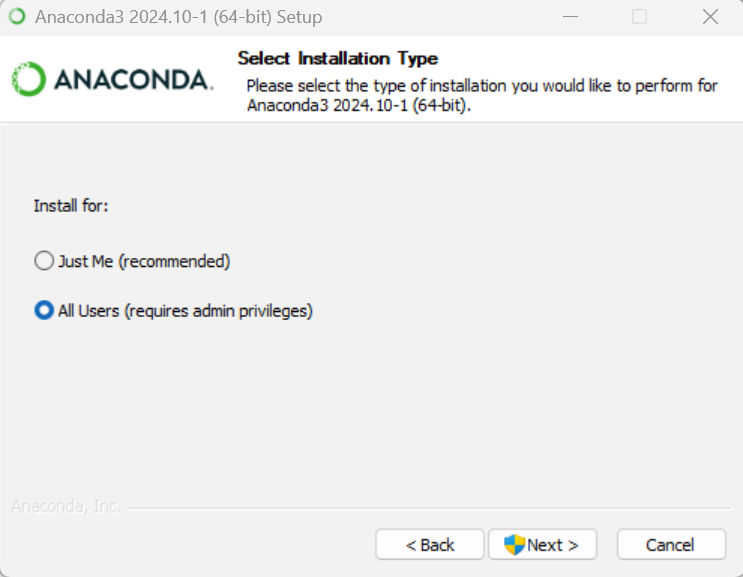

`Just Me`与`All Users`选择`All Users`.

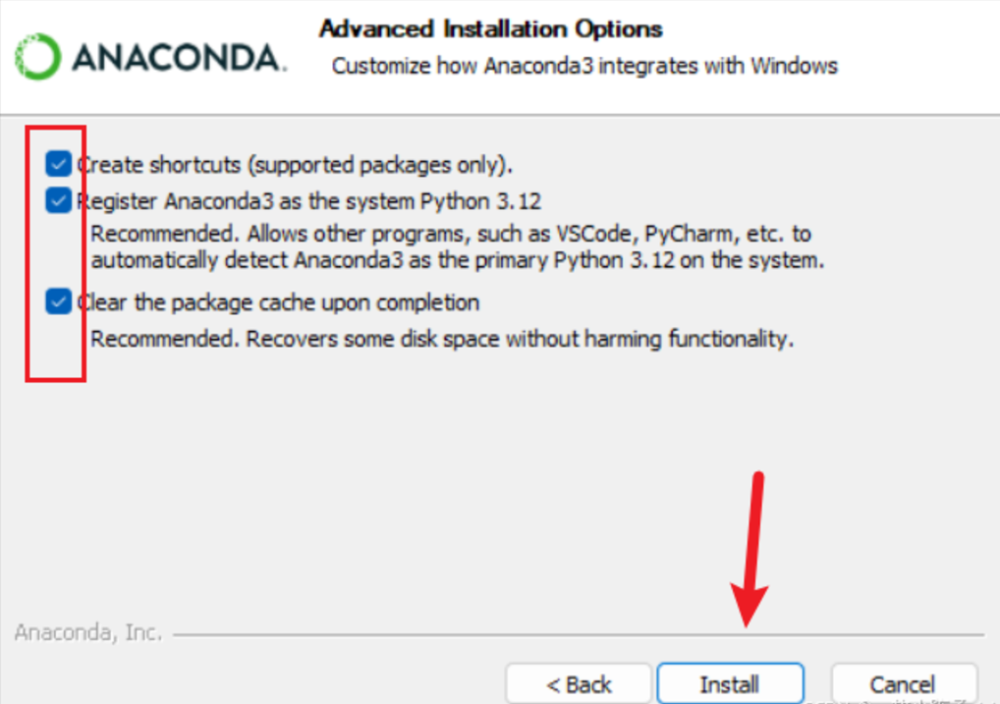

全部勾选.

安装结束后不需要launch, 还要配置环境变量.

#### 环境变量

在高级系统设置中添加系统环境变量, 路径以安装路径为准.

```Shell
D:\anaconda3
D:\anaconda3\Scripts
D:\anaconda3\Library\bin
D:\anaconda3\Library\mingw-w64\bin
```

#### 安装位置

如果已有分盘, 推荐安装到别的分区.

Anaconda的环境和包管理也可以迁移, 笔者本次省略了这个步骤.

#### Debug

笔者在安装完成后遇到了打开`Anaconda Navigator`时卡死在`Loading Applications`页面上, 通过为程序添加默认管理员权限解决.

#### Anaconda 安装检测

打开`Anaconda Prompt`, 页面如下:

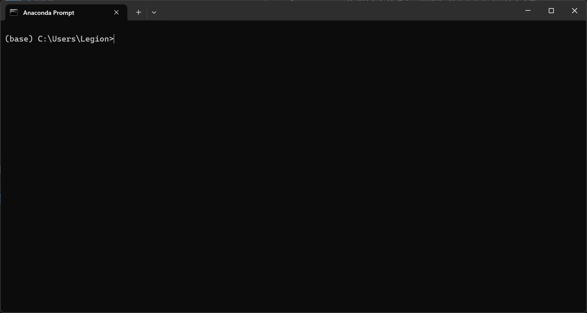

执行指令

```shell
$ conda --version
```

终端输出conda版本号即成功安装了conda

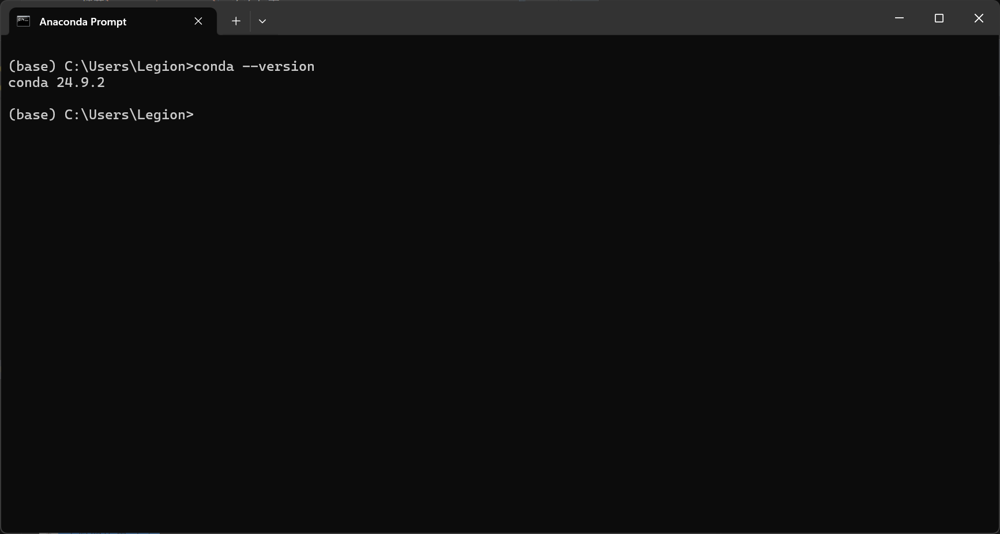

可以通过如下指令查看conda的配置信息:

```shell
$ conda info
```

> **Tips:** 笔者本次略去了Conda的配置, 如包和环境位置, 镜像源的配置. 有需要可以自行配置.

## 安装Cuda

调出cmd后在终端中输入

```shell
$ nvidia-smi
```

得到

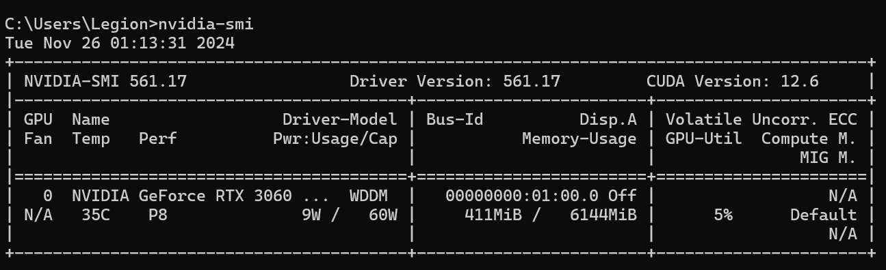

其中`CUDA Version`代表最高支持的`CUDA`版本, 到官网对应版本下载即可.

安装完成后在cmd中执行

```shell
$ nvcc -V
```

正常输出Cuda版本即安装完成.

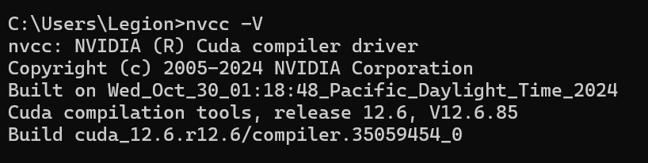

## 安装Pytorch

Pytorch依赖于conda环境, 因此在安装Pytorch前需要配置conda虚拟环境.

### Anaconda创建conda环境

打开`Anaconda Prompt`, 此时的环境为默认的`base`(见[**上文**](#anaconda-安装检测))

执行指令

```shell
$ conda create –n pytorch python=3.10
```

其中`pytorch`为环境名称, `python=3.10`为指定python解释器版本.

需要注意的是, 目前(2024.11)的Pytorch需要**至少**python版本为3.9

如果需要特定版本, 在安装Pytorch时需要查看`Preview Version`.

执行

```shell
$ conda activate pytorch
```

终端环境变更为`pytorch`

想要回到`base`环境, 只需要执行

```shell
$ conda deactivate
```

Pytorch的安装位置便是在名为`pytorch`的环境中.

### 确定Pytorch版本

进入Pytorch官网的Install页面

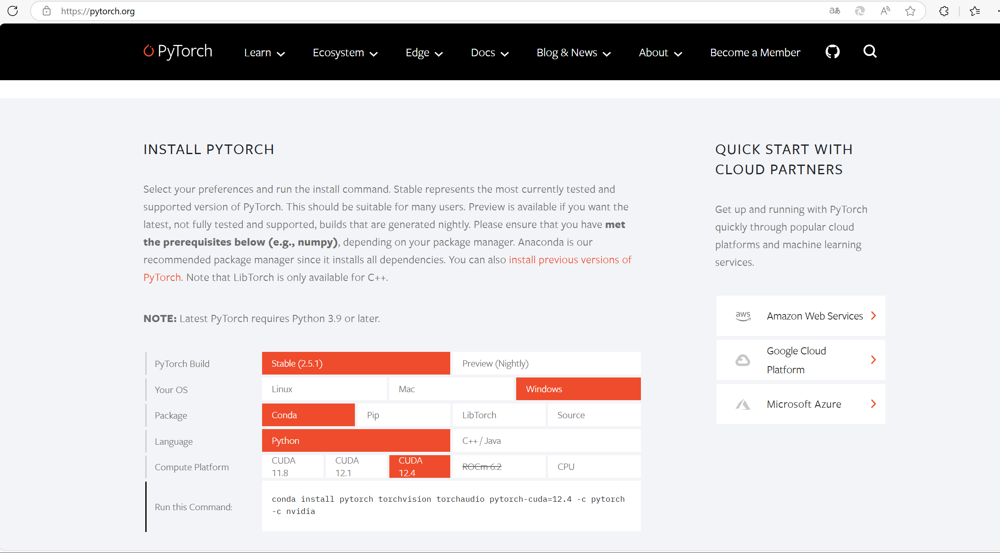

根据自己的Cuda版本选择安装.

如果选择conda安装, 只需要在`Anaconda Prompt`中激活创建的`pytorch`环境, 执行官网上给出的安装命令.

耐心等待安装完成即可.

### Pytorch安装检测

安装结束后, 在激活`pytorch`环境的终端中执行

```shell
$ python
```

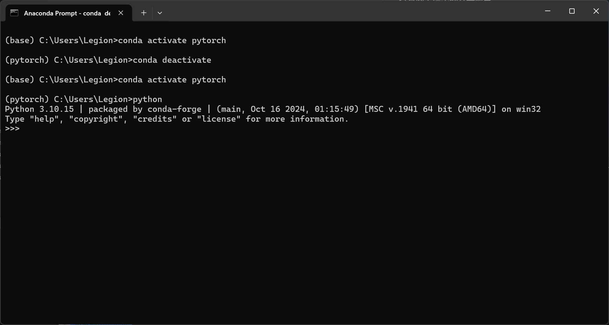

输入以下python代码

```python
import torch
print(torch.__version__)
print(torch.cuda.is_available())
```

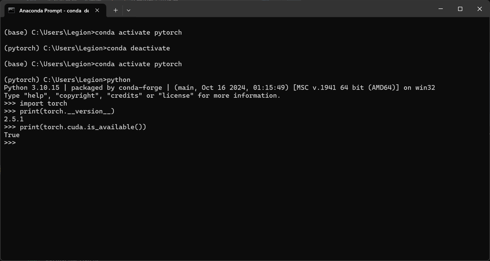

得到类似输出而没有报错即成功在conda环境中安装pytorch.

## Pycharm激活conda环境

以创建的`pytorch`环境为例.

使用Pycharm打开项目, 进入`File->Setting`页面

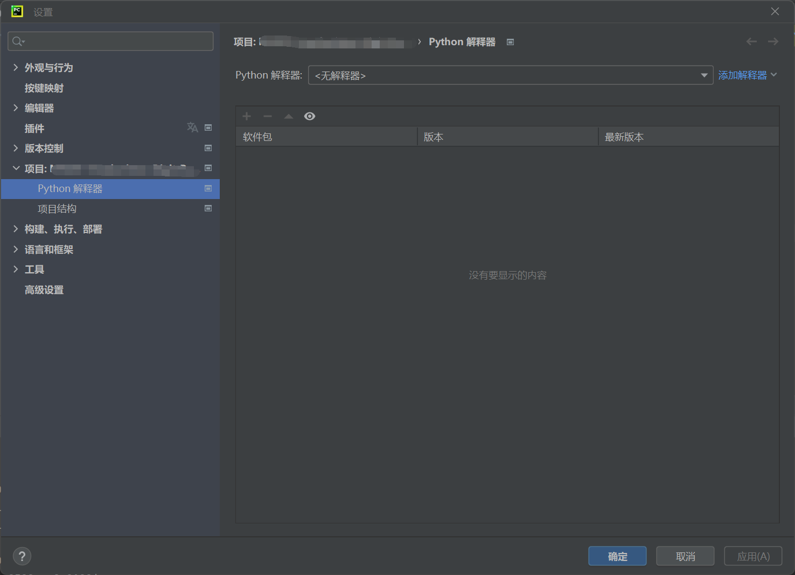

选择`项目->Python解释器`

点击`添加解释器->添加本地解释器->conda环境`

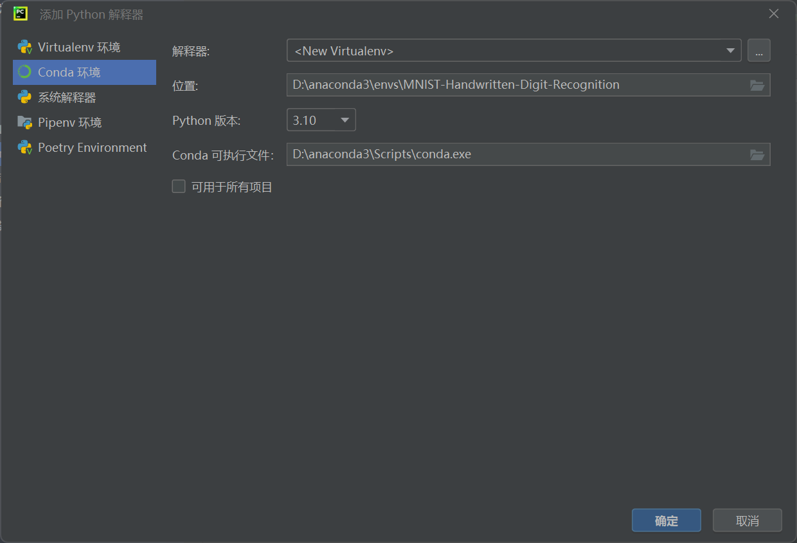

Conda可执行文件输入`D:\anaconda3\Scripts\conda.exe`(依据Anaconda安装位置)

选择解释器(依据自己的conda环境创建位置)

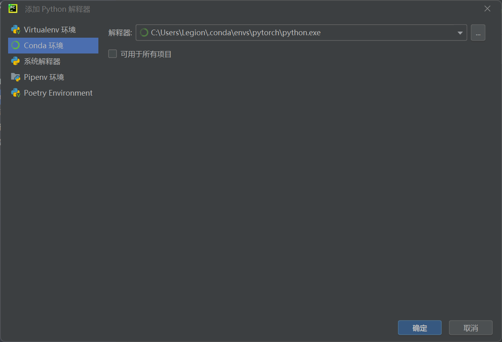

点击确认等待配置完成.

### 导入环境检测

与[**Pytorch安装检测**](#pytorch安装检测)类似, 只需要在python文件中键入

```python
import torch
print(torch.__version__)
print(torch.cuda.is_available())
```

执行代码得到

```shell
2.5.1
True
```

然后就可以开始愉快(迫真)的炼丹之旅啦!

## 参考资料

> **Tips:** 博客并不能解决所有问题, 对于博客中的内容要和面对ChatGPT生成的内容一样小心求证. 必要时更推荐官方文档(此处略去).

<https://blog.csdn.net/qq_44000789/article/details/142214660>

<https://blog.csdn.net/weixin_41401924/article/details/120332417>

<https://zhuanlan.zhihu.com/p/389992455>

<https://blog.csdn.net/weixin_62075168/article/details/131226082>